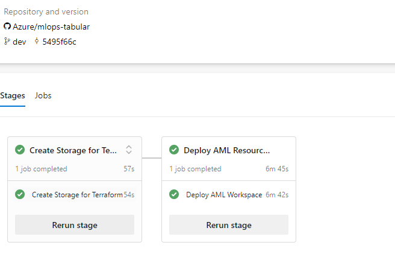

# Quickstart

## Setting Variables
---

For a quickstart, the only variables needed to be set are in 'config-infra-dev.yml':
* If your location (Azure Regtion) is different from 'northeurope' then you'll have to adjust it to the desired one p.ex. 'westus' like here: 'location: westus'
* the function of 'namespace' is to make all your artifacts, that you're going to deploy, unique. Since there's going to be a Storage Account deployed, it has to adhere to the naming limitations of these (3-24 characters, all lowercase letters or numbers)
* as of (20220405) the 'ado_service_connection_rg' needs to have contributor permission subscription wide, since there's two resource groups being created: one for the Terraform state, and the second, which contains the artifacts for the Machine Learning Workspace (Storage Account, Key Vault, Application Insights, Container Registry). You then have to create a service connection in your ADO project, which has the same name ' or adjust it here accordingly.

## Deploying Infrastructure via ADO (Azure DevOps)
---

To daploy the infrastructure in ADO (Azure DevOps), you will have to have an organization and a project, with the mentioned service connection configured.
Then under pipelines you'll create a new pipeline and choose 'infrastructure\terraform\pipelines\tf-ado-deploy-infra.yml' as the source. 
   
   You can then run the pipeline, which should create the following artifacts:
   * Resource Group for Terraform State including Storage Account
   * Resource Group for your Workspace including Storage Account, Container Registry, Application Insights, Keyvault and the Azure Machine Learning Workspace itself.

   > If you didn't change the variable 'enable_aml_computecluster' from 'true' to 'false' a compute cluster is created as defined in 'infrastructure\terraform\modules\aml-workspace\main.tf'

As of now (20220410) the Terraform infrastructure pipeline will create a new pair of Terraform state Resource Group and Machine Learning workspace Resource Group every time it runs, with a slightly different name (rg-mlopstab-10x-tf-state and rg-mlopstab-10x).

The successfully run pipeline should look like this:

## Deploying Training Pipeline via ADO (Azure DevOps)
---

In Azure DevOps, add a new pipeline, which is based on ./mlops/devops-pipelines/deploy0-model-training-pipeline-v2.yml. Make sure that the Github service connection mentioned in the pipeline as 'endpoint' under 'repositories' either matches your Github Oauth connection (from ADO service connection) or adjust it in the pipeline, if you have another service connection name. It's also possible to change the connection name in ADO/Project/ServiceConnections.