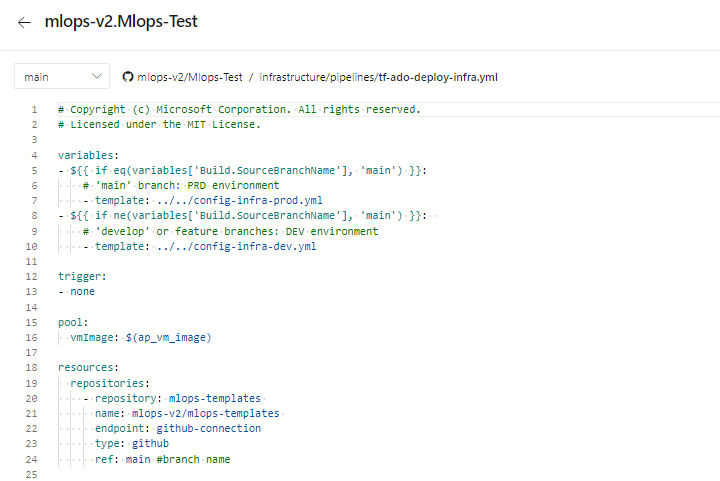
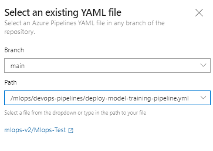
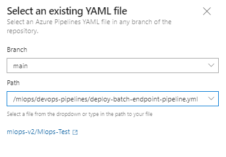
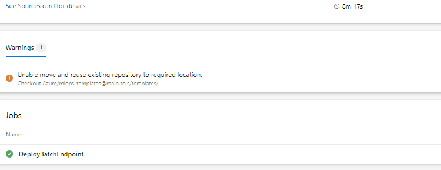

# Quickstart

## Technical requirements

- Github as the source control repository
- Azure DevOps as the DevOps orchestration tool
- The [Terraform extension for Azure DevOps](https://marketplace.visualstudio.com/items?itemName=ms-devlabs.custom-terraform-tasks) if you are using Terraform to spin up infrastructure
- Azure service principals to access / create Azure resources from Azure DevOps (or the ability to create them)
- Git bash, WSL or another shell script editor on your local machine; version 2.27 or newer required
   

## Prerequisites
---

**Duration: 45min**

**Note: This demo is based on the beta version for the MLOps Azure Machine Learning Classical ML and CV (Computer Vision) Pattern. Due to ongoing, cli v2 changes and Azure Machine Learning enhencements, the demo can fail. The team is working on keeping the example as up-to-date as possible.**


1. Create Service Principal

   For the use of the demo, the creation of one or two service principles is required, depending on how many environments, you want to work on (Dev or Prod or Both). Go into your Azure portal to set those up.

   1.1. Select Azure Active Directory (AAC)

   

   1.2. Select App Registrations on the left panel, then select "new registration".

   

   1.3. Go through the process of creating a Service Principle (SP) selecting "Accounts in any organizational directory (Any Azure AD directory - Multitenant)" and name it  "Azure-ARM-Dev-ProjectName". Once created, repeat and create a new SP named "Azure-ARM-Prod-ProjectName". Please replace "ProjectName" with the name of your project so that the service principal can be uniquely identified. 

   1.4. Go to "Certificates & Secrets" and add for each SP "New client secret", then store the value and secret sepperately.

   1.5. To assign the necessary permissions to these principals, select your respective subscription and go to IAM. Select +Add then select "Add Role Assigment.

   

   1.6. Select Contributor and add members selecting + Select Members. Add the member "Azure-ARM-Dev-ProjectName" as create before.

   

   1.7. Repeat step here, if you deploy Dev and Prod into the same subscription, otherwise change to the prod subscription and repeat with "Azure-ARM-Prod-ProjectName". The basic SP setup is successfully finished.


2. Set up Github Environment

   2.1. Go to https://github.com/Azure/mlops-templates/fork to fork the mlops templates repo into your Github org. This repo has reusable mlops code that can be used across multiple projects. 
   
   
   
   2.2. Go to https://github.com/Azure/mlops-project-template/generate to create a repository in your Github org using the mlops-project-template. This is the monorepo that you will use to pull example projects from in a later step. 
   
   

   2.3. Go to your Github organization and create an **empty** repo. This is going to be the repo, into which you'll push your sparse checkout local repo. (more to that later) 
   
   
   
     
   2.4. Now you should have your own empty Github repository. Let's fill it up!

   2.5. On your local machine create a directory or use an existing one, which is empty (p.ex. mlopsv2root). Use your shell environment (GitBash, Bash or WSL only) and CD into this directory. Now clone the Azure/mlops-v2 repo, which is going to give you the documentation and the sparse_checkout.sh script with 'git clone https://github.com/Azure/mlops-v2.git' (If you get a 404, you might need to login to Github). This creates a new directory mlops-v2 under mlopsv2root. NOTE: This mlops-v2 folder is only used to bootstrap your project. Your project folder will be generated using the sparse checkout and be linked to the blank repository you created in step 2.3.
   
   2.6. Now you need to set a few variables depending on your environment in the script /mlops-v2/sparse_checkout.sh. Open this file in an editor and set the following variables:
   
   ```console
   
      infrastructure_version=terraform   #options: terraform / bicep
      project_type=classical   #options: classical / cv
      mlops_version=aml-cli-v2   #options: python-sdk / aml-cli-v2
      git_folder_location='<local path>'   #replace with the local root folder location where you want to create the project folder
      project_name=Mlops-Test   #replace with your project name
      github_org_name=orgname   #replace with your github org name
      project_template_github_url=https://github.com/azure/mlops-project-template   #replace with the url for the project template for your organization created in step 2.2
   
   ```
   Currently we support classical and cv (computer-vision) pipelines. *NLP is currently under development*, though the CV pipeline can be modified to run NLP models. 

   > a few pointers here: 
   * infrastructure_version gives you deployment choices based on your preferred deployment scenario
   * project_type defines the AI workload you want to run in your MLOps system
   * mlops_version selects your preferred environment

   * git_folder_location points to mlopsv2root
   * project_name is the same name (case sensitive), that you used when creating the empty repo in step 2.3
   * github_org_name is your github organization, that you used when creating the empty repo
   * project_template_github_url is the URL of the repo you created in step 2.2
   
   2.7. At the end of the sparse_checkout, it pushes the initilized repo into the new, empty created github repository. In order to do that, we need to authenticate against your github organization by SSH. If not already established, please follow the steps below (see: [Key Setup](https://docs.github.com/en/authentication/connecting-to-github-with-ssh/generating-a-new-ssh-key-and-adding-it-to-the-ssh-agent) ):

   2.7.1 Create a local key in your bash shell by entering: ssh-keygen -t ed25519 -C "your_email@example.com"   Please adjust your email address aligned with your github organization.

   2.7.1.1 You will get promted by 3 different messages regarding your key set-up. You can press "enter" in all three cases and do not have to insert anything. E.g.: Enter a file in which to save the key (/home/you/.ssh/algorithm): [Press enter]

   2.7.2 Add your SSH key to your SSH agent. Start the SSH agent by entering: eval "$(ssh-agent -s)"  It will return your process ID of your agent. Next, add the private key to the SSH agent by executing: ssh-add ~/.ssh/id_ed25519

   2.7.3 Now add your SSH key to your github account ([SSH Key Github](https://docs.github.com/en/authentication/connecting-to-github-with-ssh/adding-a-new-ssh-key-to-your-github-account))

   2.7.3.1 Execute in your shell: cat ~/.ssh/id_ed25519.pub to get to public key. Copy everything including the email adress as the end and store it e.g.: ssh-ed25519 ... our_email@example.com

   2.7.3.2 Now go to github and open your settings. In settings, select "SSH and GPG Keys". Select "New SSH key" and enter a title to the key. Paste your prior stored public key into the key box. Now select "Add SSH key".
     
   2.8. Now it's time to execute this script by running in mlopsv2root (if necessary make sure with pwd, that you're in mlopsv2root) in Git Bash or another terminal by running 'bash mlops-v2/sparse_checkout.sh'. This will use the settings in the variables to create a repo for your project which you can use in subsequent steps.

   In case you face any authentication issues, follow this link to authenticate yourself using an ssh key: https://docs.github.com/en/authentication/connecting-to-github-with-ssh/generating-a-new-ssh-key-and-adding-it-to-the-ssh-agent.
   > watch the output of the script, to make sure, no error(s) were happening. And if so remediate them before continuing. You can always delete the project_name named directory and reexecute the script after fixing any error(s). Be sure though, to reposition the current working directory to be mlopsv2root.

   After this step ran successfully, you'll have an additional folder locally under mlopsv2root named after the project_name variable. This is a locally, fully initialized repo, which had been pushed to your new, empty repo, which is now no more empty.(make sure by refreshing on github)
   
   2.9. Next, create an SSO token in github by selecting "Developer settings" in your github account settings.

   
   
   2.10. Select "Personal Access Token", then generate new token. Select the check boxes and name your token "MLOpsToken". Select "Generate Token". Copy/Paste token key to a notepad interim.
   
   
   
   2.11. If your organization uses single sign on for Github, then click on "Authorize" the token to have access to the github organization. 
   
   
   
   The github setup is successfully finished.


3. Set up Azure DevOps

   3.1. Go to [Azure DevOps](https://dev.azure.com/) to set up your MLOps deployment environment. To deploy the infrastructure via ADO (Azure DevOps), you will have to have an organization and a project, with a service connection to your subscription configured.
   
   3.2. Create a new project in Azure Devops. Feel free to name it according to your project practices.
   
   
   
   3.3. In the project under 'Project Settings (at the bottom of the screen when in the project)' select "Service Connections".
   
   
   
   **Azure Subscription Connection:**
   
      3.3.1 Select "New Service Connection".

      

      3.3.2 Select "Azure Resource Manager", select "Next", select "Service principal (manual)", select "Next", select your subscrption where your Service Principal is stored and name the service connection "Azure-ARM-Dev". Fill in the details of the Dev service principal created in step 1. Select "Grant access permission to all pipelines", then select "Save". Repeat this step to create another service connection "Azure-ARM-Prod" using the details of the Prod service principal created in step 1.

      
      
   **Github Connection:**
   
      3.3.4 Select "New Service Connection".

      
      
      3.3.5 Select "Github", select "Next", select "Personal Access Token" and paste your Github SSO Token in the Personal Access token field, in the "Service connection name" field, enter "github-connection", grant pipeline security access, then select "Save".
      
      Repeat this step, and for the "Service connection name" enter YOUR GITHUB ORGANIZATION NAME or YOUR GITHUB NAME. Finishing this step, your conection should look like this.
   
      

   The Azure DevOps setup is successfully finished.
 
 
**This finishes the prerequisite section and the deployment of the solution accelerator can happen accordingly.**


   
## Outer Loop: Deploying Infrastructure via Azure DevOps
---
   
   1. Go to your Github cloned repo and select the "config-infra-prod.yml" file.
   
   
   
   Under global, there's two values namespace and postfix. These values should render the names of the artifacts to create unique. Especially the name for the storage account, which has the most rigid constraints, like uniqueness Azure wide and 3-5 lowercase characters and numbers. So please change namespace and/or postfix to a value of your liking and remember to stay within the contraints of a storage account name as mentioned above. Then save, commit, push, pr to get these values into the pipeline.
   
   If your are running a Deep Learning workload such as CV or NLP, you have to ensure your GPU compute is availible in your deployment zone. Please replace as shown above your location to eastus. Example:
   
    namespace: [5 max random new letters]
    postfix: [4 max random new digits]
    location: eastus
    
   Please repeat this step for "config-infra-dev.yml" and "config-infra-prod.yml"!

   2. Go to ADO pipelines
   
   
   
   3. Select "New Pipeline".
   
   
   
   4. Select "Github".
   
   
   
   5. Select your /MLOps-Test repository. ("Empty" reposity you created in 2.2)
   
   
   
   If your new repository is not visible, then click on the "provide access" link and on the next screen, click on the "grant" button next to the organization name to grant access to your organization.
   
   6. Select "Existing Azure Pipeline YAML File"
   
   
   
   
   7. Select "main" as a branch and choose based on your deployment method your preferred yml path. For a terraform schenario choose: 'infrastructure/pipelines/tf-ado-deploy-infra.yml', then select "Continue". For a bicep schenario choose: 'infrastructure/pipelines/bicep-ado-deploy-infra.yml', then select "Continue".
   
   
   

   
   8. Run the pipeline. This will take a few minutes to finish. The pipeline should create the following artifacts:
   * Resource Group for your Workspace including Storage Account, Container Registry, Application Insights, Keyvault and the Azure Machine Learning Workspace itself.
   * In the workspace there's also a compute cluster created.
   
   
   
   Now the Outer Loop of the MLOps Architecture is deployed.
   
   


## Inner Loop: Deploying Classical ML Model Development / Moving to Test Environment 
---

   1. Go to ADO pipelines
   
   

   2. Select "New Pipeline".
   
   
   
   3. Select "Github".
   
   
   
   4. Select your /MLOps-Test repository! ("Empty" reposity you created in 2.2)
   
   
   
   5. Select "Existing Azure Pipeline YAML File"
   
   
   
   6. Select "main" as a branch and choose '/mlops/devops-pipelines/deploy-model-training-pipeline.yml', then select "Continue".  

   
   
   >**IMPORTANT: This pipeline needs an additional connection to the Github repo yourorgname/mlops-templates, where all the templates are stored and maintained, which, like legos, encapsulate certain functionality. That's why you see in the pipeline itself a lot of calls to '-template: template in mlops-templates'. These functionalities are install the azure cli, or ml extension or run a pipeline etc. Therefore we created the connection 'github-connection' in the beginning currenly hard-coded.**
   
   This step deploys the training pipeline to the Azure Machine Learning workspace created in the previous steps. 

   Now the Inner Loop of the MLOps Architecture is deployed.
      
      
 
## Inner / Outer Loop: Moving to Production
---
   
   >**NOTE: This is an end-to-end machine learning pipeline which runs a linear regression to predict taxi fares in NYC. The pipeline is made up of components, each serving  different functions, which can be registered with the workspace, versioned, and reused with various inputs and outputs.**

   >**Prepare Data
   This component takes multiple taxi datasets (yellow and green) and merges/filters the data, and prepare the train/val and evaluation datasets.
   Input: Local data under ./data/ (multiple .csv files)
   Output: Single prepared dataset (.csv) and train/val/test datasets.**

   >**Train Model
   This component trains a Linear Regressor with the training set.
   Input: Training dataset
   Output: Trained model (pickle format)**
   
   >**Evaluate Model
   This component uses the trained model to predict taxi fares on the test set.
   Input: ML model and Test dataset
   Output: Performance of model and a deploy flag whether to deploy or not.
   This component compares the performance of the model with all previous deployed models on the new test dataset and decides whether to promote or not model into production. Promoting model into production happens by registering the model in AML workspace.**

   >**Register Model
   This component scores the model based on how accurate the predictions are in the test set.
   Input: Trained model and the deploy flag.
   Output: Registered model in Azure Machine Learning.**
   
   1. Go to ADO pipelines
   
   

   2. Select "New Pipeline".
   
   
   
   3. Select "Github".
   
   
   
   4. Select your /MLOps-Test repository! ("Empty" reposity you created in 2.2)
   
   
   
   5. Select "Existing Azure Pipeline YAML File"
   
   
   
   6. Select "main" as a branch and choose:
      For Classical Machine Learning:
         Managed Batch Endpoint '/mlops/devops-pipelines/deploy-batch-endpoint.yml'
         Managed Online Endpoint '/mlops/devops-pipelines/deploy-batch-endpoint.yml'
      For Computer Vision: 
         Managed Online Endpoint '/mlops/devops-pipelines/deploy-batch-endpoint.yml'
      
      Then select "Continue".  
   
   
   
   7. Batch/Online endpoint names need to be unique, so please change [your endpointname] to another unique name and then select "Run".

   
   
   **IMPORTANT: If the run fails due to an existing online endpoint name, recreate the pipeline as discribed above and change [your endpointname] to [your endpointname [random number]]"**
   
   8. When the run completes, you will see:
   
   
   
  Now the Inner Loop is connected to the Outer of the MLOps Architecture and inference has been run.
  
  

## Next Steps
---

This finishes the demo according to the architectual patters: Azure Machine Learning Classical Machine Learning, Azure Machine Learning Computer Vision. Next you can dive into your Azure Machine Learning service in the Azure Portal and see the inference results of this example model. 

As the cli v2 is still in development, the following components are not part of this demo:
- Model Monitoring for Data/Model Drift
- Automated Retraining
- Model and Infrastructure triggers

As the development team builds according to the Product Groups release plan, no custom components are going to be developed rather it is intended to wait for full GA release of the cli v2 to address those components. 

Interim it is recommended to schedule the deployment pipeline for development for complete model retraining on a timed trigger.

For questions, please hand in an issue or reach out to the development team at Microsoft.


   
   
   
 
