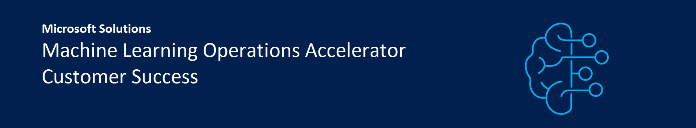

# Azure MLOps (v2) Solution Accelerator

Welcome to the MLOps (v2) solution accelerator repository! This project is intended to serve as the starting point for MLOps implementation in Azure.

MLOps is a set of repeatable, automated, and collaborative workflows with best practices that empower teams of ML professionals to quickly and easily get their machine learning models deployed into production. You can learn more about MLOps here:

- [MLOps with Azure Machine Learning](https://azure.microsoft.com/services/machine-learning/mlops/#features)
- [Cloud Adoption Framework Guidance](https://docs.microsoft.com/azure/cloud-adoption-framework/ready/azure-best-practices/ai-machine-learning-mlops)
- [How: Machine Learning Operations](https://docs.microsoft.com/azure/machine-learning/concept-model-management-and-deployment)

## Project overview

The solution accelerator provides a modular end-to-end approach for MLOps in Azure based on pattern architectures. As each organization is unique, solutions will often need to be customized to fit the organization's needs.

The solution accelerator goals are:

- Simplicity
- Modularity
- Repeatability & Security
- Collaboration
- Enterprise readiness

It accomplishes these goals with a template-based approach for end-to-end data science, driving operational efficiency at each stage. You should be able to get up and running with the solution accelerator in a few hours.

## Prerequisites

1. An Azure subscription. If you don't have an Azure subscription, [create a free account](https://azure.microsoft.com/en-us/free/machine-learning/search/?OCID=AIDcmm5edswduu_SEM_822a7351b5b21e0f1ffe102c9ca9e99f:G:s&ef_id=822a7351b5b21e0f1ffe102c9ca9e99f:G:s&msclkid=822a7351b5b21e0f1ffe102c9ca9e99f) before you begin.
2. For Azure DevOps-based deployments and projects:
    * [Azure CLI](https://learn.microsoft.com/en-us/cli/azure/install-azure-cli) with `azure-devops` extension.
    * [Terraform extension for Azure DevOps](https://marketplace.visualstudio.com/items?itemName=ms-devlabs.custom-terraform-tasks) if you are using Terraform to spin up infrastructure
3. For GitHub-based deployments and projects:
    * [Azure CLI](https://learn.microsoft.com/en-us/cli/azure/install-azure-cli)
    * [GitHub client](https://cli.github.com/)
3. Git bash, WSL, or another shell script editor on your local machine

## Documentation

1. [Solution Accelerator Concepts and Structure](documentation/structure/README.md) - Philosophy and organization
2. [Architectural Patterns](documentation/architecture/README.md) - Supported Machine Learning patterns
3. [Accelerator Deployment Guides](documentation/deployguides/README.md) - How to deploy and use the soluation accelerator with Azure DevOps or GitHub
4. Quickstarts - Precreated project scenarios for demos/POCs. [Azure DevOps ADO Quickstart](https://learn.microsoft.com/en-us/azure/machine-learning/how-to-setup-mlops-azureml?tabs=azure-shell). 
5. YouTube Videos: [Deploy MLOps on Azure in Less Than an Hour](https://www.youtube.com/watch?v=5yPDkWCMmtk) and [AI Show](https://www.youtube.com/watch?v=xaW_A0sV6PU)

## Contributing

This project welcomes contributions and suggestions. To learn more visit the contributing section, see [CONTRIBUTING.md](CONTRIBUTING.md) for details.

Most contributions require you to agree to a Contributor License Agreement (CLA) declaring that you have the right to, and actually do, grant us the rights to use your contribution. For details, visit https://cla.opensource.microsoft.com.

When you submit a pull request, a CLA bot will automatically determine whether you need to provide a CLA and decorate the PR appropriately (e.g., status check, comment). Simply follow the instructions provided by the bot. You will only need to do this once across all repos using our CLA.

This project has adopted the [Microsoft Open Source Code of Conduct](https://opensource.microsoft.com/codeofconduct/). For more information see the [Code of Conduct FAQ](https://opensource.microsoft.com/codeofconduct/faq/) or contact [opencode@microsoft.com](mailto:opencode@microsoft.com) with any additional questions or comments.

## Trademarks

This project may contain trademarks or logos for projects, products, or services. Authorized use of Microsoft
trademarks or logos is subject to and must follow
[Microsoft's Trademark & Brand Guidelines](https://www.microsoft.com/legal/intellectualproperty/trademarks/usage/general).
Use of Microsoft trademarks or logos in modified versions of this project must not cause confusion or imply Microsoft sponsorship.
Any use of third-party trademarks or logos are subject to those third-party's policies.
