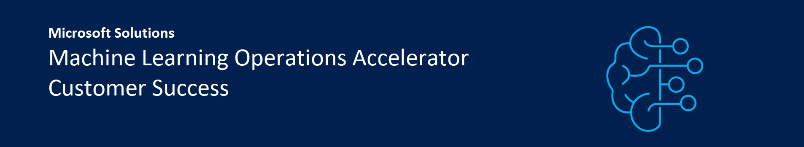

# Azure MLOps (v2) solution accelerator

MLOps or Machine Learning Ops is a set of practices that aims to automate and operationalise the deployment and maintenance of machine learning models across various stages of the lifecycle of a Data Science process. The purpose of an MLOps process is to drive efficiency, increase repeatability and predictability, enable reuse of code and drive consistency across projects. This enables Data Science teams to deploy Machine Learning models to production reliably and efficiently.  

While MLOps has many overlapping concepts with DevOps and can be seen as a derivation of DevOps, it varies significantly from DevOps due to the nature of Data Science projects. The following Microsoft articles provide a perspective on MLOps from various viewpoints: 

[MLOps using Azure Machine Learning](https://azure.microsoft.com/en-us/services/machine-learning/mlops/#features) 

[Cloud Adoption Framework Guidance](https://docs.microsoft.com/en-us/azure/cloud-adoption-framework/ready/azure-best-practices/ai-machine-learning-mlops) 

[How: Machine Learning Operations](https://docs.microsoft.com/en-us/azure/machine-learning/concept-model-management-and-deployment) 

## Prerequisites: Repository Overview

The solution accelerator provides a modular end-to-end approach for MLOps in Azure based on pattern architectures. As each organization is unique, we do not expect that each pattern architecture will suit all organizations, however, Digital Natives or enterprises will be able to deploy an MLOps ecosystem fast, simple, reliable, modular, and secure. The time to product is measurable shorter under incerased scalability.

Following are the key principles that have been applied while building the accelerator: 

&nbsp;&nbsp;&nbsp;&nbsp;&nbsp;✅**Simplicity** 
  
&nbsp;&nbsp;&nbsp;&nbsp;&nbsp;✅**Segregation of duties & Security**
  
&nbsp;&nbsp;&nbsp;&nbsp;&nbsp;✅**Reusability**
  
&nbsp;&nbsp;&nbsp;&nbsp;&nbsp;✅**Modularity**
  
&nbsp;&nbsp;&nbsp;&nbsp;&nbsp;✅**Enterprise readiness**

This repo provides a templatised approach for the end-to-end Data Science process and focuses on driving efficiency at each stage. For example, it can take a significant amount of time to bootstrap a new Data Science project, hence the repo provides templates that can be reused to establish a cookie cutter approach for the bootstrapping process to shorten the process from days to hours or minutes.

The best way to consume this accelerator will be to choose a complex use case that reflects most of your organisation’s needs from a Data Science perspective and start adjusting this accelerator to accommodate those requirements. The first use case may take longer to deliver, however, once the process has been ironed out, subsequent use cases can be onboarded in a matter of days if not hours.

Following the demo helps to understand the concept of the solution accelerator, architectual pattern, and ongoing work extending the solution accelerator to other patterns. Feel free to replace the inner loop model with your model and rerun accordingly.

 
## 👤 Getting started: Azure Machine Learning - Classical Machine Learning Demo
  
The demo follows the Classical Machine Learning Pattern with Azure Machine Learning.
  

  
Please follow the instructions to execute the demo accordingly:
  
&nbsp;&nbsp;1.
  
&nbsp;&nbsp;2.
  
&nbsp;&nbsp;3.
  
&nbsp;&nbsp;...

## 📐 Pattern Architectures: Key concepts

| Link                                                    | AI Pattern                                                              |
| ------------------------------------------------------- | ----------------------------------------------------------------------- |
| [Pattern AML CML](https://github.com/Azure/mlops-v2/blob/main/documentation/architecturepattern/AzureML_CML_Architecture_v0.7.jpg) | Azure Machine Learning - Classical Machine Learning                     |
| [Pattern AML CV](https://github.com/Azure/mlops-v2/blob/main/documentation/architecturepattern/AzureML_SupervisedCV_Architecture_v0.5.jpg)                                                 | Azure Machine Learning - Computer Vision                                |
| [TBD]                                                   | Azure Machine Learning - Natural Language Processing                    |
| [TBD]                                                   | Azure Machine Learning / Azure Databricks - Classical Machine Learning  |
| [TBD]                                                   | Azure Machine Learning / Azure Databricks - Computer Vision             |
| [TBD]                                                   | Azure Machine Learning / Azure Databricks - Natural Language Processing |
| [TBD]                                                   | Azure Machine Learning - Classical Machine Learning using R             |
| [TBD]                                                   | Azure Machine Learning - Edge AI                                        |

  
## 📯 (Coming Soon) One-click Deployments:
  
## 📯 MLOps infrastructure deployment

| Name                                                        | Description                                                | Try it out      |
| ----------------------------------------------------------- | ---------------------------------------------------------- | --------------- |
| [Outer Loop](https://github.com/Azure/mlops-infra-default)  | Default Azure Machine Learning outer infrastructure setup  | [DEPLOY BUTTON] |
| [TBD]                                                       | Default Responsible AI for Classical Machine Learning      | [DEPLOY BUTTON] |
| [Feature Store FEAST](https://github.com/Azure/feast-azure) | Default Feature Store using FEAST                          | [DEPLOY BUTTON] |

## 📯 MLOps use case deployment

| Name                                                                | AI Workload Type                   | Services                                 | Try it out      |
|-------------------------------------------------------------------- | -----------------------------------| ---------------------------------------- | --------------- |
| [classical-ml](https://github.com/Azure/mlops-project-classical-ml) | Classical machine learning         | Azure Machine Learning                   | [DEPLOY BUTTON] |
| [TBD]                                                               | Computer Vision                    | Azure Machine Learning                   | [DEPLOY BUTTON] |
| [TBD]                                                               | Natural Language Processing        | Azure Machine Learning                   | [DEPLOY BUTTON] |
| [TBD]                                                               | Classical machine learning         | Azure Machine Learning, Azure Databricks | [DEPLOY BUTTON] |
| [TBD]                                                               | Computer Vision                    | Azure Machine Learning, Azure Databricks | [DEPLOY BUTTON] |
| [TBD]                                                               | Natural Language Processing        | Azure Machine Learning, Azure Databricks | [DEPLOY BUTTON] |
| [TBD]                                                               | Classical machine learning with R  | Azure Machine Learning                   | [DEPLOY BUTTON] |  
| [TBD]                                                               | Edge AI                            | Azure Machine Learning                   | [DEPLOY BUTTON] |  

## Contributing

This project welcomes contributions and suggestions. To learn more visit the contributing section, see [CONTRIBUTING.md](CONTRIBUTING.md) for details.

Most contributions require you to agree to a Contributor License Agreement (CLA) declaring that you have the right to, and actually do, grant us the rights to use your contribution. For details, visit https://cla.opensource.microsoft.com.

When you submit a pull request, a CLA bot will automatically determine whether you need to provide a CLA and decorate the PR appropriately (e.g., status check, comment). Simply follow the instructions provided by the bot. You will only need to do this once across all repos using our CLA.

This project has adopted the [Microsoft Open Source Code of Conduct](https://opensource.microsoft.com/codeofconduct/). For more information see the [Code of Conduct FAQ](https://opensource.microsoft.com/codeofconduct/faq/) or contact [opencode@microsoft.com](mailto:opencode@microsoft.com) with any additional questions or comments.

## Trademarks

This project may contain trademarks or logos for projects, products, or services. Authorized use of Microsoft
trademarks or logos is subject to and must follow
[Microsoft's Trademark & Brand Guidelines](https://www.microsoft.com/legal/intellectualproperty/trademarks/usage/general).
Use of Microsoft trademarks or logos in modified versions of this project must not cause confusion or imply Microsoft sponsorship.
Any use of third-party trademarks or logos are subject to those third-party's policies.
