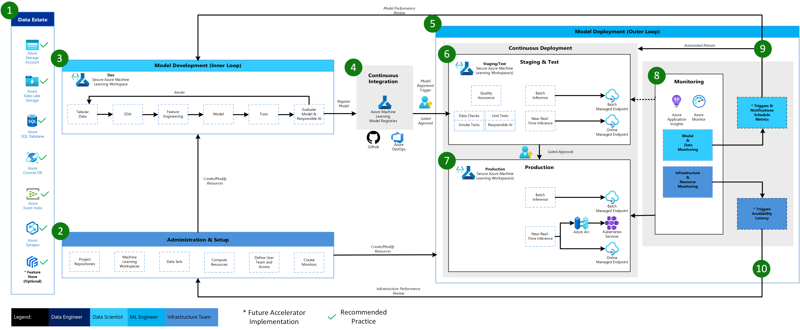
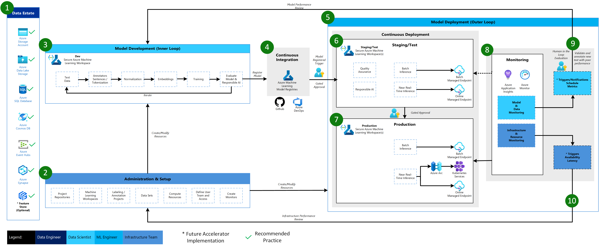

# MLOps v2 Architectures

The MLOps v2 architectural pattern is made up of four main modular elements representing phases of the MLOps lifecycle.

-   Data Estate

-   Administration & Setup

-   Model Development (Inner Loop)

-   Model Deployment (Outer Loop)

These elements, the relationships between them, and the personas typically associated with these elements are common for all MLOps v2 scenario architectures though there may some variations in the details of each depending on the scenario.

The base architecture for MLOps v2 for Azure Machine Learning is the Classical Machine Learning scenario on tabular data. Other scenarios like Computer Vision (CV) and Natural Language Processing (NLP) build on or modify this base architecture as appropriate.

## Current Architectures

-   [Azure Machine Learning Classical ML Architecture](#azure-machine-learning-classical-ml-architecture)
-   [Azure Machine Learning Computer Vision Architecture](#azure-machine-learning-computer-vision-architecture)
-   [Azure Machine Learning Natural Language Processing Architecture](#azure-machine-learning-natural-language-processing-architecture)

### Azure Machine Learning Classical ML Architecture

Below is the MLOps v2 architecture for a Classical Machine Learning scenario on tabular data along with explanation of the main elements and details.

1.  **Data Estate**

    This element illustrates the organization data estate and potential data sources and targets for a data science project. Data Engineers would be the primary owners of this element of the MLOps v2 lifecycle. The Azure data platforms in this diagram are neither exhaustive nor prescriptive. However, data sources and targets that represent recommended best practices based on customer use case are indicated by the green check.

2.  **Administration & Setup**

    This element is the first step in the MLOps v2 Accelerator deployment. It consists of all tasks related to creation and management of resources and roles associated with the project. These can include but may not be limited to:

    -   Creation of project source code repositories.

    -   Creation of Azure Machine Learning Workspaces for the project using Bicep, ARM, or Terraform.

    -   Creation/modification of Data Sets and Compute Resources used for model development and deployment.

    -   Definition of project team users, their roles, and access controls to other resources.

    -   Creation of CI/CD (Continuous Integration and Continuous Delivery) pipelines

    -   Creation of Monitors for collection and notification of model and infrastructure metrics.

    Personas associated with this phase may be primarily Infrastructure Team but may also include all of Data Engineers, Machine Learning Engineers, and Data Scientists.

3.  **Model Development (Inner Loop)**

    The inner loop element consists of your iterative data science workflow. A typical workflow is illustrated here from data ingestion, EDA (Exploratory Data Analysis), experimentation, model development and evaluation, to registration of a candidate model for production. This modular element as implemented in the MLOps v2 accelerator is agnostic and adaptable to the process your team may use to develop models.

    Personas associated with this phase include Data Scientists and ML Engineers.

4.  **Azure Machine Learning Registries**

    When the Data Science team has developed a model that is a candidate for deploying to production, the model can be registered in the Azure Machine Learning workspace registry. Continuous Integration (CI) pipelines triggered either automatically by model registration and/or gated human-in-the-loop approval promote the model and any other related assets to the model Deployment phase.  
      
    Personas associated with this stage are typically ML Engineers.

5.  **Deployment (Outer Loop)**

    The Deployment or Outer Loop phase consists of pre-production deployment staging and testing, production deployment, and monitoring of both model/data and infrastructure. Continuous Deployment (VD) pipelines manage the promotion of the model and related assets through production and monitoring as criteria appropriate to your organization and use case are satisfied.

    Monitoring in staging/test and production enables you to collect and act on data related to model performance, data drift, and infrastructure performance that may call for human-in-the-loop review, automated retraining and reevaluation of the model, or a return to the Development loop or Admin/Setup for development of a new model or modification of infrastructure resources.

    Personas associated with this phase are primarily ML Engineers.

6.  Staging & Test

7.  Production Deployment

8.  Monitoring

9.  Data & Model Monitoring - Events and Actions

10. Infrastructure Monitoring - Events and Actions

### Azure Machine Learning Computer Vision Architecture

### Azure Machine Learning Natural Language Processing Architecture

