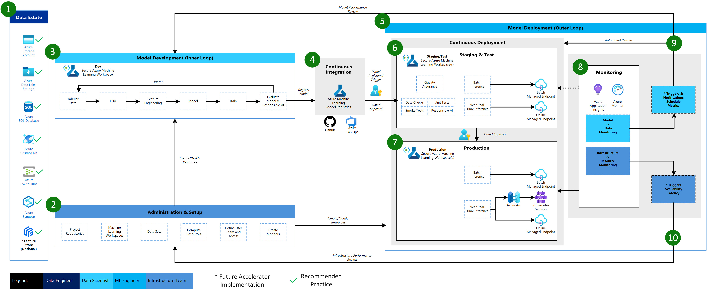

# Azure Machine Learning Classical ML Architecture

Below is the MLOps v2 architecture for a Classical Machine Learning scenario on tabular data using Azure Machine Learning along with explanation of the main elements and details.

1. **Data Estate**

    This element illustrates the organization data estate and potential data sources and targets for a data science project. Data Engineers would be the primary owners of this element of the MLOps v2 lifecycle. The Azure data platforms in this diagram are neither exhaustive nor prescriptive. However, data sources and targets that represent recommended best practices based on customer use case are indicated by the green check.

2. **Administration & Setup**

    This element is the first step in the MLOps v2 Accelerator deployment. It consists of all tasks related to creation and management of resources and roles associated with the project. These can include but may not be limited to:

    - Creation of project source code repositories.

    - Creation of Azure Machine Learning Workspaces for the project using Bicep, ARM, or Terraform.

    - Creation/modification of Data Sets and Compute Resources used for model development and deployment.

    - Definition of project team users, their roles, and access controls to other resources.

    - Creation of CI/CD (Continuous Integration and Continuous Delivery) pipelines

    - Creation of Monitors for collection and notification of model and infrastructure metrics.

    Personas associated with this phase may be primarily Infrastructure Team but may also include all of Data Engineers, Machine Learning Engineers, and Data Scientists.

3. **Model Development (Inner Loop)**

    The inner loop element consists of your iterative data science workflow performed within a dedicated, secure Azure Machine Learning Workspace. A typical workflow is illustrated here from data ingestion, EDA (Exploratory Data Analysis), experimentation, model development and evaluation, to registration of a candidate model for production. This modular element as implemented in the MLOps v2 accelerator is agnostic and adaptable to the process your data science team may use to develop models.

    Personas associated with this phase include Data Scientists and ML Engineers.

4. **Azure Machine Learning Registries**

    When the Data Science team has developed a model that is a candidate for deploying to production, the model can be registered in the Azure Machine Learning workspace registry. Continuous Integration (CI) pipelines triggered either automatically by model registration and/or gated human-in-the-loop approval promote the model and any other model dependencies to the model Deployment phase.  

    Personas associated with this stage are typically ML Engineers.

5. **Model Deployment (Outer Loop)**

    The Model Deployment or Outer Loop phase consists of pre-production staging and testing, production deployment, and monitoring of both model/data and infrastructure. Continuous Deployment (VD) pipelines manage the promotion of the model and related assets through production, monitoring, and potential retraining as criteria appropriate to your organization and use case are satisfied.

    Personas associated with this phase are primarily ML Engineers.

6. **Staging & Test**

    The Staging & Test phase can vary with customer practices but typically includes operations such as retraining and testing of the model candidate on production data,  test deployments for endpoint performance, data quality checks, unit testing, and Responsible AI checks for model and data bias.  This phase takes place in one or more dedicated, secure Azure Machine Learning Workspaces.

7. **Production Deployment**

    After a model passes the Staging & Test phase, the model can be promoted to production via a human-in-the-loop gated approvals. Model deployment options include a Batch Managed Endpoint for batch scenarios or, for online, near-realtime scenarios, either an Online Managed Endpoint or to Kubernetes using Azure Arc. Production typically takes place in one or more dedicated, secure Azure Machine Learning Workspaces.

8. **Monitoring**

    Monitoring in staging/test and production enables you to collect metrics for and act on changes in performance of the model, data, and infrastructure. Model and data monitoring may include checking for model and data drift, model performance on new data, and Responsible AI issues.  Infrastructure monitoring can watch for issues with endpoint response time, problems with deployment compute capacity, or network issues.  

9. **Data & Model Monitoring - Events and Actions**

    Based on criteria for model and data monitors of concern such as metric thresholds or schedules, automated triggers and notifications can implement appropriate actions to take. This may be regularly scheduled automated retraining of the model on newer production data and a loop back to Staging & Test for pre-production evaluation or it may be due to triggers on model or data issues that require a loop back to the Model Development phase where Data Scientists can investigate and potentially develop a new model.

10. **Infrastructure Monitoring - Events and Actions**

    Based on criteria for infrastructure monitors of concern such as endpoint response lag or insufficient compute for the deployment, automated triggers and notifications can implement appropriate actions to take. This triggers a loop back to the Setup & Administration phase where the Infrastructure Team can investigate and potentially reconfigure environment compute and network resources.
