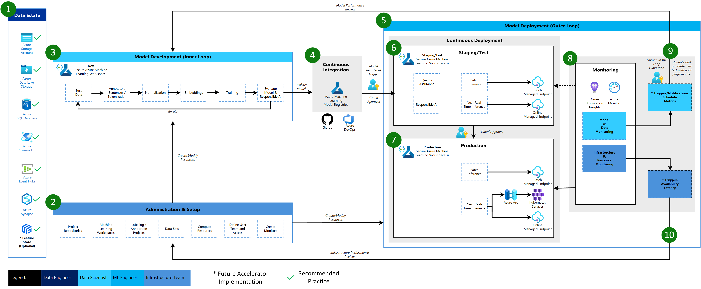

# Azure Machine Learning Natural Language Processing Architecture

The Azure Machine Learning Natural Language Processing Architecture is based on the Classical Machine Learning Architecture with some modifications particular to NLP  scenarios.

1. **Data Estate**

    This element illustrates the organization data estate and potential data sources and targets for a data science project. Data Engineers would be the primary owners of this element of the MLOps v2 lifecycle. The Azure data platforms in this diagram are neither exhaustive nor prescriptive. However, data sources and targets that represent recommended best practices based on customer use case are indicated by the green check

2. **Administration & Setup**

    This element is the first step in the MLOps v2 Accelerator deployment. It consists of all tasks related to creation and management of resources and roles associated with the project.  For NLP scenarios, Administration & Setup of the MLOps v2 environment is largely the same as for Classical Machine Learning with the addition of creation of Image Labeling and Annotation projects that can use the Labeling feature of Azure Machine Learning or other tools.

3. **Model Development (Inner Loop)**

    The inner loop element consists of your iterative data science workflow performed within a dedicated, secure Azure Machine Learning Workspace. The typical NLP model development loop can be significantly different from the Classical Machine Learning scenario in that Annotators for Sentences and Tokenization, Normalization, and Embeddings for text data are the typical development steps for this scenario.

4. **Azure Machine Learning Registries**

    When the Data Science team has developed a model that is a candidate for deploying to production, the model can be registered in the Azure Machine Learning workspace registry. Continuous Integration (CI) pipelines triggered either automatically by model registration and/or gated human-in-the-loop approval promote the model and any other model dependencies to the model Deployment phase.

5. **Model Deployment (Outer Loop)**

    The Model Deployment or Outer Loop phase consists of pre-production staging and testing, production deployment, and monitoring of both model/data and infrastructure. Continuous Deployment (CD) pipelines manage the promotion of the model and related assets through production, monitoring, and potential retraining as criteria appropriate to your organization and use case are satisfied.

6. **Staging & Test**

    The Staging & Test phase can vary with customer practices but typically includes operations such as retraining and testing of the model candidate on production data,  test deployments for endpoint performance, data quality checks, unit testing, and Responsible AI checks for model and data bias.  This phase takes place in one or more dedicated, secure Azure Machine Learning Workspaces.

7. **Production Deployment**

    After a model passes the Staging & Test phase, the model can be promoted to production via a human-in-the-loop gated approvals. Model deployment options include a Batch Managed Endpoint for batch scenarios or, for online, near-realtime scenarios, either an Online Managed Endpoint or to Kubernetes using Azure Arc. Production typically takes place in one or more dedicated, secure Azure Machine Learning Workspaces.

8. **Monitoring**

    Monitoring in staging/test and production enables you to collect and act on changes in performance of the model, data, and infrastructure. Model and data monitoring may include checking for model and data drift, model performance on new text data, and Responsible AI issues.  Infrastructure monitoring can watch for issues with endpoint response time, problems with deployment compute capacity, or network issues.

9. **Data & Model Monitoring - Events and Actions**

    As with the Computer Vision architecture, the Data & Model monitoring and event/action phase of MLOps for Natural Language Processing is the key difference from Classical Machine Learning.  Automated retraining is typically not done in NLP scenarios when model performance degradation on new text is detected. In this case, new text data for which the model performs poorly must be reviewed and annotated by a human-in-the-loop and often the next action goes back to the Model Development loop for updating the model with the new text data.

10. **Infrastructure Monitoring - Events and Actions**

    Based on criteria for infrastructure monitors of concern such as endpoint response lag or insufficient compute for the deployment, automated triggers and notifications can implement appropriate actions to take. This triggers a loop back to the Setup & Administration phase where the Infrastructure Team can investigate and potentially reconfigure environment compute and network resources.
