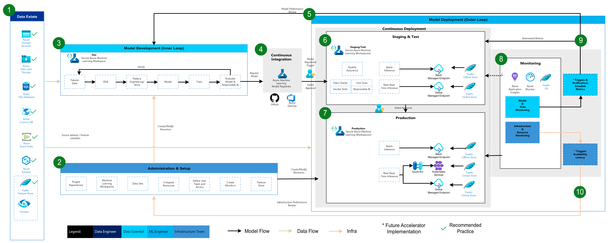

# Azure Machine Learning with Feathr Computer Vision Architecture

The Azure Machine Learning Computer Vision Architecture is based on the Classical Machine Learning Architecture with some modifications particular to supervised CV scenarios.

1. **Data Estate**

   This element illustrates the organization data estate and potential data sources and targets for a data science project. Data Engineers would be the primary owners of this element of the MLOps v2 lifecycle. The Azure data platforms in this diagram are neither exhaustive nor prescriptive. Images for Computer Vision scenarios may come from many different data sources. For efficiency when developing and deploying CV models with Azure Machine Learning, recommended Azure data sources for images are Azure Blob Storage and Azure Data Lake Storage.
2. **Administration & Setup**

   This element is the first step in the MLOps v2 Accelerator deployment. It consists of all tasks related to creation and management of resources and roles associated with the project. For CV scenarios, Administration & Setup of the MLOps v2 environment is largely the same as for Classical Machine Learning with the addition of creation of Image Labeling and Annotation projects that can use the Labeling feature of Azure Machine Learning or other tools.
3. **Model Development (Inner Loop)**

   The inner loop element consists of your iterative data science workflow performed within a dedicated, secure Azure Machine Learning Workspace. The primary difference between this workflow and the Classical Machine Learning scenario in that Image Labeling/Annotation is a key element of this development loop.
4. **Azure Machine Learning Registries**

   When the Data Science team has developed a model that is a candidate for deploying to production, the model can be registered in the Azure Machine Learning workspace registry. Continuous Integration (CI) pipelines triggered either automatically by model registration and/or gated human-in-the-loop approval promote the model and any other model dependencies to the model Deployment phase.
5. **Model Deployment (Outer Loop)**

   The Model Deployment or Outer Loop phase consists of pre-production staging and testing, production deployment, and monitoring of both model/data and infrastructure. Continuous Deployment (CD) pipelines manage the promotion of the model and related assets through production, monitoring, and potential retraining as criteria appropriate to your organization and use case are satisfied.
6. **Staging & Test**

   The Staging & Test phase can vary with customer practices but typically includes operations such as test deployments for endpoint performance, data quality checks, unit testing, and Responsible AI checks for model and data bias. For CV scenarios, retraining of the model candidate on production data may not be done due to resource and time constraints. Rather the data science team may have access to production data for model development and the candidate model registered from the development loop is the "final" model to be evaluated for production. This phase takes place in one or more dedicated, secure Azure Machine Learning Workspaces.
7. **Production Deployment**

   After a model passes the Staging & Test phase, the model can be promoted to production via human-in-the-loop gated approvals. Model deployment options include a Batch Managed Endpoint for batch scenarios or, for online, near-realtime scenarios, either an Online Managed Endpoint or to Kubernetes using Azure Arc. Production typically takes place in one or more dedicated, secure Azure Machine Learning Workspaces.
8. **Monitoring**

   Monitoring in staging/test and production enables you to collect metrics for and act on changes in performance of the model, data, and infrastructure. Model and data monitoring may include checking for model performance on new images. Infrastructure monitoring can watch for issues with endpoint response time, problems with deployment compute capacity, or network issues.
9. **Data & Model Monitoring - Events and Actions**

   The Data & Model monitoring and event/action phase of MLOps for Computer Vision is the key difference from Classical Machine Learning.  Automated retraining is typically not done in CV scenarios when model performance degradation on new images is detected. In this case, new images for which the model performs poorly must be reviewed and annotated by a human-in-the-loop and often the next action goes back to the Model Development loop for updating the model with the new images.
10. **Infrastructure Monitoring - Events and Actions**

    Based on criteria for infrastructure monitors of concern such as endpoint response lag or insufficient compute for the deployment, automated triggers and notifications can implement appropriate actions to take. This triggers a loop back to the Setup & Administration phase where the Infrastructure Team can investigate and potentially reconfigure environment compute and network resources.
