# Deployment Guide - Azure DevOps 

This document will guide you through using the MLOps V2 project generator to deploy a single-environment ("Prod") demo project using only Azure DevOps to host source repositories and pipelines. See notes at the end for guidance on multi-environment MLOps and adapting the pattern to your use case.

**Prerequisites:**
- One or more Azure subscription(s) based on whether you are deploying Prod only or Prod and Dev environments
- An Azure DevOps organization
- Ability to create Azure service principals to access / create Azure resources from Azure DevOps
- If using Terraform to create and manage infrastructure from Azure DevOps, install the [Terraform extension for Azure DevOps](https://marketplace.visualstudio.com/items?itemName=ms-devlabs.custom-terraform-tasks).


# Steps to Deploy

1. [Clone and Configure the MLOps V2 Solution Accelerator](#clone-and-configure-the-mlops-v2-solution-accelerator)  
Create a copy of the MLOps V2 Solution Accelerator in your organization that can be used to bootstrap new ML projects.

2. [Create and Configure a New ML Project Repo](#create-and-configure-a-new-ml-project-repo)  
Use the solution accelerator to create a new ML project according to your scenario and environments and configure it for deployment. 

3. [Deploy and Execute Azure Machine Learning Pipelines](#deploy-and-execute-azure-machine-learning-pipelines)  
Run Azure DevOps pipelines in your new project to deploy Azure Machine Learning infrastructure, deploy and run a training pipeline, and a deployment pipeline.
 

# **Clone and Configure the MLOps V2 Solution Accelerator**

This section guides you through creating an Azure DevOps project to contain the MLOps repositories and your ML projects, importing the MLOps repositories, and configuring the project with permissions to create new pipelines in the ML projects you generate.

Below are the three repositories that you will import. They each serve a different purpose and together make up the MLOPs V2 Solution Accelerator. They will used as a "project factory" to help you bootstrap new ML projects customized for your ML scenario, preferred Azure ML interface, CI/CD platform, and infrastructure provider.

| Repository | Role |
| ---        | ---  |
| https://github.com/Azure/mlops-v2 | The parent MLOps V2 repo. This contains project creation scripts and pipelines and MLOps V2 documentation |
| https://github.com/Azure/mlops-project-template | This repo contains templates for the supported ML scenarios and their associated ML and CI/CD pipelines. |
| https://github.com/Azure/mlops-templates | This repo contains Azure ML interface helpers and infrastructure deployment templates. |

---
   1. Navigate to [Azure DevOps](https://go.microsoft.com/fwlink/?LinkId=2014676&githubsi=true&clcid=0x409&WebUserId=2ecdcbf9a1ae497d934540f4edce2b7d) and the organization where you want to create the project. [Create a new organization](https://learn.microsoft.com/en-us/azure/devops/organizations/accounts/create-organization?view=azure-devops) for your project, if needed. 
   
   2. Create a new project named `mlops-v2`. 
   
   <p align="center">
      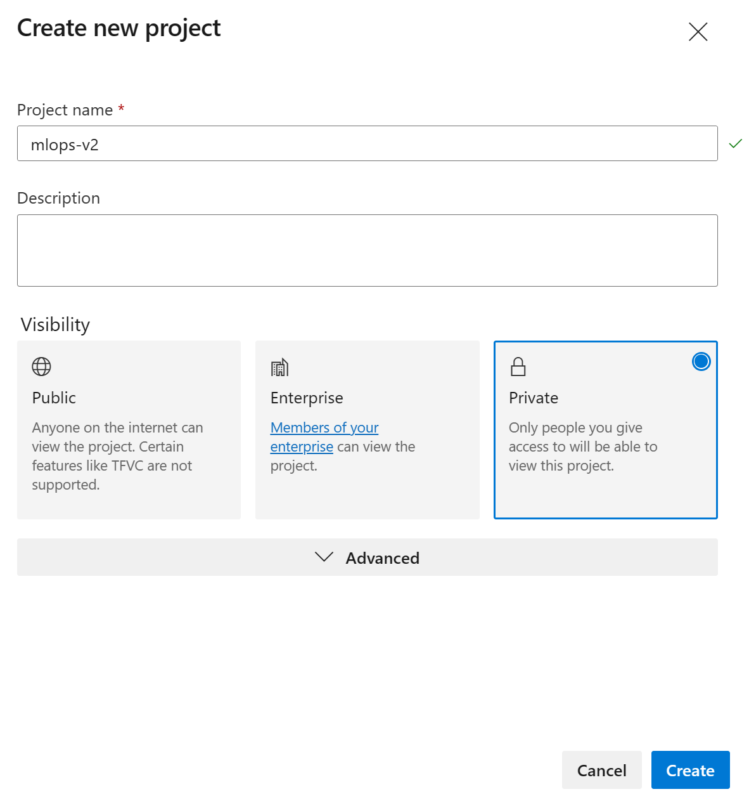
   </p>

   3.  Import the MLOps V2 repositories. In your new `mlops-v2` project, select the Repos section on the left side.
   
         <p align="center">
            
         </p>
            
         The default repo, `mlops-v2`, is empty. Under "Import a repository", select **Import**.
         
         <p align="center">
            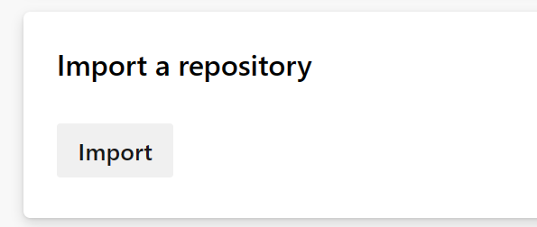
         </p>

         Enter https://github.com/Azure/mlops-v2 into the Clone URL field. Click import at the bottom of the page.

         <p align="center">
            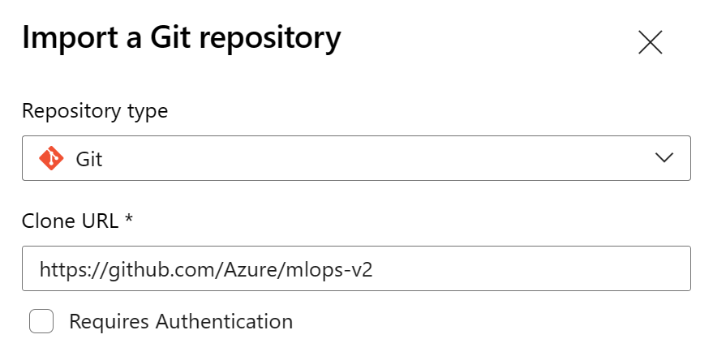
         </p>

         At the top of the page, open the Repos drop-down and repeat the import for the following repositories:  
         - https://github.com/Azure/mlops-project-template
         - https://github.com/Azure/mlops-templates 

         <p align="center">
            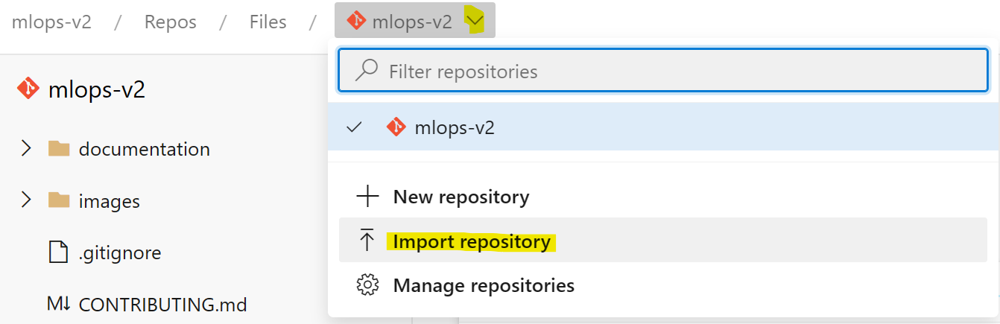
         </p>

         When done, you should see [all three MLOps V2 repositories](../structure/README.md#repositories) in your project.

         <p align="center">
            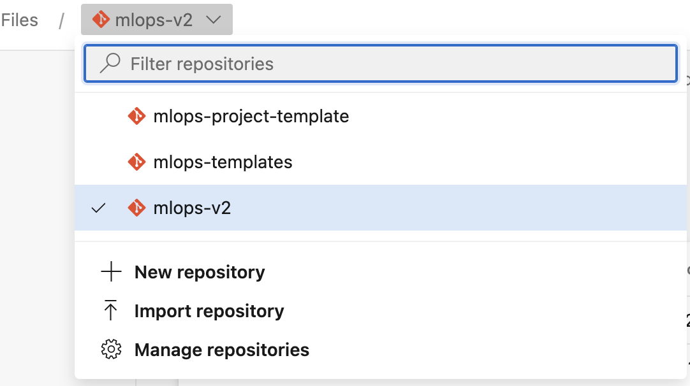
         </p>

         >**Important:**
         >
         >Azure DevOps may not import the three MLOps V2 repos with the default branch set to `main`. If not, select **Branches** under the **Repos** section on the left and [reset the default branch](https://learn.microsoft.com/en-us/azure/devops/repos/git/change-default-branch?view=azure-devops) to `main` for each of the three imported repos.

   4. Lastly, you will grant the MLOps Solution Accelerator permission to create new pipelines in the ML projects you will create. In your mlops-v2 project, select the Pipelines section on the left side.

      <p align="center">
         
      </p>

      Select the three vertical dots next to **Create Pipeline** and select **Manage Security**.

      <p align="center">
         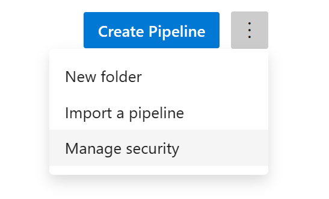
      </p>

      Select the "`<projectname> Build Service`" account for your project under the Users section. Change the permission for **Edit build pipeline** to **Allow**

      <p align="center">
            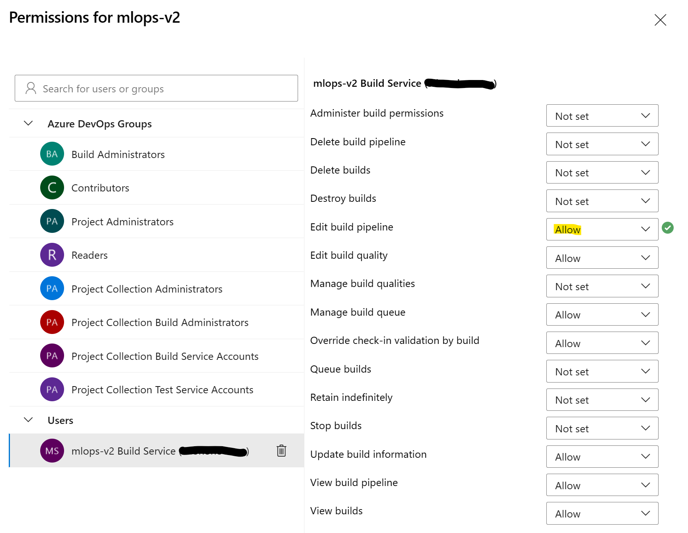
      </p>

You are done cloning and configuring the MLOps V2 Solution Accelerator. Next, you will create a new ML project using the accelerator templates.


# Create and Configure a New ML Project Repo

In this section, you will create your ML project repository, set permissions to allow the solution accelerator to interact with your project, and create service principals so your Azure pipelines can interact with Azure Machine Learning.

### Creating the project repository
---

 1. Open the **Repos** drop-down once more and select **New repository**. Create a new repository for your ML project. In this example, the repo is named `taxi-fare-regression`. The MLOps V2 templates will be used to populate this repo based on your  choices for ML scenario, Azure ML interface, and infrastructure provider.

      Leave **Add a README** selected to initialize the repo with a `main` branch.

      <p align="center">
         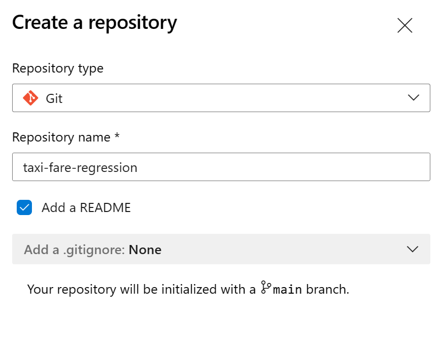
      </p>

      You should now have your `taxi-fare-regression` repo and [all three MLOps V2 repositories](../structure/README.md#repositories) in your Azure DevOps project.
      
      <p align="center">
         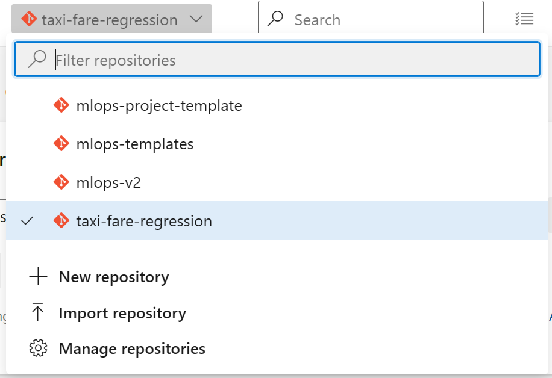
      </p>

### Setting project permissions
---

2. Next, set access permissions on your ML project repository. Open the **Project settings** at the bottom of the left hand navigation pane

      <p align="left">
            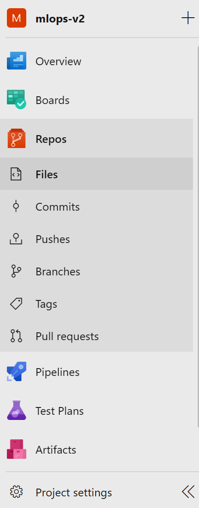
      </p>

      Under the **Repos** section, select **Repositories**.  
      * Select the `taxi-fare-regression`  repository.  
      * Select the **Security** tab.  
      * Under **User permissions**, select the "`<projectname> Build Service`" account for your project under the Users section.  
      * Change the permissions for **Contribute** and **Create branch** to **Allow**.

      <p align="center">
            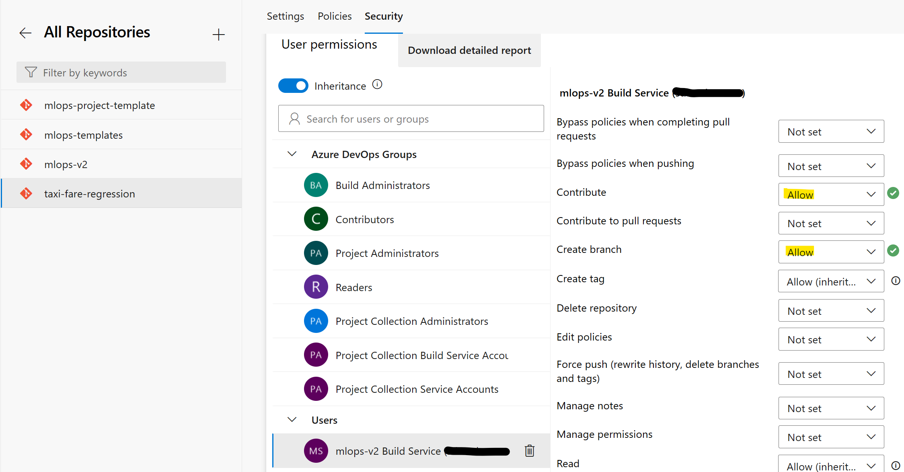
      </p>
  
### Initializing the new ML project repo
---

In this step, you will run an Azure DevOps pipeline, `initialise-project`, that will prompt you for the properties of the ML project you want to build including the ML scenario (classical, computer vision, or natural language processing), the interface you will use to interface with Azure ML (CLI or SDK), and the CI/CD tool and infrastructure provider your organization uses. When run, the pipeline will populate the empty repo you created in the previous steps with the correct elements of the template repos to build your project.


3. Open the Pipelines section again and select **Create Pipeline** in the center of the page.
      <p align="center">
            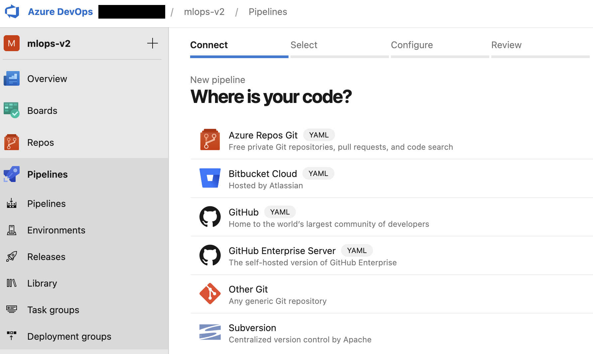
      </p>

   - Select **Azure Repos Git**
   - Select the **mlops-v2** repository
   - Select **Existing Azure Pipelines YAML file**
   - Ensure the selected branch is **main**
   - Select the `/.azuredevops/initialise-project.yml` file in the Path drop-down
   - Click Continue 

   On the pipeline review page, drop-down the **Run** menu and select **Save** the pipeline before running it. 

      <p align="center">
            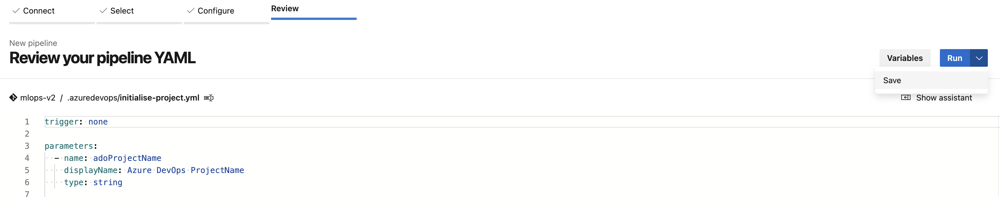
      </p>


   Now select **Run pipeline**.

      <p align="center">
            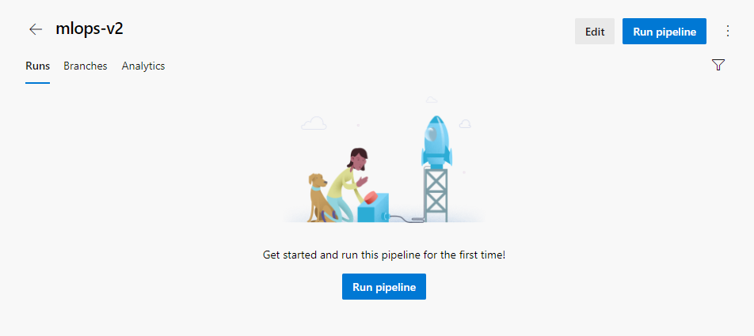
      </p>
   

   This action will run an Azure DevOps pipeline that prompts you for some parameters of your project. You can select the ML scenario, the interface the ML pipelines will use to interact with Azure Machine Learning, and the Infrastructure-as-Code provider for your organization. Below shows the parameter selection panel followed by explanations of each option:

      <p align="center">
            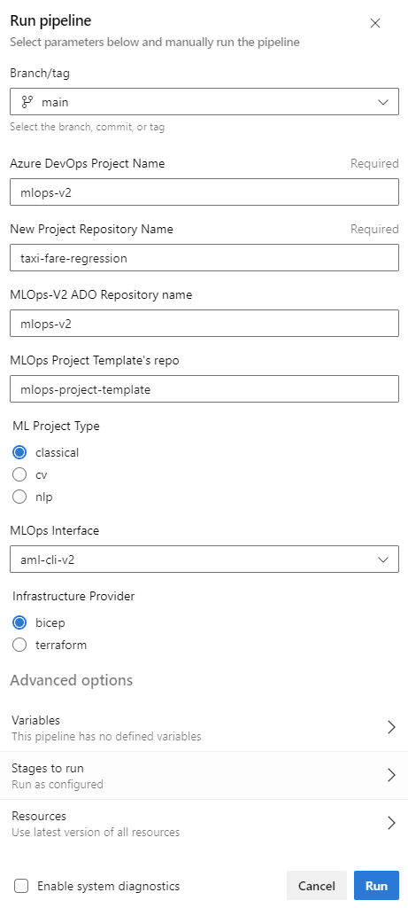
      </p>

   ### Project Parameters
---

   - **Azure DevOps Project Name** : This is the name of the Azure DevOps project you are running the pipeline from. In this case, `mlops-v2`.
   - **New Project Repository Name**: The name of your new project repository created in step 1. In this example, `taxi-fare-regression`.
   - **MLOps Project Template Repo Name**: Name of the MLOps project template repo you imported previously. The default is **mlops-project-template**. Leave as default.
   - **ML Project type**:
     - Choose **classical** for a regression or classification project
     - Choose **cv** for a computer vision project
     - Choose **nlp** for natural language  projects
   - **MLOps Interface**: Select the interface to the Azure ML platform, either CLI or SDK.
     - Choose **aml-cli-v2** for the Azure ML CLI v2 interface. This is supported for all ML project types.
     - Choose **python-sdk-v1** to use the Azure ML python SDK v1 for training and deployment of your model. This is supported for Classical and CV project types.
     - Choose **python-sdk-v2** to use the Azure ML python SDK v2 for training and deployment of your model. This is supported for Classical and NLP project types.
     - Choose **rai-aml-cli-v2** to use the Responsible AI cli tools for training and deployment of your model. This is supported only for Classical project types at this time.

   - **Infrastructure Provider**: Choose the provider to use to deploy Azure infrastructure for your project.
     - Choose **Bicep** to deploy using Azure Bicep templates
     - Choose **terraform** to use terraform based templates. 

   
   After selecting the parameters, click **Run** at the bottom of the panel. The first run of the pipeline will prompt you to grant access to the repositories you created.

   <p align="center">
            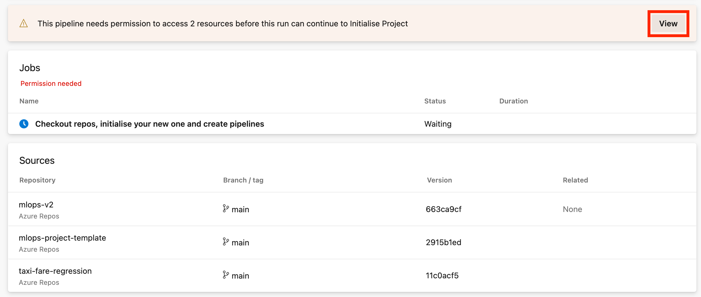
   </p>

   Click **View** to see the permissions waiting for review.

   <p align="center">
            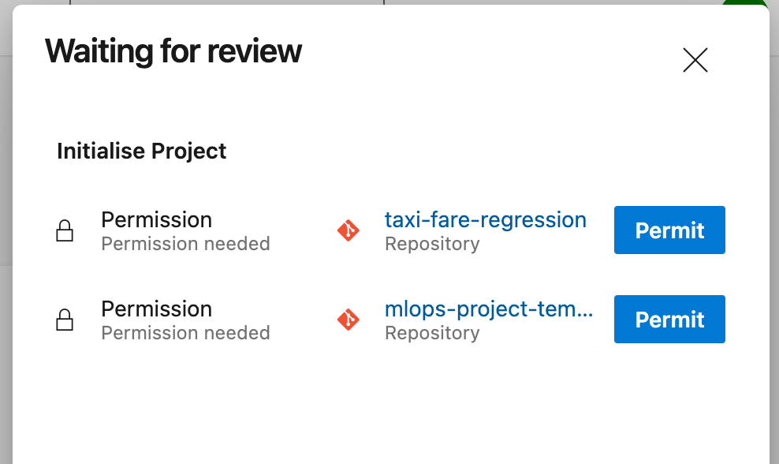
   </p>

   For each of the repos, click **Permit** waiting for review.

   The pipeline run should take a few minutes. When the pipeline run is complete and successful, go back to **Repos** and look at the contents of your ML project repo, `taxi-fare-regression`. The solution accelerator has populated the project repository according to your configuration selections. 

   <p align="center">
            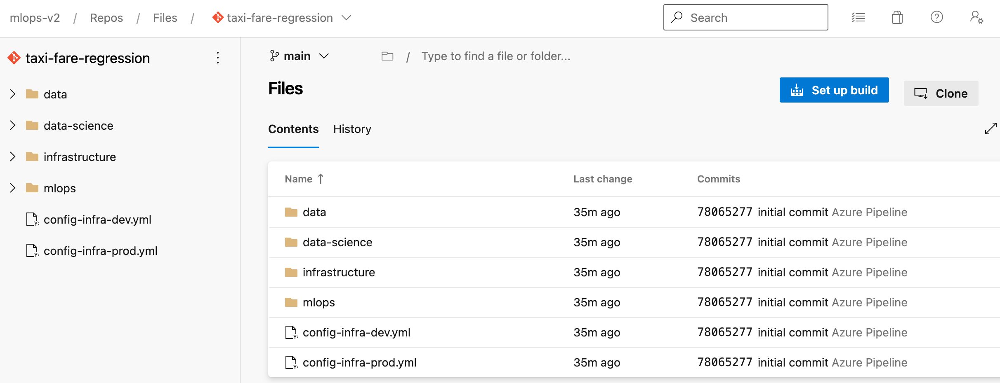
   </p>

   The structure of the project repo is as follows:   

   | File | Purpose |
   | --- | --------- |
   | `/data` |     Sample data for the example project  |
   | `/data-science` | Contains python code for the data science workflow |
   | `/infrastructure` | IaC code for deploying the Azure Machine Learning infrastructure  |
   | `/mlops` | Azure DevOps pipelines and Azure Machine Learning pipelines for orchestrating deployment of infrastructure and ML workflows.  |
   | `config-infra-dev.yml`  | Configuration file to define dev environment resources |
   | `config-infra-prod.yml` | Configuration file to define production environment resources |


 
### Create and Configure Service Principals and Connections
---

For Azure DevOps pipelines to create Azure Machine Learning infrastructure and deploy and execute Azure ML pipelines, it is necessary to create an Azure service principal for each Azure ML environment (Dev and/or Prod) and configure Azure DevOps service connections using those service principals. These service princiapls can be created using one of the two methods below:

<details>
<summary>Create Service Principal from Azure Cloud Shell</summary>

1. Launch the <a href="https://shell.azure.com"> Azure Cloud Shell </a>. (If this the first time you have launched the cloud shell, you will be required to create a storage account for the cloud shell.)  

2. If prompted, choose **Bash** as the environment used in the Cloud Shell. You can also change environments in the drop-down on the top navigation bar

   <p align="center">
                  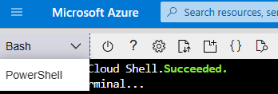
   </p>


3. Copy the bash commands below to your computer and update the **projectName**, **subscriptionId**, and **environment** variables with the values for your project. If you are creating both a Dev and Prod environment you will need to run this script once for each environment, creating a service principal for each. This command will also grant the **Contributor** role to the service principal in the subscription provided. This is required for Azure DevOps to properly deploy resources to that subscription. 

   ``` bash
   projectName="<your project name>"
   roleName="Contributor"
   subscriptionId="<subscription Id>"
   environment="<Dev|Prod>" #First letter should be capitalized
   servicePrincipalName="Azure-ARM-${environment}-${projectName}"
   # Verify the ID of the active subscription
   echo "Using subscription ID $subscriptionId"
   echo "Creating SP for RBAC with name $servicePrincipalName, with role $roleName and in scopes /subscriptions/$subscriptionId"
   az ad sp create-for-rbac --name $servicePrincipalName --role $roleName --scopes /subscriptions/$subscriptionId
   echo "Please ensure that the information created here is properly save for future use."
   ```

4. Copy your edited commmands into the Azure Shell and run them (<kbd>Ctrl</kbd> + <kbd>Shift</kbd> + <kbd>v</kbd>).

   <p align="center">
                  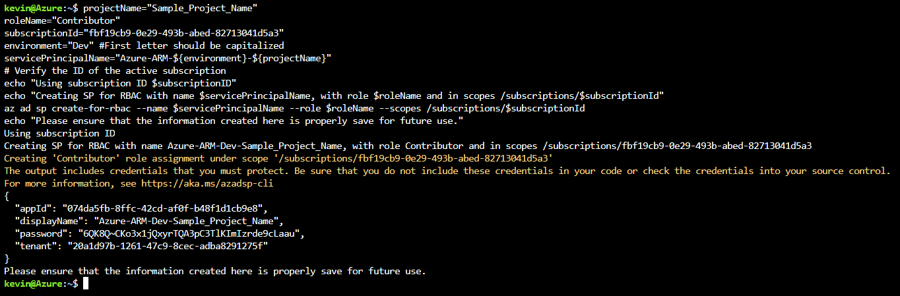
   </p>


5. After running these commands you will be presented with information related to the service principal. Save this information to a safe location, it will be used later in the demo to configure Azure DevOps.

   ```
   {
      "appId": "<application id>",
      "displayName": "Azure-ARM-dev-Sample_Project_Name",
      "password": "<password>",
      "tenant": "<tenant id>"
   }
   ```

6. Repeat **step 3** if you are creating service principals for Dev and Prod environments.

7. Close the Cloud Shell once the service principals are created. 

</details>

<details>
<summary>Create Service Principal from the Azure Portal</summary>

1. Navigate to <a href="https://entra.microsoft.com/#view/Microsoft_AAD_RegisteredApps/ApplicationsListBlade/quickStartType~/null/sourceType/Microsoft_AAD_IAM">Azure App Registrations</a> 

2. Select **New registration**.

   <p align="center">
                  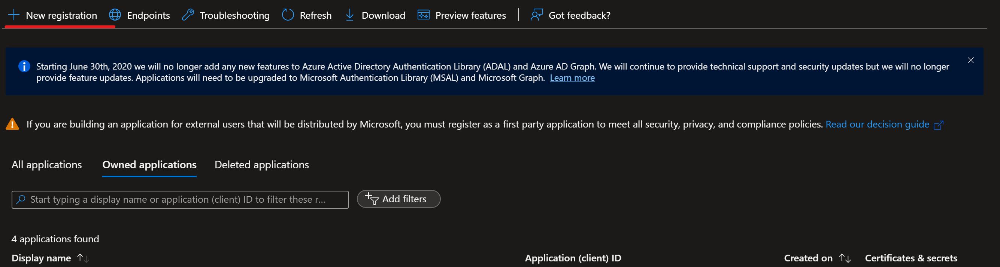
   </p>


3. Go through the process of creating a Service Principle (SP) selecting "Accounts in any organizational directory (Any Azure AD directory - Multitenant)" and name it  "Azure-ARM-Dev-ProjectName". Once created, repeat and create a new SP named "Azure-ARM-Prod-ProjectName". Please replace "ProjectName" with the name of your project so that the service principal can be uniquely identified. 

4. Go to "Certificates & Secrets" and add for each SP "New client secret", then store the value and secret seperately.

5. To assign the necessary permissions to these principals, select your respective <a href="https://portal.azure.com/#view/Microsoft_Azure_Billing/SubscriptionsBlade?">subscription</a>  and go to **Access control (IAM)**. Select +Add then select "Add Role Assigment.

   <p align="center">
                  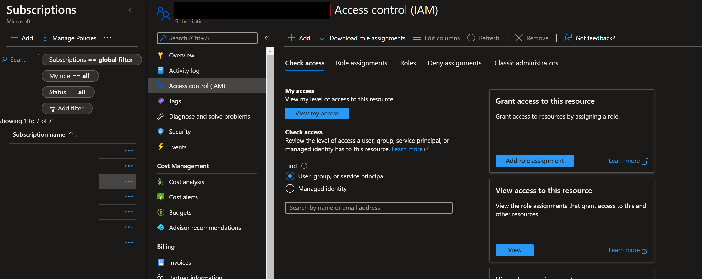
   </p>


6. Select Contributor and add members selecting + Select Members. Add the member "Azure-ARM-Dev-ProjectName" as create before.

   <p align="center">
                  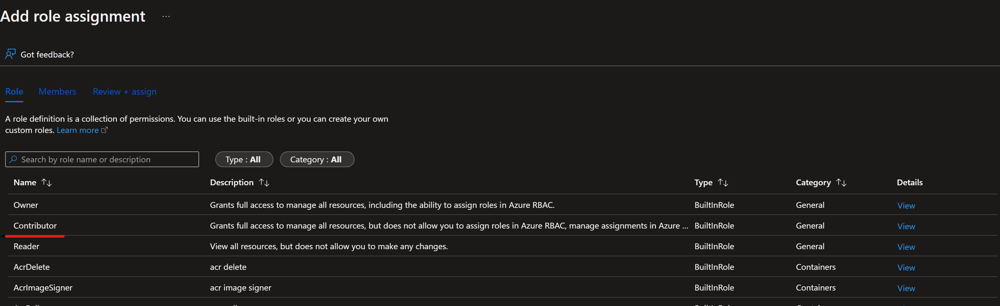
   </p>


7. Repeat step here, if you deploy Dev and Prod into the same subscription, otherwise change to the prod subscription and repeat with "Azure-ARM-Prod-ProjectName". The basic SP setup is successfully finished.
</details>


### Create Service Connections
---

Select **Project Settings** at the bottom left of the project page and select **Service connections**.
   
   <p align="left">
      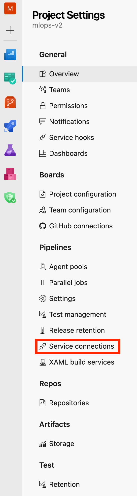
   </p>

   
Select **Create service connection**

* For service, select **Azure Resource Manager** and **Next**  
* For authentication method, select **Service principal (manual)** and **Next**  

Complete the new service connection configuration using the information from your tenant, subscription, and the service principal you created for Prod.

   <p align="left">
      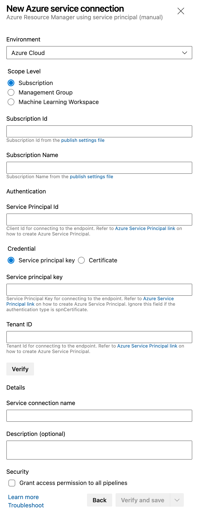
   </p>

Name this service connection **Azure-ARM-Prod**.  Check **Grant access permission to all pipelines**. and click **Verify and save**.

### Create Azure DevOps Environment
---

The pipelines in each branch of your ML project repository will depend on an Azure DevOps environment. These environments should be created before deployment.

To create the prod environment, select **Pipeline** in the left menu and **Environments**. Select **New environment**

   <p align="center">
      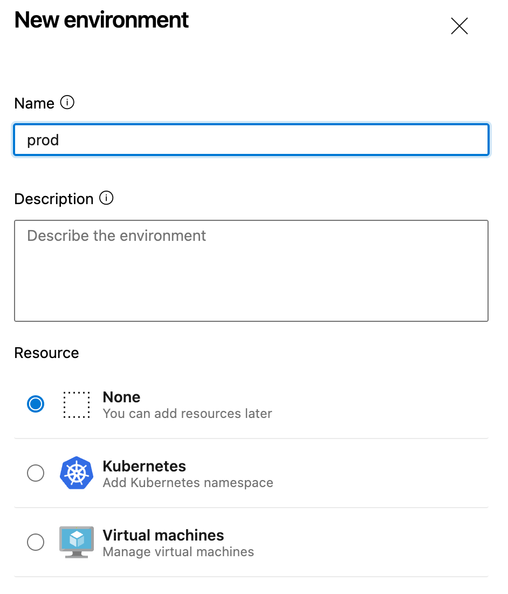
   </p>

Name the new environment `prod` and click **Create**. The environment will initially be empty and indicate "Never deployed" but this status will update after the first deployment.

The configuration of your new ML project repo is complete and you are ready to deploy your Azure Machine Learning infrastructure and deploy ML training and model deployment pipelines in the next section.


# Deploy and Execute Azure Machine Learning Pipelines

Now that your ML project is created, this last section will guide you through executing Azure DevOps pipelines created for you that will first deploy Azure Machine Learning infrastructure for your project then deploy a model training pipeline followed by a model deployment pipeline. 

Each pipeline may have different roles associated with its deployment and management. For example, infrastructure by your IT team, model training by your data scientists and ML engineers, and model deployment by ML engineers. Likewise, depending on the environments and project branches you have created, you may deploy infrastructure for both **dev** and **prod** Azure ML infrastructure, with data scientists developing the training pipeline in the **dev** environment and branch and, when the model is acceptable, opening a pull request to the **main** branch to merge updates and run the model deployment pipeline in the **prod** environment.

Depending on the options you chose when initializing the project, you should have one infrastructure deployment pipeline, one model training pipeline, and one or two model deployment pipelines in your ML project. Model deployment options are online-endpoint for near real-time scoring and batch-endpoint for batch scoring. To see all pipelines in your project, select the **Pipelines** section from the left navigation menu, then **Pipelines**, then the **All** tab. For the example project in this guide, you should see:


   <p align="left">
      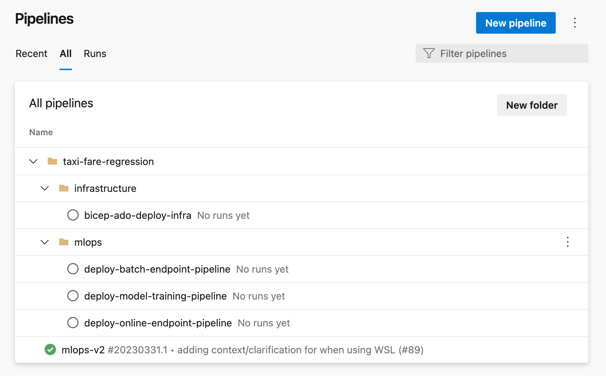
   </p>


### Deploy Azure Machine Learning Infrastructure
---

The first task for your ML project is to deploy Azure Machine Learning infrastructure in which to develop your ML code, define your datasets, define your ML pipelines, train models, and deploy your models in production. This pipeline deployment is typically managed by your IT group responsible for ensuring that the subscription is able to create the infrastructure needed. The infarstructure is created by executing the Azure DevOps deploy-infra pipeline. Before doing this, you will customize environment files that define unique Azure resource groups and Azure ML workspaces for your project.

To do this, go back to **Repos** and your ML project repo, in this example, `taxi-fare-regression`. You will see two files in the root directory, `config-infra-prod.yml` and `config-infra-dev.yml`.
   
   <p align="center">
            
   </p>

Making sure you are in the **main** branch, click on `config-infra-prod.yml` to open it. 

Under the Global section, you will see properties for `namespace`, `postfix`, and `location`.

   ```bash
   # Prod environment
   variables:
      # Global
      ap_vm_image: ubuntu-20.04

      namespace: mlopsv2 #Note: A namespace with many characters will cause storage account creation to fail due to storage account names having a limit of 24 characters.
      postfix: 0001
      location: eastus
      environment: prod
      enable_aml_computecluster: true
   ```

The two properties `namespace` and `postfix` will be used to construct a unique name for your Azure resource group, Azure ML workspace, and associated resources. The naming convention for your resource group will be `rg-<namespace>-<postfix>prod`. The name of the Azure ML workspace will be `mlw-<namespace>-<postfix>prod`. The `location` property will be the Azure region into which to provision these resources.
   
Edit `config-infra-prod.yml` to set the variables for your environment. You can clone the repo, edit the file, and push/PR to make the change or select **Edit** in the upper right of the screen to edit the file within Azure DevOps. If editing in place, change `namespace`, `postfix`, and `location` to your preferences and click **Commit**

If the `enable_aml_computecluster` property is set to true, the infra deployment pipeline will pre-create Azure ML compute clusters for your training. In the case of CV or NLP scenarios, it will create both CPU-based and GPU-based compute clusters so ensure that your subscription has GPU compute available. 

Now you are ready to run the infrastructure deployment pipeline. Open the **Pipelines** section again and select **New pipeline** in the upper right of the page.

   <p align="center">
         
   </p>

   - Select **Azure Repos Git**
   - Select the **taxi-fare-regression** repository
   - Select **Existing Azure Pipelines YAML file**
   - Ensure the selected branch is **main**
   - Select the `/infrastructure/pipelines/bicep-ado-deploy-infra.yml` file in the Path drop-down
   - Click Continue 

Now you will see the pipeline details.

   <p align="center">
         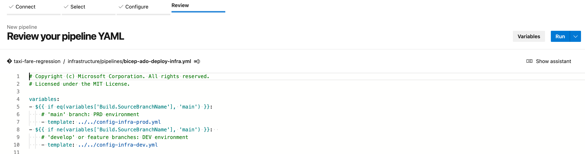
   </p>

 Click **Run** to execute the pipeline. This will take a few minutes to finish. When complete, you can view the pipeline jobs and tasks by selecting **Pipelines** then **taxi-fare-regression** under **Recently run pipelines**. 
 
   <p align="center">
         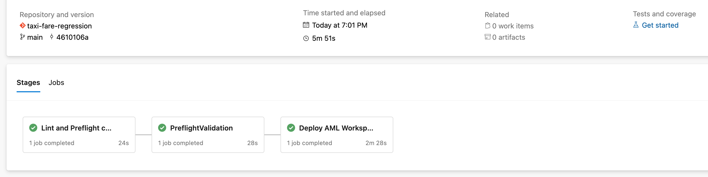
   </p>

 The pipeline should create the following artifacts which you can view in your Azure subscription:

   * Resource Group for your Workspace
   * Azure Machine Learning Workspace and associated resources including Storage Account, Container Registry, Application Insights, and Keyvault 
   * Inside the workspace, an AmlCompute cluster will be created
   
Your Azure Machine Learning infrastructure is now deployed and you are ready to deploy an ML model training pipeline.
 
### Deploy Azure Machine Learning Model Training Pipeline
---

The solution accelerator includes code and data for a sample end-to-end machine learning pipeline which trains a linear regression model to predict taxi fares in NYC. The pipeline is made up of multiple steps for data prep, training, model evaluation, and model registration. Sample pipelines and workflows for the Computer Vision and NLP scenarios will have different steps.  

In this section you will execute an Azure DevOps pipeline that will create and run an Azure Machine Learning pipeline. Together, they perform the following steps:

* Connect to the Azure Machine Learning workspace created by the infrastructure deployment  
* Create a compute cluster for training in the workspace   
* Register the training dataset in the workspace   
* Prepare data for training  
* Registers a custom python environment with the packages required for this model  
* Train a linear regression model to predict taxi fares  
* Evaluate the model on the test dataset against the performance of any previously-registered models  
* If the new model performs better, register the model as an MLflow model in the workspace for later deployment

To deploy the model training pipeline, open the **Pipelines** section again and select **New pipeline** in the upper right of the page
   
   - Select **Azure Repos Git**
   - Select the **taxi-fare-regression** repository
   - Select **Existing Azure Pipelines YAML file**
   - Ensure the selected branch is **main**
   - Select the `/mlops/devops-pipelines/deploy-model-training-pipeline.yml` file in the Path drop-down
   - Click Continue 

Next you can see the pipeline details.

   <p align="center">
         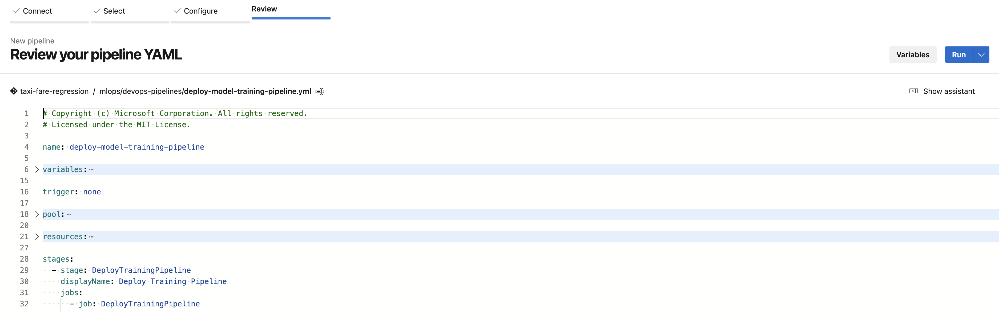
   </p>

 Click **Run** to execute the pipeline. This will take several minutes to finish. When complete, you can view the pipeline jobs and tasks by selecting **Pipelines** then **taxi-fare-regression** under **Recently run pipelines**. The pipeline run will be tagged `#deploy-model-training-pipeline`. Drill down into the pipeline run to see the **DeployTrainingPipeline** job. Click on the job to see pipeline run details.

   <p align="center">
         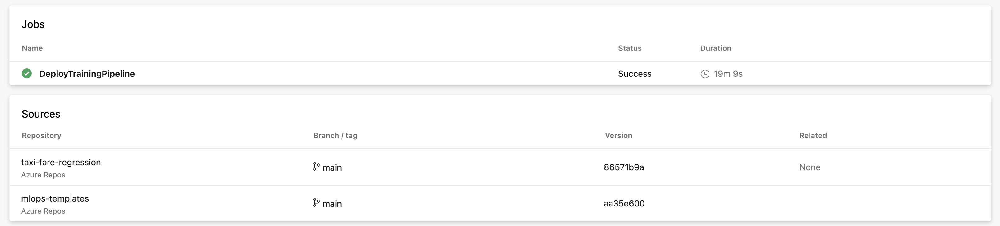
   </p>
   
Now you can open your Azure Machine Learning workspace to see the training run artifacts. Open a browser to https://ml.azure.com and login with your Azure account. You should see your Azure Machine Learning workspace under the **Workspaces** tab on the left. Your workspace name will have a name built from the options you chose in the `config-infra-prod.yml` file with the format **mlw-(namespace)-(postfix)(environment)**. For example, **mlw-mlopsv2-0001prod**. Click on your workspace. You will be presented with the Azure ML Studio home page for the workspace showing your training pipeline jobs under **Recent jobs**.

   <p align="center">
         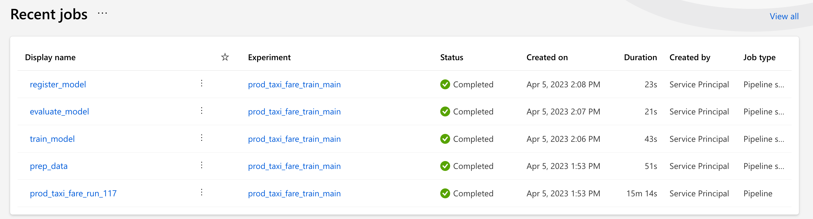
   </p>

You can now explore the artifacts of the pipeline run from the workspace navigation menus on the left:  
* Select **Data** to see and explore the registered `taxi-data` Data asset.  
* Select **Jobs** to see and explore the `prod_taxi_fare_train_main` Experiment.  
* Select **Pipelines** to see and explore the `prod_taxi_fare_run` pipeline run.  
* Select **Environments** then **Custom environments** to see the custom `taxi-train-env` environment registered by the pipeline.  
* Select **Models** to see the `taxi-model` registered by the training pipeline.  
* Select **Compute** then **Compute clusters** to see the `cpu-cluster` created by the training pipeline.  

This section demonstrated end-to-end model training in Azure DevOps/Azure ML pipelines, creating all necessary assets as part of the pipeline. With a trained model registered in the Azure Machine Learning workspace, the next section will guide you through deploying the model to as either a real-time endpoint or batch scoring endpoint. 

### Deploy Azure Machine Learning Model Deployment Pipeline
---

In this section you will execute an Azure DevOps pipeline that will create and run an Azure Machine Learning pipeline that deploys your trained model to an endpoint. This can be a online managed (real-time) endpoint called by an application to score new data or a batch managed endpoint to score larger blocks of new data. In this example, there are two sample model deployment pipelines provided, one for online endpoint and one for batch endpoint. You can deploy one or the other or both.

For each type of endpoint, the deployment steps are essentially the same:

* Connect to the Azure Machine Learning workspace created by the infrastructure deployment  
* Create a new compute cluster (batch managed endpoint only)
* Create an endpoint in Azure Machine Learning for the model deployment  
* Create a deployment of the trained model on the new endpoint  
* Update traffic allocation for the endpoint  
* Test the deployment with sample data  

For batch managed endpoint deployments, a new compute cluster is created to process batch scoring requests. For online managed endpoints, the compute to process requests is managed by Azure Machine Learning.

To deploy the model deployment pipeline, open the **Pipelines** section again and select **New pipeline** in the upper right of the page
   
   - Select **Azure Repos Git**
   - Select the **taxi-fare-regression** repository
   - Select **Existing Azure Pipelines YAML file**
   - Ensure the selected branch is **main**
   - Select `/mlops/devops-pipelines/deploy-online-endpoint-pipeline.yml` or `/mlops/devops-pipelines/deploy-batch-endpoint-pipeline.yml` in the Path drop-down depending on your choice
   - Click Continue 

 Again, from the pipeline details path, click **Run** to execute the pipeline. This will take several minutes to finish. When complete, you can view the pipeline jobs and tasks by selecting **Pipelines** then **taxi-fare-regression** under **Recently run pipelines**. The pipeline run will be tagged `#deploy-online-endpoint-pipeline` or `#deploy-batch-endpoint-pipeline`. Drill down into the pipeline run to see the **DeployOnlineEndpoint** or **DeployBatchEndpoint** job and click on the job to see pipeline run details.

Once the deployment pipeline execution is complete, open your Azure Machine Learning workspace to see the deployed endpoints. Select **Endpoints** from the workspace navigation menu on the left. By default, you will see a list of deployed **Online endpoints**. If you chose to deploy the sample online endpoint pipeline, you should see your `taxi-online-(namespace)(postfix)prod` endpoint.

   <p align="center">
         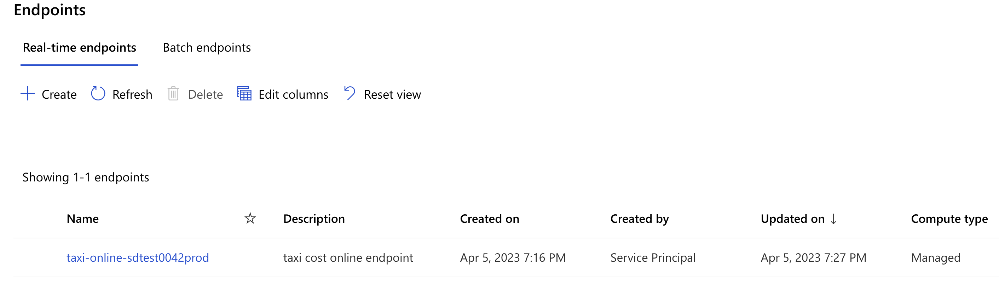
   </p>

Click on this endpoint instance to explore the details of the online endpoint model deployment. 

If you deployed the batch managed endpoint, select **Batch endpoints** on the **Endpoints** page to see your `taxi-batch-(namespace)(postfix)prod` endpoint. Click on this endpoint instance to explore the details of the batch endpoint model deployment. 

   <p align="center">
         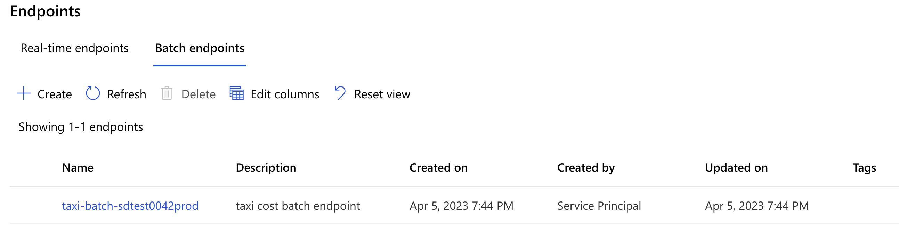
   </p>

For the batch endpoint, you can also select **Compute** and ***Compute clusters** to see the cluster created to support batch request processing.

   <p align="center">
         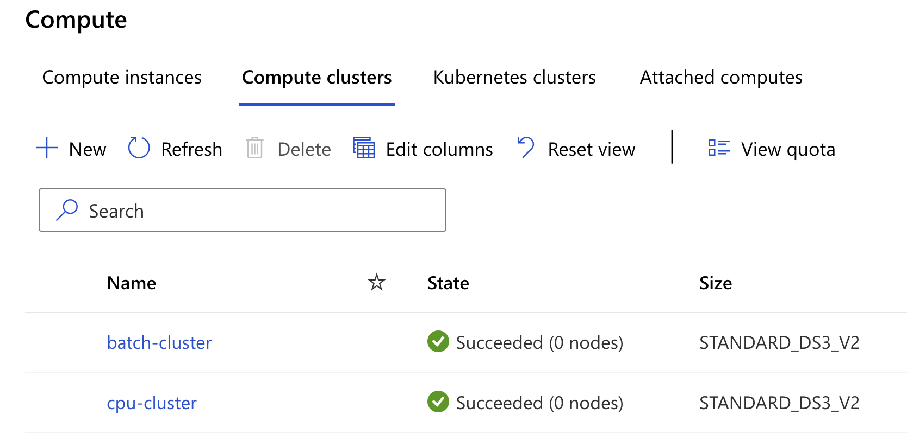
   </p>

This section demonstrated use of a pipeline to deploy a trained model to a managed online or managed batch endpoint in Azure Machine Learning.

The single-environment deployment of this MLOps solution accelerator is complete. See the next section for information on adapting this pattern to your use case and broader MLOps practices.

# MLOps Next Steps

To adapt this pattern to your use case and code, a guide to modifying files and pipelines in the ML project repo is below:

### `/data`  

In the `/data` directory, you can place your data to be registered with Azure ML. A `data.yml` file describing the dataset is used by the training pipeline in `/mlops/azureml/train/` and should be modified as needed for your data. Likewise, the training pipeline should be modified to refer to your dataset.

### `/data-science/src`

In this directory you will modify, add, or remove code for your data science workflow.

### `/data-science/environment`  

In this directory, modify `train-conda.yml` to define the python environment required by your model training.

### `/infrastructure`  

This directory contains the infrastructure template and infrastructure pipeline for your Azure ML environment. In general, it should not need modification but review by your IT and verification you can create the defined resources is recommended.

### `/mlops/azureml/train`  

This directory contains the Azure ML yaml definitions for your dataset (`data.yml`), your python environment (`train-env.yml`), and the Azure ML training pipeline itself (`pipeline.yml`). Modify these as necessary to correctly refer to your data, environment, and python code steps as needed.

### `/mlops/azureml/deploy/batch` and `/mlops/azureml/deploy/online`  

These directories contain the yaml definitions and Azure ML pipelines for deployment of your model endpoints. Modify these as needed for your endpoint and model type.

### `/devops-pipelines`  

This directory contains the Azure DevOps pipeline definitions for deployment of Azure ML model training and endpoint pipelines. In general, these should need minimal changes except for updating references to data and training pipelines.

## Next Steps in MLOps

This guide illustrated using Azure DevOps pipelines and Azure Machine Learning pipelines to adopt training automation, deployment, and repeatability for your data science workflow for a single Azure ML environment. Follow on MLOps practices may include the following:

* By default, the Azure DevOps pipelines in this accelerator do not execute unless manually triggered. This is to avoid unnecesary automatic runs during initial deployment of the accelerator. However, you may want to modify the pipelines to enhance automation. A few examples:
   * Modify the deployed [Azure ML model training pipeline to run on a schedule](https://learn.microsoft.com/en-us/azure/machine-learning/how-to-schedule-pipeline-job?tabs=cliv2)  
   * Modify the manual trigger on the [Azure DevOps deploy-model-training-pipeline to trigger on a schedule](https://learn.microsoft.com/en-us/azure/devops/pipelines/process/scheduled-triggers?view=azure-devops&tabs=yaml)  
   * Modify the Azure DevOps model deployment pipeline to [trigger upon successful completion of the model training pipeline](https://learn.microsoft.com/en-us/azure/devops/pipelines/process/pipeline-triggers?view=azure-devops) instead of a manual trigger

* Trunk-based development using development and test/staging branches in Azure DevOps. Development and Production environments are typically separated. You may create an additional Dev branch in your project repo and deploy a development Azure ML environment from that. when code and model development in that environment is satisfactory, code and pipeline changes can be merged into the main branch and updates deployed to Prod. A `config-infra-dev.yml` example is provided in the project repo. To create this environment, repeat the steps in this guide from a dev branch in your ML project repo. Note that you should create a matching `dev` pipeline environment in Azure DevOps and new Azure service principal for an **Azure-ARM-Dev** service connection.

* Future work on this MLOps solution accelerator will include:  
   * Integration of the [Azure Machine Learning registries](https://learn.microsoft.com/en-us/azure/machine-learning/how-to-manage-registries?tabs=cli) allowing you to register models and other artifacts from your development environment then deploying them in production directly.
   * Azure Machine Learning data drift monitoring
   * Integrated feature store
   * Deployment of secured Azure ML environments in a vnet
   
For questions, problems, or feature requests, please [submit an issue](https://github.com/Azure/mlops-v2/issues) or reach out to the development team at Microsoft.