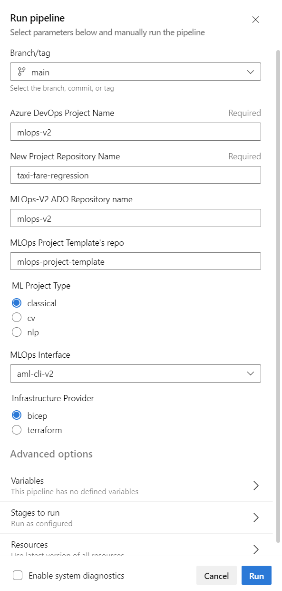
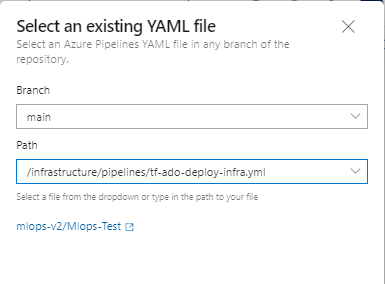

# Deployment Guide - Azure DevOps 

This document will guide you through deploying the MLOps V2 project generator and example project using only Azure DevOps to host source repositories and pipelines.

**Prerequisites:**
- One or more Azure subscription(s) based on whether you are deploying Prod only or Prod and Dev environments
- An Azure DevOps organization
- Ability to create Azure service principals to access / create Azure resources from Azure DevOps
- If using Terraform to create and manage infrastructure from Azure DevOps, install the [Terraform extension for Azure DevOps](https://marketplace.visualstudio.com/items?itemName=ms-devlabs.custom-terraform-tasks).


# Steps to Deploy

1. [Clone and Configure the MLOps V2 Solution Accelerator](#clone-and-configure-the-mlops-v2-solution-accelerator)  
Create a copy of the MLOps V2 Solution Accelerator in your organization that can be used to bootstrap new ML projects.

2. [Create and Configure a New ML Project Repo](#create-and-configure-a-new-ml-project-repo)  
Use the solution accelerator to create a new ML project according to your scenario and environments and configure it for deployment. 

3. [Deploy and Execute Azure Machine Learning Pipelines](#deploy-and-execute-azure-machine-learning-pipelines)  
Run Azure DevOps pipelines in your new project to deploy Azure Machine Learning infrastructure, deploy and run a training pipeline, and a deployment pipeline.
 

# **Clone and Configure the MLOps V2 Solution Accelerator**

This section guides you through creating an Azure DevOps project to contain the MLOps repositories and your ML projects, importing the MLOps repositories, and configuring the project with permissions to create new pipelines in the ML projects you generate.

Below are the three repositories that you will import. They each serve a different purpose and together make up the MLOPs V2 Solution Accelerator. They will used as a "project factory" to help you bootstrap new ML projects customized for your ML scenario, preferred Azure ML interface, CI/CD platform, and infrastructure provider.

| Repository | Role |
| ---        | ---  |
| https://github.com/Azure/mlops-v2 | The parent MLOps V2 repo. This contains project creation scripts and pipelines and MLOps V2 documentation |
| https://github.com/Azure/mlops-project-template | This repo contains templates for the supported ML scenarios and their associated ML and CI/CD pipelines. |
| https://github.com/Azure/mlops-templates | This repo contains Azure ML interface helpers and infrastructure deployment templates. |


   1. Navigate to [Azure DevOps](https://go.microsoft.com/fwlink/?LinkId=2014676&githubsi=true&clcid=0x409&WebUserId=2ecdcbf9a1ae497d934540f4edce2b7d) and the organization where you want to create the project. [Create a new organization](https://learn.microsoft.com/en-us/azure/devops/organizations/accounts/create-organization?view=azure-devops) for your project, if needed. 
   
   2. Create a new project named `mlops-v2`. 
   
   <p align="center">
      
   </p>

   3.  Import the MLOps V2 repositories. In your new `mlops-v2` project, select the Repos section on the left side.
   
         <p align="center">
            
         </p>
            
         The default repo, `mlops-v2`, is empty. Under "Import a repository", select **Import**.
         
         <p align="center">
            
         </p>

         Enter https://github.com/Azure/mlops-v2 into the Clone URL field. Click import at the bottom of the page.

         <p align="center">
            
         </p>

         At the top of the page, open the Repos drop-down and repeat the import for the following repositories:  
         - https://github.com/Azure/mlops-project-template
         - https://github.com/Azure/mlops-templates 

         <p align="center">
            
         </p>

         When done, you should see [all three MLOps V2 repositories](../structure/README.md#repositories) in your project.

         <p align="center">
            
         </p>

         >**Important:**
         >
         >Azure DevOps may not import the three MLOps V2 repos with the default branch set to `main`. If not, select **Branches** under the **Repos** section on the left and [reset the default branch](https://learn.microsoft.com/en-us/azure/devops/repos/git/change-default-branch?view=azure-devops) to `main` for each of the three imported repos.

   4. Lastly, you will grant the MLOps Solution Accelerator permission to create new pipelines in the ML projects you will create. In your mlops-v2 project, select the Pipelines section on the left side.

      <p align="center">
         
      </p>

      Select the three vertical dots next to **Create Pipeline** and select **Manage Security**.

      <p align="center">
         
      </p>

      Select the "`<projectname> Build Service`" account for your project under the Users section. Change the permission for **Edit build pipeline** to **Allow**

      <p align="center">
            
      </p>

You are done cloning and configuring the MLOps V2 Solution Accelerator. Next, you will create a new ML project using the accelerator templates.


# Create and Configure a New ML Project Repo

In this section, you will create your ML project repository, set permissions to allow the solution accelerator to interact with your project, and create service principals so your Azure pipelines can interact with Azure Machine Learning.

### Creating the project repository

 1. Open the **Repos** drop-down once more and select **New repository**. Create a new repository for your ML project. In this example, the repo is named `taxi-fare-regression`. The MLOps V2 templates will be used to populate this repo based on your  choices for ML scenario, Azure ML interface, and infrastructure provider.

      Leave **Add a README** selected to initialize the repo with a `main` branch.

      <p align="center">
         
      </p>

      You should now have your `taxi-fare-regression` repo and [all three MLOps V2 repositories](../structure/README.md#repositories) in your Azure DevOps project.
      
      <p align="center">
         
      </p>

### Setting project permissions

2. Next, set access permissions on your ML project repository. Open the **Project settings** at the bottom of the left hand navigation pane

      <p align="left">
            
      </p>

      Under the **Repos** section, select **Repositories**.  
      * Select the `taxi-fare-regression`  repository.  
      * Select the **Security** tab.  
      * Under **User permissions**, select the "`<projectname> Build Service`" account for your project under the Users section.  
      * Change the permissions for **Contribute** and **Create branch** to **Allow**.

      <p align="center">
            
      </p>
  
### Initializing the new ML project repo

In this step, you will run an Azure DevOps pipeline, `initialise-project`, that will prompt you for the properties of the ML project you want to build including the ML scenario (classical, computer vision, or natural language processing), the interface you will use to interface with Azure ML (CLI or SDK), and the CI/CD tool and infrastructure provider your organization uses. When run, the pipeline will populate the empty repo you created in the previous steps with the correct elements of the template repos to build your project.


3. Open the Pipelines section again and select **Create Pipeline** in the center of the page.
      <p align="center">
            
      </p>

   - Select **Azure Repos Git**
   - Select the **mlops-v2** repository
   - Select **Existing Azure Pipelines YAML file**
   - Ensure the selected branch is **main**
   - Select the `/.azuredevops/initialise-project.yml` file in the Path drop-down
   - Click Continue 

   On the pipeline review page, drop-down the **Run** menu and select **Save** the pipeline before running it. 

      <p align="center">
            
      </p>


   Now select **Run pipeline**.

      <p align="center">
            
      </p>
   

   This action will run an Azure DevOps pipeline that prompts you for some parameters of your project. You can select the ML scenario, the interface the ML pipelines will use to interact with Azure Machine Learning, and the Infrastructure-as-Code provider for your organization. Below shows the parameter selection panel followed by explanations of each option:

      <p align="center">
            
      </p>

   ### Project Parameters

   - **Azure DevOps Project Name** : This is the name of the Azure DevOps project you are running the pipeline from. In this case, `mlops-v2`.
   - **New Project Repository Name**: The name of your new project repository created in step 1. In this example, `taxi-fare-regression`.
   - **MLOps Project Template Repo Name**: Name of the MLOps project template repo you imported previously. The default is **mlops-project-template**. Leave as default.
   - **ML Project type**:
     - Choose **classical** for a regression or classification project
     - Choose **cv** for a computer vision project
     - Choose **nlp** for natural language  projects
   - **MLOps Interface**: Select the interface to the Azure ML platform, either CLI or SDK.
     - Choose **aml-cli-v2** for the Azure ML CLI v2 interface. This is supported for all ML project types.
     - Choose **python-sdk-v1** to use the Azure ML python SDK v1 for training and deployment of your model. This is supported for Classical and CV project types.
     - Choose **python-sdk-v2** to use the Azure ML python SDK v2 for training and deployment of your model. This is supported for Classical and NLP project types.
     - Choose **rai-aml-cli-v2** to use the Responsible AI cli tools for training and deployment of your model. This is supported only for Classical project types at this time.

   - **Infrastructure Provider**: Choose the provider to use to deploy Azure infrastructure for your project.
     - Choose **Bicep** to deploy using Azure Bicep templates
     - Choose **terraform** to use terraform based templates. 

   
   After selecting the parameters, click **Run** at the bottom of the panel. The first run of the pipeline will prompt you to grant access to the repositories you created.


      <p align="center">
               
      </p>

      Click **View** to see the permissions waiting for review.

      <p align="center">
               
      </p>

      For each of the repos, click **Permit** waiting for review.

   The pipeline run should take a few minutes. When the pipeline run is complete and successful, go back to **Repos** and look at the contents of your ML project repo, `taxi-fare-regression`. The solution accelerator has populated the project repository according to your configuration selections. 

      <p align="center">
               
      </p>

   The structure of the project repo is as follows:   

   | File | Purpose |
   | --- | --------- |
   | `/data` |     Sample data for the example project  |
   | `/data-science` | Contains python code for the data science workflow |
   | `/infrastructure` | IaC code for deploying the Azure Machine Learning infrastructure  |
   | `/mlops` | Azure DevOps pipelines and Azure Machine Learning pipelines for orchestrating deployment of infrastructure and ML workflows.  |
   | `config-infra-dev.yml`  | Configuration file to define dev environment resources |
   | `config-infra-prod.yml` | Configuration file to define production environment resources |

### (Optional) Create a development branch

   If you are deploying to explore the Taxi Fare Regression example, you may work with only the `main` branch to understand the components of the project, the pipelines, and workflow. If you wish to use trunk-based development, doing work in a development branch, merging to main and deploying from the main branch, you can create the dev branch now.
   
   From the new `taxi-fare-regression` repo, select the `main` branch drop-down and select **New branch**. Name the new branch `dev` and click **Create**. Your development work will be done in the `dev` branch and the development environment is deployed from this branch. The production environment is deployed from the `main` branch.

   <p align="center">
               
   </p>
 
### Create and Configure Service Principals and Connections

For Azure DevOps pipelines to create Azure Machine Learning infrastructure and deploy and execute Azure ML pipelines, it is necessary to create a an Azure service principal for each Azure ML environment (Dev and/or Prod) and configure Azure DevOps service connections using those service principals. These service princiapls can be created using one of the two methods below:

<details>
<summary>Create Service Principal from Azure Cloud Shell</summary>

1. Launch the <a href="https://shell.azure.com"> Azure Cloud Shell </a>. (If this the first time you have launched the cloud shell, you will be required to create a storage account for the cloud shell.)  

2. If prompted, choose **Bash** as the environment used in the Cloud Shell. You can also change environments in the drop-down on the top navigation bar

   <p align="center">
                  
   </p>


3. Copy the bash commands below to your computer and update the **projectName**, **subscriptionId**, and **environment** variables with the values for your project. If you are creating both a Dev and Prod environment you will need to run this script once for each environment, creating a service principal for each. This command will also grant the **Contributor** role to the service principal in the subscription provided. This is required for Azure DevOps to properly deploy resources to that subscription. 

   ``` bash
   projectName="<your project name>"
   roleName="Contributor"
   subscriptionId="<subscription Id>"
   environment="<Dev|Prod>" #First letter should be capitalized
   servicePrincipalName="Azure-ARM-${environment}-${projectName}"
   # Verify the ID of the active subscription
   echo "Using subscription ID $subscriptionId"
   echo "Creating SP for RBAC with name $servicePrincipalName, with role $roleName and in scopes /subscriptions/$subscriptionId"
   az ad sp create-for-rbac --name $servicePrincipalName --role $roleName --scopes /subscriptions/$subscriptionId
   echo "Please ensure that the information created here is properly save for future use."
   ```

4. Copy your edited commmands into the Azure Shell and run them (<kbd>Ctrl</kbd> + <kbd>Shift</kbd> + <kbd>v</kbd>).

   <p align="center">
                  
   </p>


5. After running these commands you will be presented with information related to the service principal. Save this information to a safe location, it will be used later in the demo to configure Azure DevOps.

   ```
   {
      "appId": "<application id>",
      "displayName": "Azure-ARM-dev-Sample_Project_Name",
      "password": "<password>",
      "tenant": "<tenant id>"
   }
   ```

6. Repeat **step 3** if you are creating service principals for Dev and Prod environments.

7. Close the Cloud Shell once the service principals are created. 

</details>

<details>
<summary>Create Service Principal from the Azure Portal</summary>

1. Navigate to <a href="https://entra.microsoft.com/#view/Microsoft_AAD_RegisteredApps/ApplicationsListBlade/quickStartType~/null/sourceType/Microsoft_AAD_IAM">Azure App Registrations</a> 

2. Select **New registration**.

   <p align="center">
                  
   </p>


3. Go through the process of creating a Service Principle (SP) selecting "Accounts in any organizational directory (Any Azure AD directory - Multitenant)" and name it  "Azure-ARM-Dev-ProjectName". Once created, repeat and create a new SP named "Azure-ARM-Prod-ProjectName". Please replace "ProjectName" with the name of your project so that the service principal can be uniquely identified. 

4. Go to "Certificates & Secrets" and add for each SP "New client secret", then store the value and secret seperately.

5. To assign the necessary permissions to these principals, select your respective <a href="https://portal.azure.com/#view/Microsoft_Azure_Billing/SubscriptionsBlade?">subscription</a>  and go to **Access control (IAM)**. Select +Add then select "Add Role Assigment.

   <p align="center">
                  
   </p>


6. Select Contributor and add members selecting + Select Members. Add the member "Azure-ARM-Dev-ProjectName" as create before.

   <p align="center">
                  
   </p>


7. Repeat step here, if you deploy Dev and Prod into the same subscription, otherwise change to the prod subscription and repeat with "Azure-ARM-Prod-ProjectName". The basic SP setup is successfully finished.
</details>


### Create Service Connections
   
Select **Project Settings** at the bottom left of the project page and select **Service connections**.
   
   <p align="left">
      
   </p>

   
Select **Create service connection**

* For service, select **Azure Resource Manager** and **Next**  
* For authentication method, select **Service principal (manual)** and **Next**  

Complete the new service connection configuration using the information from your tenant, subscription, and the service principal you created for Prod.

   <p align="left">
      
   </p>

Name this service connection **Azure-ARM-Prod**.  Check **Grant access permission to all pipelines**. and click **Verify and save**.


If you created a dev/Dev environment as well, crerepeat these steps to create a second service connection using the service principal you created for dev with the service connection name **Azure-ARM-Dev**.


The configuration of your new ML project repo is complete and you are ready to deploy your Azure Machine Learning infrastructure and deploy ML training and model deployment pipelines in the next section.


# Deploy and Execute Azure Machine Learning Pipelines

# TO-DO

Deploy Azure Machine Learning infrastructure  
Deploy model training pipeline  
Deploy model 

   
   3.10 Under Pipelines, select Environments and ensure both "Prod" and "Dev" environments are created. Create the "Dev" environment manually, if necessary.

   3.9 The pipeline will run the following actions:
   - Your project repository will be populated with the files needed to create the Azure Machine Learning project and resources. 
   

    - Pipelines for the creation of infrastructure and the training and deployment of machine learning models. 
   

Run Azure Infrastructure pipeline
 1. Go to your Github cloned repo and select the "config-infra-prod.yml" file.
   
   
   
   Under global, there's two values namespace and postfix. These values should render the names of the artifacts to create unique. Especially the name for the storage account, which has the most rigid constraints, like uniqueness Azure wide and 3-5 lowercase characters and numbers. So please change namespace and/or postfix to a value of your liking and remember to stay within the contraints of a storage account name as mentioned above. Then save, commit, push, pr to get these values into the pipeline.
   
   If your are running a Deep Learning workload such as CV or NLP, you have to ensure your GPU compute is availible in your deployment zone. Please replace as shown above your location to eastus. Example:
   
    namespace: [5 max random new letters]
    postfix: [4 max random new digits]
    location: eastus
    
   Please repeat this step for "config-infra-dev.yml" and "config-infra-prod.yml"!

   2. Go to ADO pipelines
   
   
   
   3. Select "New Pipeline".
   
   
   
   4. Select "Azure Repos Git".
   
   
   
   5. Select your /MLOps-Test repository. 
   
   
   
   If your new repository is not visible, then click on the "provide access" link and on the next screen, click on the "grant" button next to the organization name to grant access to your organization.
   
   6. Select "Existing Azure Pipeline YAML File"
   
   
   
   
   7. Select "main" as a branch and choose based on your deployment method your preferred yml path. For a terraform schenario choose: 'infrastructure/pipelines/tf-ado-deploy-infra.yml', then select "Continue". For a bicep schenario choose: 'infrastructure/pipelines/bicep-ado-deploy-infra.yml', then select "Continue".
   
   
   

   
   8. Run the pipeline. This will take a few minutes to finish. The pipeline should create the following artifacts:
   * Resource Group for your Workspace including Storage Account, Container Registry, Application Insights, Keyvault and the Azure Machine Learning Workspace itself.
   * In the workspace there's also a compute cluster created.
   
   
   
   Now the Outer Loop of the MLOps Architecture is deployed.
   
   

> Note: the "Unable move and reuse existing repository to required location" warnings may be ignored.


>
 
## Inner Loop: Deploying Classical ML Model Development / Moving to Test Environment - Azure DevOps
---
   Deploy Classical ML Model
   1. Go to ADO pipelines
   
   

   2. Select "New Pipeline".
   
   
   
   3. Select "Azure Repos Git".
   
   
   
   4. Select your /MLOps-Test repository
   
   
   
   5. Select "Existing Azure Pipeline YAML File"
   
   
   
   6. Select "main" as a branch and choose '/mlops/devops-pipelines/deploy-model-training-pipeline.yml', then select "Continue".  

   

   7. Before running the pipeline, the repository location for the mlops-templates will need to be updated. Modify the **resources** section of the pipeline to match the image below

   


   
   
## Inner Loop: Checkpoint
   
   At this point, the infrastructure is configured and the Inner Loop of the MLOps Architecture is deployed. We are ready to move to our trained model to production.      

   
## Inner / Outer Loop: Moving to Production - Introduction
---
         
   >**NOTE: This is an end-to-end machine learning pipeline which runs a linear regression to predict taxi fares in NYC. The pipeline is made up of components, each serving  different functions, which can be registered with the workspace, versioned, and reused with various inputs and outputs.**

   >**Prepare Data
   This component takes multiple taxi datasets (yellow and green) and merges/filters the data, and prepare the train/val and evaluation datasets.
   Input: Local data under ./data/ (multiple .csv files)
   Output: Single prepared dataset (.csv) and train/val/test datasets.**

   >**Train Model
   This component trains a Linear Regressor with the training set.
   Input: Training dataset
   Output: Trained model (pickle format)**
   
   >**Evaluate Model
   This component uses the trained model to predict taxi fares on the test set.
   Input: ML model and Test dataset
   Output: Performance of model and a deploy flag whether to deploy or not.
   This component compares the performance of the model with all previous deployed models on the new test dataset and decides whether to promote or not model into production. Promoting model into production happens by registering the model in AML workspace.**

   >**Register Model
   This component scores the model based on how accurate the predictions are in the test set.
   Input: Trained model and the deploy flag.
   Output: Registered model in Azure Machine Learning.**
   

## Inner / Outer Loop: Moving to Production - Azure DevOps
---
   Deploy ML model endpoint
   1. Go to ADO pipelines
   
   

   2. Select "New Pipeline".
   
   
   
   3. Select "Azure Repos Git".
   
   
   
   4. Select your /MLOps-Test repository! ("Empty" repository you created in 2.3)
   
   
   
   5. Select "Existing Azure Pipeline YAML File"
   
   
   
   6. Select "main" as a branch and choose:
      For Classical Machine Learning:
         Managed Batch Endpoint '/mlops/devops-pipelines/deploy-batch-endpoint-pipeline.yml'
         Managed Online Endpoint '/mlops/devops-pipelines/deploy-online-endpoint-pipeline.yml'
      For Computer Vision: 
         Managed Online Endpoint '/mlops/devops-pipelines/deploy-batch-endpoint-pipeline.yml'
      
      Then select "Continue".  
   
   

   7. The resource repository will need to be modified to request the correct repository from your project. Modify the Repository section as shown below

   
   
   8. Batch/Online endpoint names need to be unique, so please change [your endpointname] to another unique name and then select "Run".

   
   
   **IMPORTANT: If the run fails due to an existing online endpoint name, recreate the pipeline as discribed above and change [your endpointname] to [your endpointname [random number]]"**
   
   9.  When the run completes, you will see:
   
   
   
  Now the Inner Loop is connected to the Outer of the MLOps Architecture and inference has been run.

  


## Next Steps
---

This finishes the demo according to the architectual pattern: Azure Machine Learning Classical Machine Learning. Next you can dive into your Azure Machine Learning service in the Azure Portal and see the inference results of this example model. 

As elements of Azure Machine Learning are still in development, the following components are not part of this demo:
- Secure Workspaces
- Model Monitoring for Data/Model Drift
- Automated Retraining
- Model and Infrastructure triggers

Interim it is recommended to schedule the deployment pipeline for development for complete model retraining on a timed trigger.

For questions, please [submit an issue](https://github.com/Azure/mlops-v2/issues) or reach out to the development team at Microsoft.