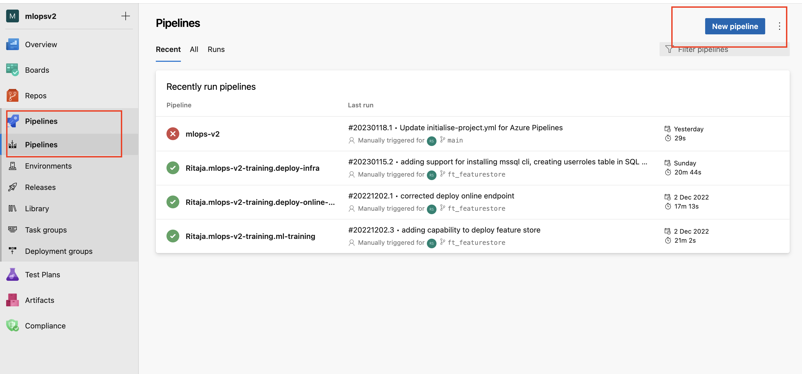
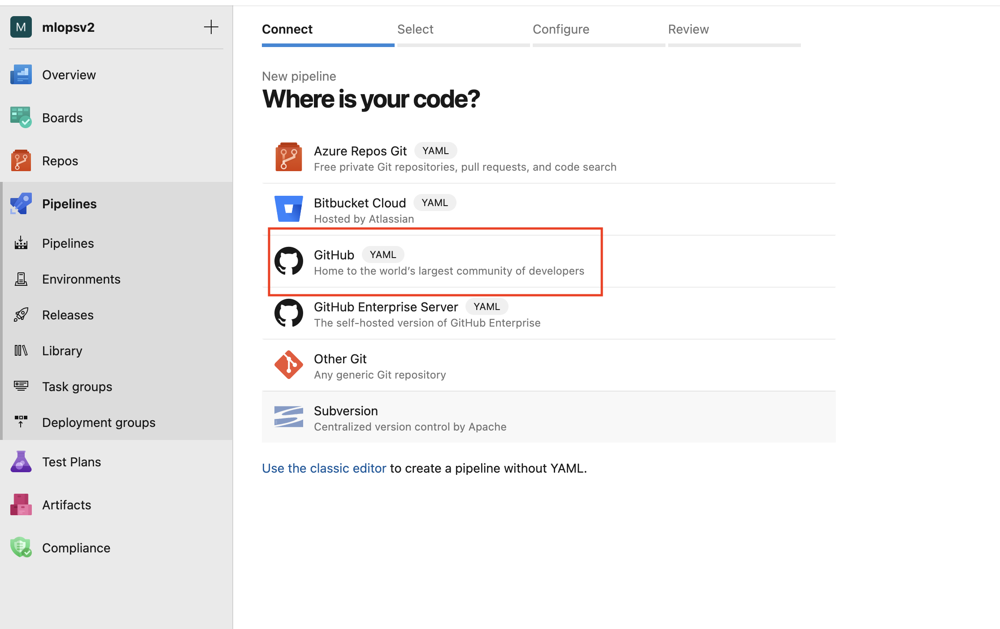
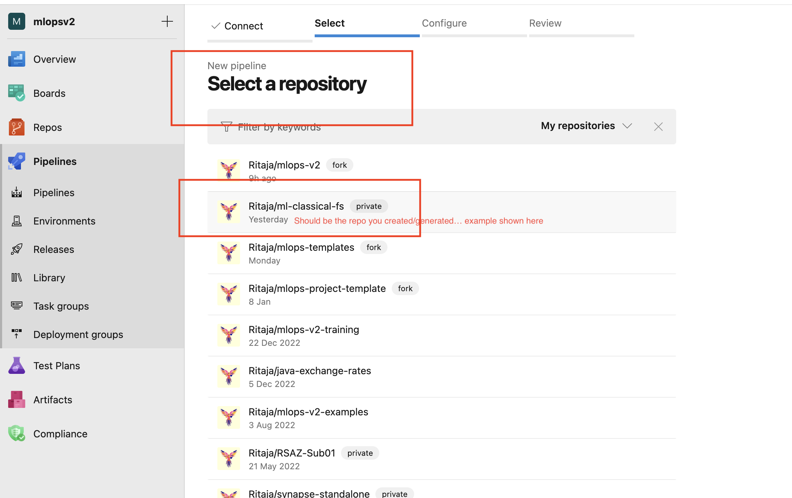
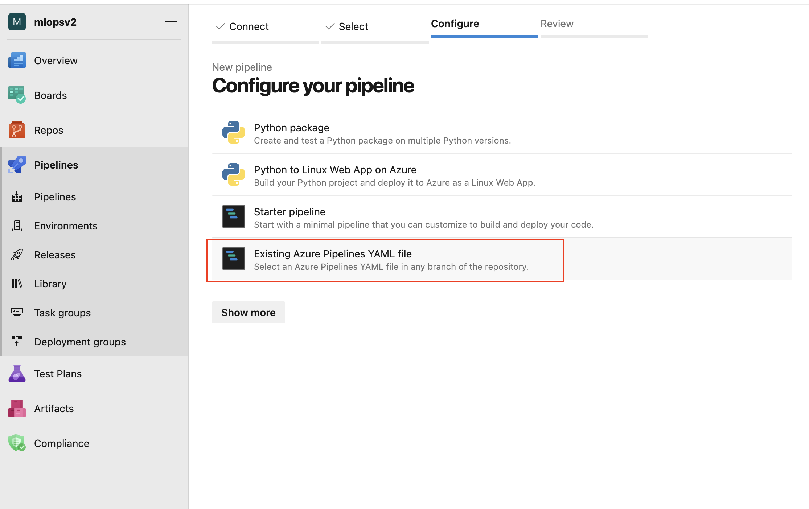
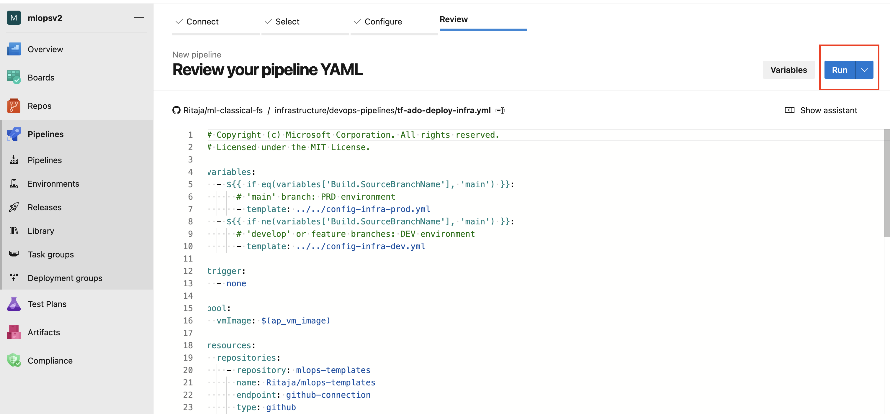
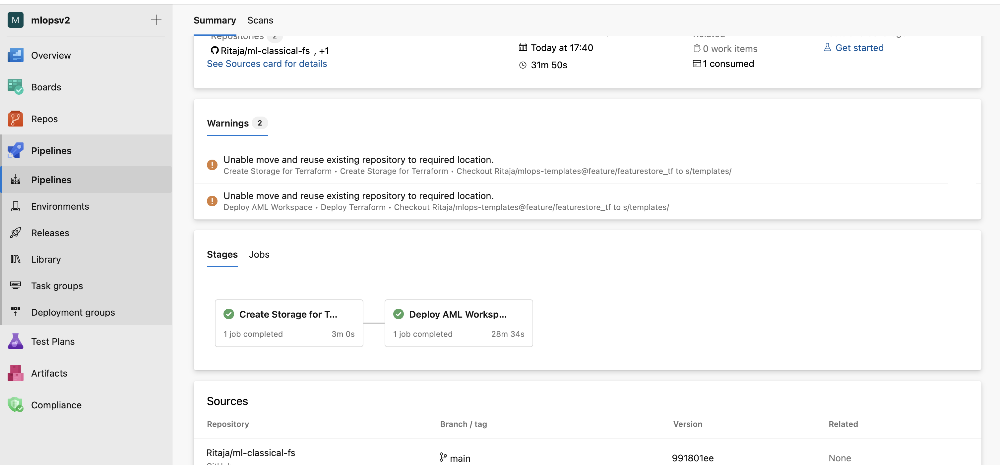
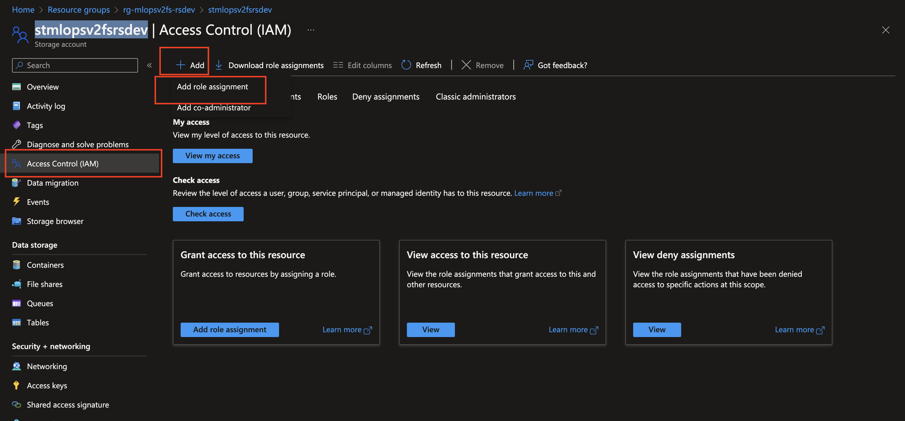
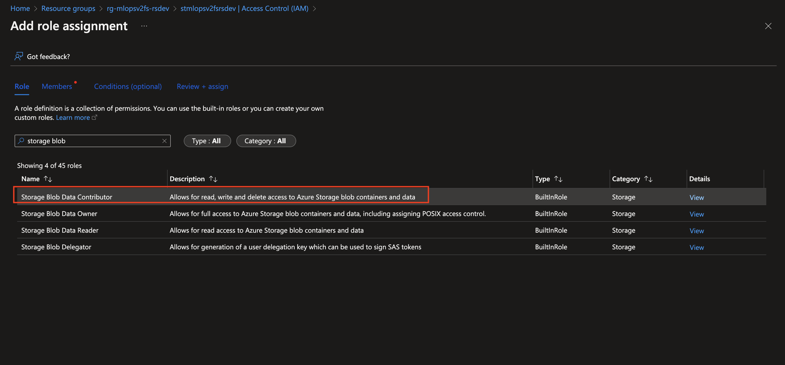
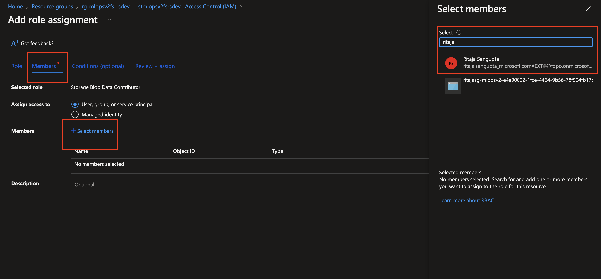

# Deployment Guide - Feathr feature store

This guide will help you through deploying all components required for [Feathr feature store](https://github.com/feathr-ai/feathr). Please follow instructions below to deploy the feature store on Azure. 

**Requirements:**
- If using Terraform to create and manage infrastructure from Azure DevOps, install the [Terraform extension for Azure DevOps](https://marketplace.visualstudio.com/items?itemName=ms-devlabs.custom-terraform-tasks).
- [Azure CLI](https://learn.microsoft.com/en-us/cli/azure/install-azure-cli) with `azure-devops` extension.
- Azure subscription(s) based on if you are deploying Prod only or Prod and Dev environments
- Ability to create Azure service principals to access / create Azure resources from Azure DevOps
- Git bash, WSL, or another shell script editor on your local machine
- Please follow the [Azure Devops guide](/documentation/deployguides/deployguide_ado.md) up until right before "Set up source repository with Azure DevOps" and then follow steps in this linked deployment guide

## Repository setup and infrastructure deployment:

- Clone the [MLops v2 repository and checkout the feature/feathr branch](https://github.com/Azure/mlops-v2/tree/feature/feathr).
- The `sparse_checkout.sh` file is already configured for basic setup, please change the `project_name` and the `github_org_name` in the sparse_checkout file to match your project name (new project template that will be generated for you) and github org name (your github org name).
- Create a new repository in your github org matching the project name you have provided in the sparse_checkout.sh file.
- Run the `sparse_checkout.sh` file to create the new project template, the script will push the template to your github org.
- Make the following modification in the generated project (the generated project matches the `project_name` you have provided in the sparse_checkout.sh file): 
    - Start with `prefeaturestore.md` at the root folder of the generated project: adjust the values for `prefix`, `environment` and `postfix` make them unique to your project. Use short strings 3-4 characters long as these will be used to generate Azure resource names and some of the resources have contrainsts on the length of the name. 
    - Follow through the instructions in `prefeaturestore.md` to create the AAD app registration for the Feathr App. 
    - Next: look into `config-infra-prod.yml` and `config-infra-dev.yml` and adjust the values for `namespace`, `environment`(you need to execute the steps in this file once for each environment you have, for now you could start with a single environment: dev) and `postfix` to match the values you have used in `prefeaturestore.md`. Adjust the values for `aad_client_id` and `priviledged_object_id` (this provides a convenient way to add a user to eleveted permissions in Synapse and Keyvault: required when you want to run featurestore client locally with your user account). To look up object_id for a user, use the following command: `az ad user show --id <user email address> --query id`. Adjust the `ado_service_connection_rg` and `ado_service_connection_aml_ws` to match the service connection name you provisioned in Azure DevOps in previous steps from the [Azure Devops guide](/documentation/deployguides/deployguide_ado.md).
    - Navigate to `infrastructure/devops-pipelines/tf-ado-deploy-infra.yml` and adjust: `name` to point to the repository having mlops-templates (use `Azure/mlops-templates` as value), change the `ref` to point to the `feature/feathr` branch.
    Also change the `- template: ../../config-infra-prod.yml` under `variables` to point to `- template: ../../config-infra-dev.yml`. You will notice we used the `dev environment` setting in the `prefeaturestore.md` file, so we will use the `config-infra-dev.yml` file for the deployment. 
    - Push your changes to the repository (the project you created on github org)
    - Navigate to Azure DevOps and create a new pipeline using the `tf-ado-deploy-infra.yml` file in the repository you just created:
    
     

        The next screen will ask you to authorize for github access, please authorize and then select the repository you just created:

        

        

        Select the "main" branch and from the "Path" dropdown select the `/infrastructure/devops-pipelines/tf-ado-deploy-infra.yml` file, then click on the "Continue" button

        On the review screen, click on the "Run" button to start the pipeline.

        

        Wait for the pipeline run to complete:

        

## Steps for a quick test of the feature store:

TODO: currently the ADO service connection depends on an AAD SP, which has contributor rights to the subscription. This limits the SP to add user roles. We could elevate the SP to owner rights, but this is not recommended as an enterprise security practice. We need to move to a [managed identity based service connection in future](https://learn.microsoft.com/en-us/azure/devops/pipelines/library/connect-to-azure?view=azure-devops#create-an-azure-resource-manager-service-connection-to-a-vm-with-a-managed-service-identity). lack of this creates some additional steps below for now:

- Navigate to the Azure Portal and look up the storage account that was created in the feature store resource group (resource group name should be: `rg-{prefix}-{postfix}{env}` should have "fs" added to your configured `prefix`) and the storage account name: `st{prefix}{postfix}{env}`; should have "fs" added to your configured `prefix` . Click on the storage account and from the navigation panel on left select "Identity and access (IAM)" and then click on "Add role assignment" button. Then click on "Add Role Assignment" button. Select "Storage Blob Data Contributor" as role and search for your user account and select it. Click on "Save" button to save the role assignment:

    

    Add role assignment for the "Storage Queue Data Contributor" role:

    

    Next, click on "Members" and add your user account to the "Storage Blob Data Contributor" role:

    

    Finally click on "Review and Assign" and apply the role assignment

- Navigate to the [sample github repository](https://github.com/Ritaja/feathr-mlopsv2-sample) and use that for the sample (follow instructions there). 

        

