# Deployment Guide using Github Repositories Workflows

## Technical Requirements

### Source Control and DevOps
- **GitHub** as the source control repository
- **GitHub Actions** as the CI/CD orchestration tool
- [GitHub CLI](https://cli.github.com/) installed locally

### Azure Tools
- [Azure CLI](https://learn.microsoft.com/cli/azure/install-azure-cli) installed locally
- One or more Azure subscriptions (separate subscriptions recommended for Dev and Prod environments)
   - **Important**: Free/Trial subscriptions may have quota limitations. Review the [Prerequisites](https://github.com/Azure/mlops-v2?tab=readme-ov-file#prerequisites) carefully before deployment.
- Azure service principal with permissions to create and manage resources

### Infrastructure as Code (Optional)
- [Terraform extension for Azure DevOps](https://marketplace.visualstudio.com/items?itemName=ms-devlabs.custom-terraform-tasks) (only if using Azure DevOps with Terraform)

### Local Development Environment
- **Shell environment**: Git Bash, [WSL](https://learn.microsoft.com/windows/wsl/install), or equivalent Unix shell

### WSL-Specific Setup (If Using Windows Subsystem for Linux)
If using WSL, complete all setup within the Unix environment:

1. **Install required tools**:
    ```bash
    sudo apt-get update
    sudo apt-get install dos2unix gh
    ```

2. **Configure GitHub CLI**:
    ```bash
    gh auth login
    ```

3. **Configure Git**:
    ```bash
    git config --global user.email "you@example.com"
    git config --global user.name "Your Name"
    ```

4. **VSCode integration** (optional):
    - Install the [Remote - SSH](https://marketplace.visualstudio.com/items?itemName=ms-vscode-remote.remote-ssh) extension
    - Connect VSCode to your WSL environment for seamless editing

> **Note**: Clone repositories and define all file paths within the WSL environment to avoid cross-platform compatibility issues.


> **Important**: Git version 2.51 or newer is required. See [upgrade instructions](https://github.com/cli/cli/blob/trunk/docs/install_linux.md#debian-ubuntu-linux-raspberry-pi-os-apt) if needed.
   

## Configure The GitHub Environment
---

1. **Replicate MLOps-V2 Template Repositories in your GitHub organization**  
   Go to https://github.com/Azure/mlops-templates/fork to fork the mlops templates repo into your Github org. This repo has reusable mlops code that can be used across multiple projects.

   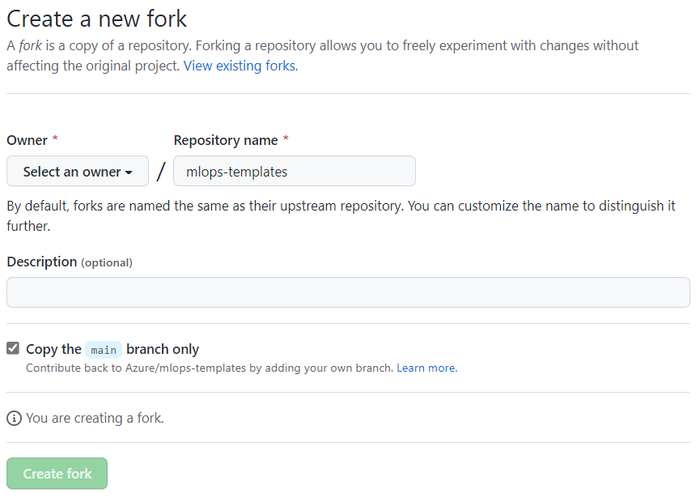

   Go to https://github.com/Azure/mlops-project-template/generate to create a repository in your Github org using the mlops-project-template. This is the monorepo that you will use to pull example projects from in a later step.

   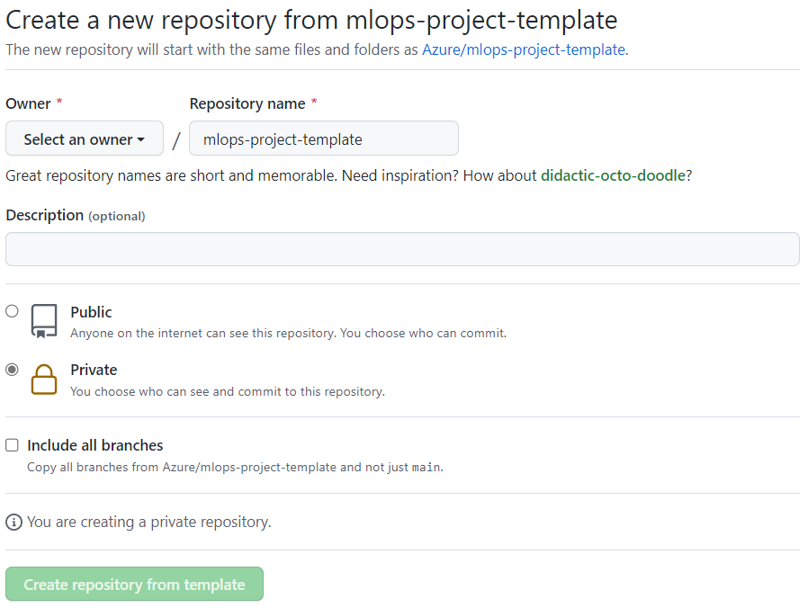

2. **Clone the mlops-v2 repository to local system**  
   On your local machine, select or create a root directory (ex: 'mlprojects') to hold your project repository as well as the mlops-v2 repository. Change to this directory.

   Clone the mlops-v2 repository to this directory. This provides the documentation and the `sparse_checkout.sh` script. This repository and folder will be used to bootstrap your projects:  
   `# git clone https://github.com/Azure/mlops-v2.git`

3. **Configure and run sparse checkout**  
   From your local project root directory, open the `/mlops-v2/sparse_checkout.sh` for editing. Edit the following variables as needed to select the infastructure management tool used by your organization, the type of Open this file in an editor and set the following variables:
   
   >**Note:**
   > When running the script through a  "vanilla" WSL, then you'll most likely get strange errors... In that case it might suffice to use dos2unix on the file
   > (in WSL) run; `dos2unix sparse_checkout.sh` (in the mlops-v2 repo folder)
   

   * **infrastructure_version** selects the tool that will be used to deploy cloud resources.
   * **project_type** selects the AI workload type for your project (classical ml, computer vision, or nlp)
   * **mlops_version** selects your preferred interaction approach with Azure Machine Learning
   * **git_folder_location** points to the root project directory to which you cloned mlops-v2 in step 3
   * **project_name** is the name (case sensitive) of your project. A  GitHub repository will be created with this name
   * **github_org_name** is your GitHub organization (or GitHub username)
   * **project_template_github_url** is the URL to the original or your generated clone of the mlops_project_template repository from step 1
   * **orchestration** specifies the CI/CD orchestration to use
   <br><br>
   A sparse_checkout.sh example is below:  

   ```bash
      #options: terraform / bicep
      infrastructure_version=terraform

      #options: classical / cv / nlp
      project_type=classical
      
      #options: python-sdk / aml-cli-v2
      mlops_version=aml-cli-v2   
      
      #replace with the local root folder location where you want
      git_folder_location='/home/<username>/mlprojects'    
      
      #replace with your project name
      project_name=taxi-fare-regression   
      
      #replace with your github org name
      github_org_name=<orgname>
      
      #replace with the url for the project template for your organization created in step 2.2
      project_template_github_url=https://github.com/azure/mlops-project-template   
      
      #options: github-actions / azure-devops
      orchestration=github-actions 
   ```
   Currently, the following pipelines are supported:
   - classical 

4. **Run sparse checkout**  
   The `sparse_checkout.sh` script will use ssh to authenticate to your GitHub organization. If this is not yet configured in your environment, follow the steps below or refer to the documentation at  [GitHub Key Setup](https://docs.github.com/en/authentication/connecting-to-github-with-ssh/generating-a-new-ssh-key-and-adding-it-to-the-ssh-agent).
   
   > **GitHub Key Setup**
   >
   > On your local machine, create a new ssh key:  
   > `# ssh-keygen -t ed25519 -C "<your_email@example.com>"`  
   > You may press enter to all three prompts to create a new key in `/home/<username>/.ssh/id_ed25519`
   >
   > Add your SSH key to your SSH agent:  
   > `# eval "$(ssh-agent -s)" `  
   > `# ssh-add ~/.ssh/id_ed25519`
   >
   > Get your public key to add to GitHub:  
   > `# cat ~/.ssh/id_ed25519.pub`  
   > It will be a string of the format '`ssh-ed25519 ... your_email@example.com`'. Copy this string.
   >
   > [Add your SSH key to Github](https://docs.github.com/en/authentication/connecting-to-github-with-ssh/adding-a-new-ssh-key-to-your-github-account). Under your account menu, select "Settings", then "SSH and GPG Keys". Select "New SSH key" and enter a title. Paste your public key into the key box and click "Add SSH key"

   From your root project directory (ex: mlprojects/), execute the `sparse_checkout.sh` script:  
   >  `# bash mlops-v2/sparse_checkout.sh`  

   This will run the script, using git sparse checkout to build a local copy of your project repository based on your choices configured in the script. It will then create the GitHub repository and push the project code to it.  

   Monitor the script execution for any errors. If there are errors, you can safely remove the local copy of the repository (ex: taxi_fare_regression/) as well as delete the GitHub project repository. After addressing the errors, run the script again.
   
   After the script runs successfully, the GitHub project will be initialized with your project files.

5. **Configure GitHub Actions Authentication with OIDC**

   This step creates an Azure AD application with federated credentials and GitHub secrets to allow the GitHub Action workflows to authenticate using OpenID Connect (OIDC) and create/interact with Azure Machine Learning Workspace resources.

   >**IMPORTANT**: This solution now uses OIDC workload identity federation instead of client secrets for enhanced security. No client secrets are stored or managed.

   **Step 5.1: Create Azure AD Application**

   From the command line, create an Azure AD app registration:
   > `# az ad app create --display-name <application_name>`

   This will output the application details. Copy the **appId** value.

   **Step 5.2: Create Service Principal**

   Create a service principal for the application:
   > `# az ad sp create --id <app_id_from_previous_step>`

   **Step 5.3: Assign Azure Permissions**

   Assign the Contributor role to the service principal:
   > `# az role assignment create --assignee <app_id> --role Contributor --scope /subscriptions/<subscription_id>`

   **Step 5.3a: Get Service Principal Object ID**

   Get the object ID of the service principal (needed for Terraform configuration):
   ```bash
   az ad sp show --id <app_id> --query id -o tsv
   ```
   
   **IMPORTANT**: Save this object ID value. You will need to add it to `infrastructure/terraform/terraform.tfvars` as `github_actions_service_principal_id` in Step 2 below. This grants GitHub Actions the required permissions to register datasets, upload data, and execute training pipelines in your Azure ML workspace.

   **Step 5.4: Configure Federated Identity Credentials**

   Create federated credentials for GitHub Actions to authenticate without secrets. Run this for each branch you plan to use (main and any dev branches):

   For the **main** branch:
   ```bash
   az ad app federated-credential create --id <app_id> --parameters '{
     "name": "github-main-branch",
     "issuer": "https://token.actions.githubusercontent.com",
     "subject": "repo:<github_org>/<repo_name>:ref:refs/heads/main",
     "audiences": ["api://AzureADTokenExchange"],
     "description": "GitHub Actions for main branch"
   }'
   ```

   For a **dev** branch (optional, if using dev environment):
   ```bash
   az ad app federated-credential create --id <app_id> --parameters '{
     "name": "github-dev-branch",
     "issuer": "https://token.actions.githubusercontent.com",
     "subject": "repo:<github_org>/<repo_name>:ref:refs/heads/dev",
     "audiences": ["api://AzureADTokenExchange"],
     "description": "GitHub Actions for dev branch"
   }'
   ```

   **Step 5.5: Add GitHub Repository Secrets**

   From your GitHub project, select **Settings**:

   

   Then select **Secrets**, then **Actions**:

   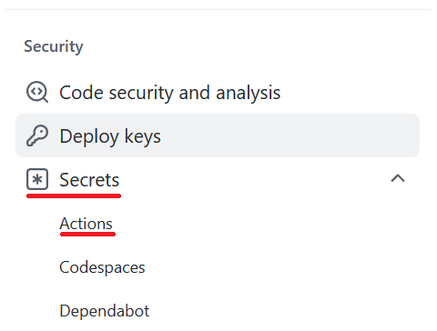

   Add the following three repository secrets (select **New repository secret** for each):

   1. **AZURE_CLIENT_ID**: The application (client) ID from step 5.1
   2. **AZURE_TENANT_ID**: Your Azure tenant ID (get with `az account show --query tenantId -o tsv`)
   3. **AZURE_SUBSCRIPTION_ID**: Your Azure subscription ID (get with `az account show --query id -o tsv`)

   > **IMPORTANT NOTES:**
   > - Do NOT create an **AZURE_CREDENTIALS** secret (deprecated)
   > - Do NOT use the `--sdk-auth` flag (deprecated)
   > - OIDC authentication provides enhanced security with no client secrets to manage or rotate
   > - Each workflow will automatically receive short-lived tokens from GitHub
   > - If deploying infrastructure with Terraform, no additional ARM_* secrets are needed (OIDC is configured in the provider)

   The GitHub configuration is complete.

## Deploy Machine Learning Project Infrastructure Using GitHub Actions

1. **Configure Azure ML Environment Parameters**

   In your Github project repository (ex: taxi-fare-regression), there are two configuration files in the root, `config-infra-dev.yml` and `config-infra-prod.yml`. These files are used to define and deploy Dev and Prod Azure Machine Learning environments. With the default deployment, `config-infra-prod.yml` will be used when working with the main branch or your project and `config-infra-dev.yml` will be used when working with any non-main branch.

   It is recommended to first create a dev branch from main and deploy this environment first.

>**Important:**
>> Note that `config-infra-prod.yml` and `config-infra-dev.yml` files use default region as **eastus** to deploy resource group and Azure ML Workspace. If you are using Free/Trial or similar learning purpose subscriptions, you must do one of the below  -
> 1. If you decide to use **eastus** region, ensure that your subscription(s) have a quota/limit of up to 64 vCPUs for **Standard DSv3 Family vCPUs**. The default compute cluster uses **STANDARD_D16S_V3** (16 vCPUs per node, up to 4 nodes = 64 vCPUs max). Visit Subscription page in Azure Portal as shown below to validate this.
        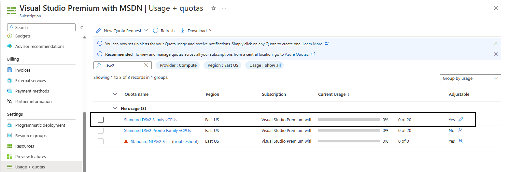
> 2. If not, you should change it to a region where **Standard DSv3 Family vCPUs** has sufficient quota.
> 3. You can easily change the VM SKU by editing the `aml_compute_sku` parameter in your config file:
>      - `config-infra-prod.yml` or `config-infra-dev.yml` - set `aml_compute_sku: <YOUR_SKU>` (e.g., `STANDARD_D4S_V3`)
>      - This works for both Bicep and Terraform deployments
> 4. For ML pipeline compute (separate from infrastructure), you may need to edit:
>      - `mlops-templates/aml-cli-v2/mlops/devops-pipelines/deploy-model-training-pipeline.yml` - for ML pipeline compute
>      - `mlops-project-template/classical/aml-cli-v2/mlops/devops-pipelines/deploy-batch-endpoint-pipeline.yml`
>      - `mlops-project-template/classical/aml-cli-v2/mlops/azureml/deploy/online/online-deployment.yml`
>
> **Note**: The default infrastructure SKU is **STANDARD_D16S_V3** (3rd generation). ML pipelines may use different SKUs like **Standard_D4s_v5**. Adjust based on your quota and requirements.

   Edit each file to configure a namespace, postfix string, Azure location, and environment for deploying your Dev and Prod Azure ML environments. Default values and settings in the files are show below:

   > ```bash
   > namespace: mlopsv2 #Note: A namespace with many characters will cause storage account creation to fail due to storage account names having a limit of 24 characters.  
   > postfix: 0001  
   > location: eastus  
   > environment: dev  
   > enable_aml_computecluster: true  
   > enable_monitoring: false
   > aml_compute_sku: STANDARD_D16S_V3  # VM SKU for AML compute cluster
   >```
   
   The first four values are used to create globally unique names for your Azure environment and contained resources. The `aml_compute_sku` parameter allows you to customize the VM size for your AML compute cluster (default: `STANDARD_D16S_V3`). Edit these values to your liking then save, commit, push, or pr to update these files in the project repository.

2. **Configure Terraform Variables (Required for GitHub Actions Permissions)**

   In your project repository, copy the `infrastructure/terraform/terraform.tfvars.example` file and rename it to `terraform.tfvars`. Then edit the file to add the GitHub Actions service principal object ID from Step 5.3a:

   ```bash
   namespace: mlopsv2
   postfix: "0001"
   location: "eastus"
   environment: "dev"  
   enable_aml_computecluster: true
   enable_monitoring: false
   aml_compute_sku: "STANDARD_D16S_V3"  # VM SKU for AML compute cluster

   # REQUIRED: GitHub Actions service principal object ID for CI/CD permissions
   # Get this value from Step 5.3a above:
   # az ad sp show --id <app_id> --query id -o tsv
   github_actions_service_principal_id = "your-service-principal-object-id"

   # VNet and Private Endpoints Configuration
   # Set to true to enable network isolation with private endpoints
   enable_private_endpoints = false

   # VNet address space (only used if enable_private_endpoints = true)
   # Ensure the address space is large enough for your needs:
   # - Private endpoints: ~20 IPs (one per service per subnet)
   # - Compute instances/cluster nodes: 1 IP per node
   # Example: 10.0.0.0/16 provides 65,536 addresses
   vnet_address_space               = "10.0.0.0/16"
   training_subnet_address_prefix   = "10.0.0.0/24"    # For compute cluster nodes (254 hosts)
   endpoints_subnet_address_prefix  = "10.0.1.0/24"    # For private endpoints (254 hosts)
   ```

   **Configuration Guidelines**:
   - **namespace**: Short name for your project (keep it concise to avoid storage account name length limits)
   - **postfix**: Unique identifier (e.g., "0001"). If redeploying after deletion, use a different postfix to avoid Azure ML workspace soft-delete conflicts (see note below)
   - **environment**: "dev" or "prod" (should match your branch context)
   - **location**: Azure region (default: "eastus")
   - **github_actions_service_principal_id**: Service principal object ID from Step 5.3a (NOT the app ID)

   This configuration enables Terraform to automatically:
   - Grant the GitHub Actions service principal the required permissions to:
     - Register datasets in Azure ML
     - Upload data to the workspace storage account
     - Execute training pipelines that access data in the storage account
   - Configure Network Security Groups with Azure ML required rules
   - Create private DNS zones for name resolution within the VNet

   These permissions (Storage Blob Data Reader and Storage Blob Data Contributor) will be automatically assigned to the Azure ML workspace storage account during infrastructure deployment.

   **For Bicep**: Role assignments are handled differently - see the Bicep templates for specific implementation details.

   > **Best Practice**: Using OIDC (OpenID Connect) federation instead of client secrets provides better security by eliminating the need to manage and rotate secrets. The service principal authenticates using short-lived tokens issued by GitHub, which reduces the risk of credential exposure.

   > **Alternative**: If your organization doesn't allow OIDC, you can use a client secret instead. However, this requires storing and managing secrets, which increases security risks. See [GitHub's documentation on secrets](https://docs.github.com/en/actions/security-guides/encrypted-secrets) for more information.

   > **Note**: The `github_actions_service_principal_id` must be the **object ID**, not the application ID. You can retrieve it using:

   ```bash
   az ad sp show --id <APPLICATION_ID> --query id -o tsv
   ```

2.1. **(Optional) Configure Virtual Network and Private Endpoints**

   The infrastructure supports optional network isolation using Azure Virtual Networks and Private Endpoints for enhanced security. By default, this feature is disabled (`enable_private_endpoints = false`) to maintain backward compatibility and simplify initial deployments.

   **When to Enable VNet and Private Endpoints:**
   - Production environments requiring network isolation
   - Compliance requirements mandating private connectivity
   - Sensitive data workloads requiring additional security

   **To enable network isolation**, add the following to your `infrastructure/terraform/terraform.tfvars.sample`:

   ```bash
   # Enable VNet and private endpoints for network isolation
   enable_private_endpoints = true

   # Customize VNet address space if needed (optional)
   vnet_address_space               = "10.0.0.0/16"      # Default
   training_subnet_address_prefix   = "10.0.0.0/24"     # For compute (254 hosts)
   endpoints_subnet_address_prefix  = "10.0.1.0/24"     # For endpoints (254 hosts)
   ```

   **What gets deployed when enabled:**
   - Virtual Network with two subnets (training and endpoints)
   - Network Security Group with Azure ML required rules
   - Private endpoints for: ML Workspace, Storage (blob/file/dfs), Key Vault, Container Registry
   - Private DNS zones for name resolution within the VNet

   **Impact:**
   - All Azure ML resources communicate through private IPs
   - Public network access restricted on storage, Key Vault, and Container Registry
   - Deployment time increases by ~5 minutes


   > **Note**: For initial evaluation and development environments, you can leave `enable_private_endpoints = false` (default). The infrastructure will deploy with public network access, which simplifies setup and reduces costs. You can always enable private endpoints later when moving to production.

3. **Deploy Azure Machine Learning Infrastructure**  
   > Note:
   >
   > The _enable_monitoring_ flag in these files defaults to False. Enabling this flag will add additional elements to the deployment to support Azure ML monitoring based on https://github.com/microsoft/AzureML-Observability. This will include an ADX cluster and increase the deployment time and cost of the MLOps solution.
   
3. **Deploy Azure Machine Learning Infrastructure**

   In your GitHub project repository (ex: taxi-fare-regression), select **Actions**

   

   This will display the pre-defined GitHub workflows associated with your project. For a classical machine learning project, the available workflows will look similar to this:

   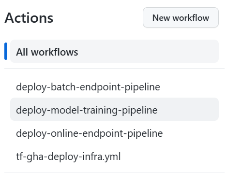

   Depending on the the use case, available workflows may vary. Select the workflow to 'deploy-infra'. In this scenario, the workflow to select would be **tf-gha-deploy-infra.yml**. This would deploy the Azure ML infrastructure using GitHub Actions and Terraform.

   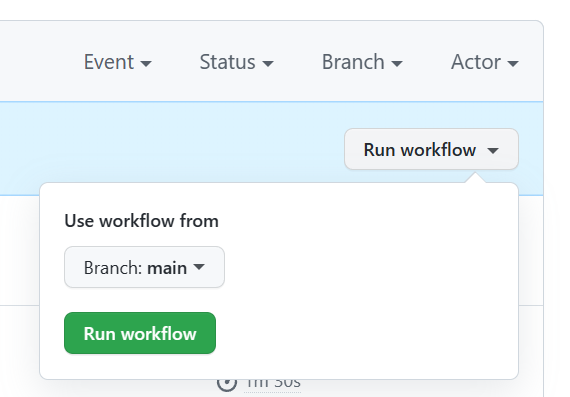

   On the right side of the page, select **Run workflow** and select the branch to run the workflow on. This may deploy Dev Infrastructure if you've created a dev branch or Prod infrastructure if deploying from main. Monitor the pipline for successful completion.

   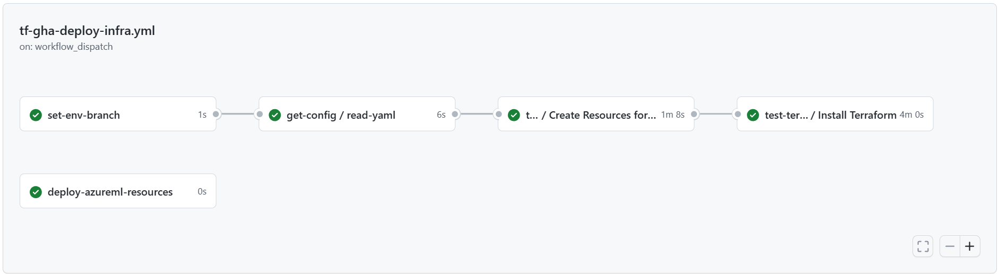

   When the pipline has complete successfully, you can find your Azure ML Workspace and associated resources by logging in to the Azure Portal.

   Next, a model training and scoring pipelines will be deployed into the new Azure Machine Learning environment.

## Sample Training and Deployment Scenario

The solution accelerator includes code and data for a sample end-to-end machine learning pipeline which runs a linear regression to predict taxi fares in NYC. The pipeline is made up of components, each serving different functions, which can be registered with the workspace, versioned, and reused with various inputs and outputs. Sample pipelines and workflows for the Computer Vision and NLP scenarios will have different steps and deployment steps.

This training pipeline contains the following steps:

### Pipeline Components

**Prepare Data**

This component takes multiple taxi datasets (yellow and green) and merges/filters the data, and prepares the train/val and evaluation datasets.

- **Input**: Local data under `./data/` (multiple `.csv` files)
- **Output**: Single prepared dataset (`.csv`) and train/val/test datasets

**Train Model**

This component trains a Linear Regressor with the training set.

- **Input**: Training dataset
- **Output**: Trained model (pickle format)

**Evaluate Model**

This component uses the trained model to predict taxi fares on the test set.

- **Input**: ML model and test dataset
- **Output**: Performance of model and a deploy flag whether to deploy or not

This component compares the performance of the model with all previous deployed models on the new test dataset and decides whether to promote the model into production. Promoting the model into production happens by registering the model in the AML workspace.

**Register Model**

This component scores the model based on how accurate the predictions are in the test set.

- **Input**: Trained model and the deploy flag
- **Output**: Registered model in Azure Machine Learning

## Deploying the Model Training Pipeline to the Test Environment

Next, you will deploy the model training pipeline to your new Azure Machine Learning workspace. This pipeline will create a compute cluster instance, register a training environment defining the necessary Docker image and Python packages, register a training dataset, then start the training pipeline described in the previous section. When the job is complete, the trained model will be registered in the Azure ML workspace and be available for deployment.

In your GitHub project repository (ex: taxi-fare-regression), select **Actions**


Select the **deploy-model-training-pipeline** from the workflows listed on the left and click **Run Workflow** to execute the model training workflow. This will take several minutes to run, depending on the compute size.

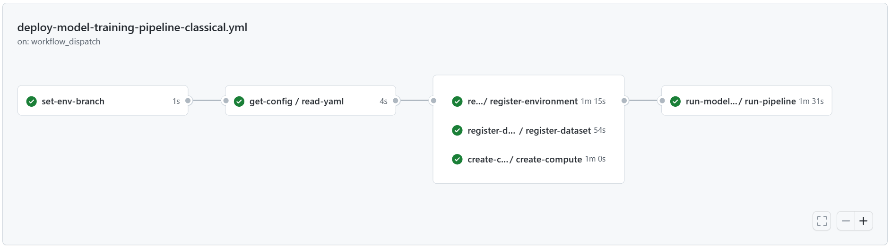

Once completed, a successful run will register the model in the Azure Machine Learning workspace.

> **Note**: If you want to check the output of each individual step, for example to view output of a failed run, click a job output, and then click each step in the job to view any output of that step.

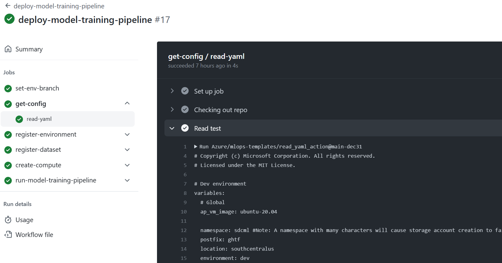

With the trained model registered in the Azure Machine Learning workspace, you are ready to deploy the model for scoring.


## Deploying the Trained Model in Dev

This scenario includes prebuilt workflows for two approaches to deploying a trained model, batch scoring or a deploying a model to an endpoint for real-time scoring. You may run either or both of these workflows in your dev branch to test the performance of the model in your Dev Azure ML workspace.

In your GitHub project repository (ex: taxi-fare-regression), select **Actions**  
 
   

 ### Online Endpoint  
      
Select the **deploy-online-endpoint-pipeline** from the workflows listed on the left and click **Run workflow** to execute the online endpoint deployment pipeline workflow. The steps in this pipeline will create an online endpoint in your Azure Machine Learning workspace, create a deployment of your model to this endpoint, then allocate traffic to the endpoint.

   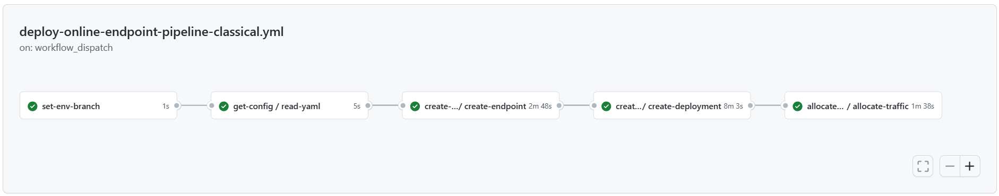
   
   Once completed, you will find the online endpoint deployed in the Azure ML workspace and available for testing.

 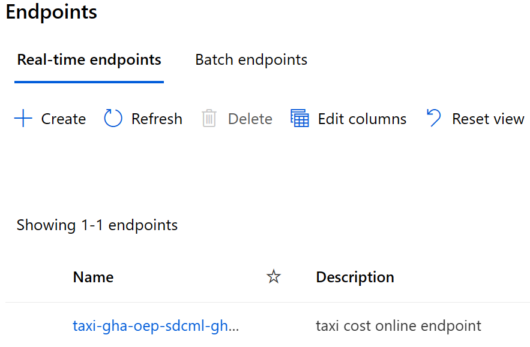

### Batch Endpoint
      
Select the **deploy-batch-endpoint-pipeline** from the workflows and click **Run workflow** to execute the batch endpoint deployment pipeline workflow. The steps in this pipeline will create a new AmlCompute cluster on which to execute batch scoring, create the batch endpoint in your Azure Machine Learning workspace, then create a deployment of your model to this endpoint.

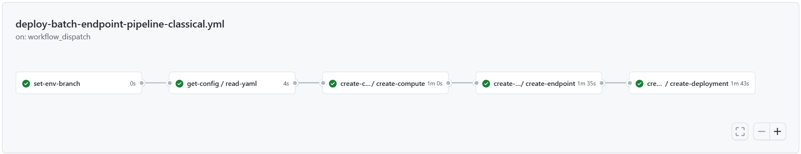

Once completed, you will find the batch endpoint deployed in the Azure ML workspace and available for testing.

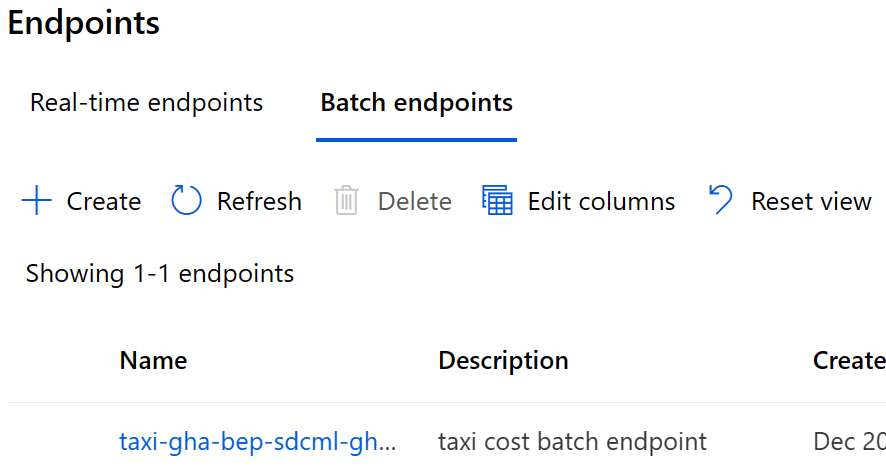

## Testing Deployed Endpoints

After deploying your endpoints, you can test them to validate model inference.

### Testing Online Endpoint

1. **Get endpoint details**:
   ```bash
   az ml online-endpoint show --name <endpoint-name> \
     --workspace-name <workspace-name> \
     --resource-group <resource-group> \
     --query "{ScoringUri:scoring_uri}" --output table
   ```

2. **Get authentication key**:
   ```bash
   az ml online-endpoint get-credentials --name <endpoint-name> \
     --workspace-name <workspace-name> \
     --resource-group <resource-group> \
     --query "primaryKey" --output tsv
   ```

3. **Create test request** (pandas DataFrame JSON format):
   
   The online endpoint expects input in pandas DataFrame JSON format. Create a file `test-request.json`:
   ```json
   {
     "input_data": {
       "columns": ["distance", "dropoff_latitude", "dropoff_longitude", "dropoff_taxizone_id", "dropoff_borough", "extra", "fare_amount", "improvement_surcharge", "mta_tax", "passenger_count", "payment_type", "pickup_latitude", "pickup_longitude", "pickup_taxizone_id", "pickup_borough", "rate_code_id", "store_and_fwd_flag", "tip_amount", "tolls_amount", "total_amount", "trip_type"],
       "index": [0, 1],
       "data": [
         [0.45, 40.67, -74.01, 7, "Manhattan", 0, 3.5, 0.3, 0.5, 1, 1, 40.68, -74.0, 7, "Manhattan", 1, "N", 0, 0, 4.3, 1],
         [18.51, 40.64, -73.78, 132, "Queens", 0.5, 52.0, 0.3, 0.5, 1, 1, 40.77, -73.97, 237, "Manhattan", 1, "N", 10.0, 0, 63.3, 1]
       ]
     }
   }
   ```

4. **Invoke endpoint**:
   ```bash
   curl -X POST "<scoring-uri>" \
     -H "Authorization: Bearer <authentication-key>" \
     -H "Content-Type: application/json" \
     --data @test-request.json
   ```

5. **Expected output**: JSON array of predictions (e.g., `[7.14, 47.33]`)

### Testing Batch Endpoint

1. **Upload test data to workspace**:
   ```bash
   az ml data create --name taxi-batch \
     --version 1 \
     --workspace-name <workspace-name> \
     --resource-group <resource-group> \
     --path <path-to-test-data.csv> \
     --type uri_file
   ```

2. **Invoke batch endpoint**:
   ```bash
   az ml batch-endpoint invoke --name <endpoint-name> \
     --workspace-name <workspace-name> \
     --resource-group <resource-group> \
     --input <data-path> \
     --input-type uri_file
   ```

3. **Monitor batch job**: The command will output a job ID. Use it to check status:
   ```bash
   az ml job show --name <job-id> \
     --workspace-name <workspace-name> \
     --resource-group <resource-group>
   ```

**Note**: Batch endpoint invocation requires Storage Blob Data Reader and Storage Blob Data Contributor roles on the workspace storage account. These are automatically granted to the GitHub Actions service principal if you configured `github_actions_service_principal_id` in Step 2.
   
 
## Moving to Production

Example scenarios can be trained and deployed both for Dev and Prod branches and environments. When you are satisfied with the performance of the model training pipeline, model, and deployment in Testing, Dev pipelines and models can be replicated and deployed in the Production environment.

The sample training and deployment Azure ML pipelines and GitHub workflows can be used as a starting point to adapt your own modeling code and data.

## Destroying Environments

When you need to tear down a development or production environment:

1. **Automatic Endpoint Cleanup**: The destroy workflow automatically deletes all Azure ML endpoints (online and batch) before destroying the infrastructure. This prevents the "Cannot delete resource while nested resources exist" error.

2. **Run the destroy workflow**:
   ```bash
   # For dev environment (run from dev branch)
   gh workflow run tf-gha-deploy-infra.yml --ref dev -f action=destroy
   
   # For prod environment (run from main branch)
   gh workflow run tf-gha-deploy-infra.yml --ref main -f action=destroy
   ```

3. **Monitor the workflow**: The destroy process takes approximately 9-12 minutes and includes:
   - Detection of workspace existence
   - Automatic deletion of all online endpoints
   - Automatic deletion of all batch endpoints
   - 2-minute wait for endpoint deletions to process (online endpoints can take 2-3 minutes)
   - Terraform infrastructure destroy
   - Automatic cleanup of Terraform state storage

4. **Verify cleanup**:
   ```bash
   # Check for remaining resource groups
   az group list --query "[?starts_with(name, 'rg-<namespace>-<postfix>')]" --output table
   ```

5. **Expected result**: All resource groups should be deleted, including:
   - `rg-<namespace>-<postfix><environment>` (main resources)
   - `rg-<namespace>-<postfix><environment>-tf` (Terraform state)
   - Managed resource groups (automatically cleaned up)

**Troubleshooting**:
- If the destroy fails with endpoint errors, the endpoints may still be deleting. Wait 60 seconds and retry the destroy workflow.
- If you manually deleted the workspace, the destroy workflow will skip endpoint deletion and proceed with cleanup.
- Old resource groups from previous deployments with different postfix values must be manually deleted if desired.

## Next Steps
---

This finishes the demo according to the architectual pattern: Azure Machine Learning Classical Machine Learning. Next you can dive into your Azure Machine Learning service in the Azure Portal and see the inference results of this example model. 

As elements of Azure Machine Learning are still in development, the following components are not part of this demo:
- Model and pipeline promotion from Dev to Prod
- Secure Workspaces
- Model Monitoring for Data/Model Drift
- Automated Retraining
- Model and Infrastructure triggers

Interim it is recommended to schedule the deployment pipeline for development for complete model retraining on a timed trigger.

For questions, please [submit an issue](https://github.com/Azure/mlops-v2/issues) or reach out to the development team at Microsoft.
