# Deployment Guide using Azure DevOps Repositories and Pipelines

## Technical requirements

- Azure DevOps project that will host the source repositories and pipelines
- The [Terraform extension for Azure DevOps](https://marketplace.visualstudio.com/items?itemName=ms-devlabs.custom-terraform-tasks) if you are using Azure DevOps + Terraform to spin up infrastructure
- Azure subscriptions based on if you are deploying Prod only or Prod and Dev environments
- Azure service principals to access / create Azure resources from Azure DevOps (or the ability to create them)
- Git bash, WSL or another shell script editor on your local machine;

>**Note:**
>
>**Git version 2.27 or newer is required. See [these instructions](https://github.com/cli/cli/blob/trunk/docs/install_linux.md#debian-ubuntu-linux-raspberry-pi-os-apt) to upgrade.**
   

## Prerequisites
---

1. <details>
   <summary>Create Service Principal </summary>
   For the use of the demo, the creation of one or two service principles is required, depending on how many environments, you want to work on (Dev or Prod or Both). These principles can be created using one of the methods below:
      <details>
      <summary>Create from Azure Cloud Shell</summary>
      1.1 Launch the <a href="https://shell.azure.com"> Azure Cloud Shell </a>. (If this the first time you have launched the cloud shell, you will be required to create a storage account for the cloud shell.)
      
      1.2 If prompted, choose **Bash** as the environment used in the Cloud Shell. You can also change environments in the drop-down on the top navigation bar

      

      1.3 Copy the bash commands below to your computer and update the **projectName**, **subscriptionId**, and **environment** variables with the values for your project. If you are creating both a Dev and Prod environment you will need to run this script once for each environment, creating a service principal for each. This command will also grant the **Contributor** role to the service principal in the subscription provided. This is required for Azure DevOps to properly deploy resources to that subscription. 

      ``` bash
      projectName="<your project name>"
      roleName="Contributor"
      subscriptionId="<subscription Id>"
      environment="<Dev|Prod>" #First letter should be capitalized
      servicePrincipalName="Azure-ARM-${environment}-${projectName}"
      # Verify the ID of the active subscription
      echo "Using subscription ID $subscriptionID"
      echo "Creating SP for RBAC with name $servicePrincipalName, with role $roleName and in scopes /subscriptions/$subscriptionId"
      az ad sp create-for-rbac --name $servicePrincipalName --role $roleName --scopes /subscriptions/$subscriptionId
      echo "Please ensure that the information created here is properly save for future use."
      ```
      
      1.4 Copy your edited commmands into the Azure Shell and run them (<kbd>Ctrl</kbd> + <kbd>Shift</kbd> + <kbd>v</kbd>).

       

      
      1.4 After running these commands you will be presented with information related to the service principal. Save this information to a safe location, it will be used later in the demo to configure Azure DevOps.

      ```
      {
         "appId": "<application id>",
         "displayName": "Azure-ARM-dev-Sample_Project_Name",
         "password": "<password>",
         "tenant": "<tenant id>"
      }
      ```

      1.5 Repeat step 1.3 if you are creating service principals for Dev and Prod environments.

      1.6 Close the Cloud Shell once the service principals are created. 
      
      </details>
      <details>
      <summary>Create from Azure Portal</summary>
      1.1. Navigate to <a href="https://entra.microsoft.com/#view/Microsoft_AAD_RegisteredApps/ApplicationsListBlade/quickStartType~/null/sourceType/Microsoft_AAD_IAM">Azure App Registrations</a> 

      1.2. Select "new registration".

      

      1.3. Go through the process of creating a Service Principle (SP) selecting "Accounts in any organizational directory (Any Azure AD directory - Multitenant)" and name it  "Azure-ARM-Dev-ProjectName". Once created, repeat and create a new SP named "Azure-ARM-Prod-ProjectName". Please replace "ProjectName" with the name of your project so that the service principal can be uniquely identified. 

      1.4. Go to "Certificates & Secrets" and add for each SP "New client secret", then store the value and secret seperately.

      1.5. To assign the necessary permissions to these principals, select your respective <a href="https://portal.azure.com/#view/Microsoft_Azure_Billing/SubscriptionsBlade?">subscription</a>  and go to IAM. Select +Add then select "Add Role Assigment.

      

      1.6. Select Contributor and add members selecting + Select Members. Add the member "Azure-ARM-Dev-ProjectName" as create before.

      

      1.7. Repeat step here, if you deploy Dev and Prod into the same subscription, otherwise change to the prod subscription and repeat with "Azure-ARM-Prod-ProjectName". The basic SP setup is successfully finished.
      </details>
   </details>

2. <details>
   <summary>Set up Azure DevOps</summary>

   ## Prerequisites 
   ---

   - An Organization in Azure DevOps (<a href="https://learn.microsoft.com/en-us/azure/devops/organizations/accounts/create-organization?view=azure-devops">Create your Organization</a>)

   2.1. Navigate to [Azure DevOps](https://go.microsoft.com/fwlink/?LinkId=2014676&githubsi=true&clcid=0x409&WebUserId=2ecdcbf9a1ae497d934540f4edce2b7d). 
   
   2.2. Create a new project.
   
   
   
   2.3. In the project under **Project Settings** (at the bottom left of the project page) select **Service Connections**.
   
   
   
   **Azure Subscription Connection:**
   
      2.3.1 Select "New Service Connection".

      

      3.3.2 Select "Azure Resource Manager", select "Next", select "Service principal (manual)", select "Next", select your subscrption where your Service Principal is stored and name the service connection "Azure-ARM-Dev". Fill in the details of the Dev service principal created in step 1. Select "Grant access permission to all pipelines", then select "Save". Repeat this step to create another service connection "Azure-ARM-Prod" using the details of the Prod service principal created in step 1.

      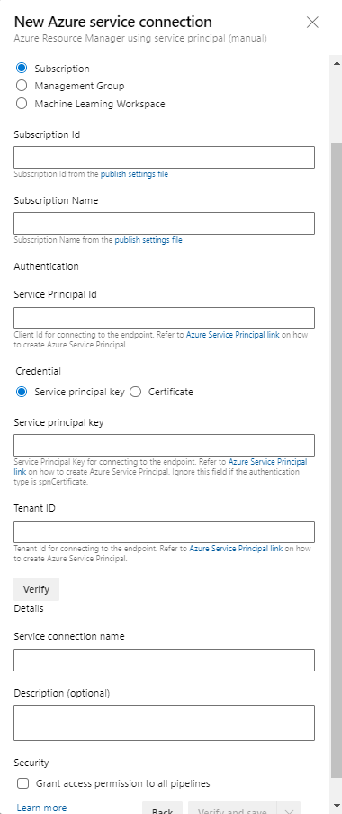

   The Azure DevOps setup is successfully finished.
   </details>
3. <details>
   <summary> Set up source repository with Azure DevOps </summary>
   
   3.1 Open the project you created in [Azure DevOps](https://dev.azure.com/)
   
   3.2 Open the Repos section. Click on  the default repo name at the top of the screen and select **Import Repository**

   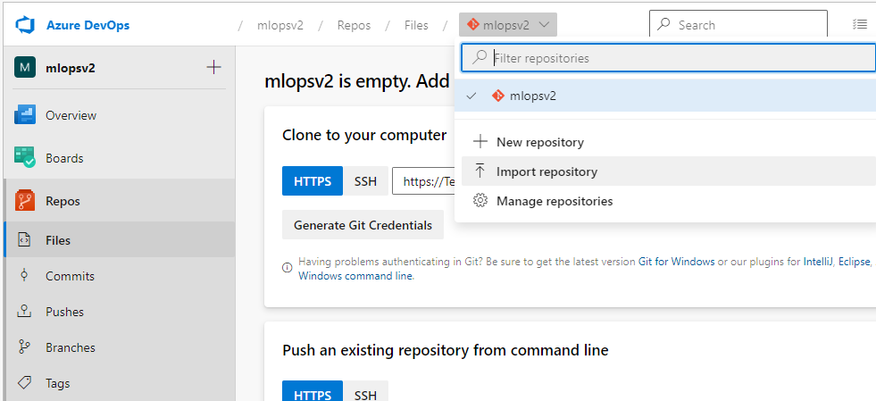

   3.3 Enter https://github.com/Azure/mlops-templates into the Clone URL field. Click import at the bottem of the page

   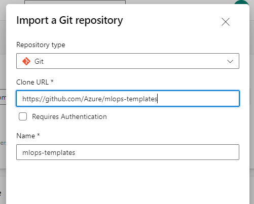

   3.4 Open the Repos section again and import the following repositories: 
   - https://github.com/Azure/mlops-project-template
   - https://github.com/Azure/mlops-v2 


   3.5.1 Open the Repos section. Click on the default repo name at the top of the screen and select **New Repository**

   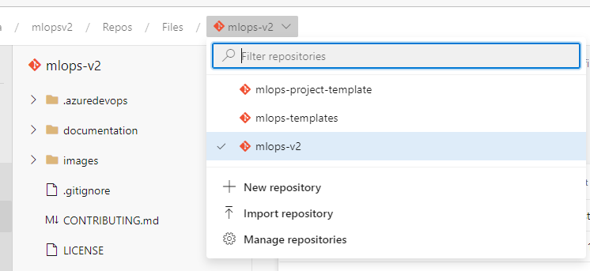

   3.5.2  Enter a name for the repository. This will be used to store the files for the project type you choose. Click **Create**

   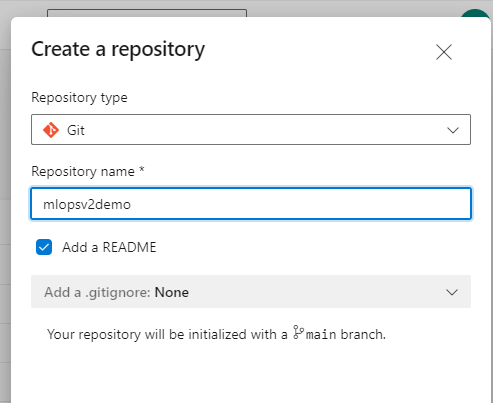

   3.5.3 Open the **project settings** at the bottom of the left hand navigation pane

   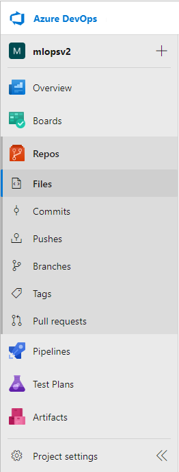

   3.5.4  Under the Repos section, click **Repositories**. Select the repository you created in step 3.5.2. Select the **Security** tab

   3.5.5 Under the User permissions section, select the \<projectname> Build Service user
   
   3.5.6 Change the permissions for **Contribute** and **Create branch** to **Allow**
   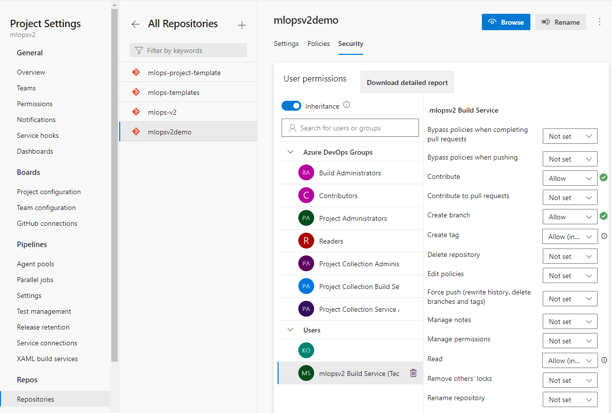

   

   3.6 Open the Pipelines section and click on the 3 vertical dots next to the **Create Pipelines** button. Select **Manage Security**

   

   3.6.1 Select the \<projectname> Build Service account for your project under the Users section. Change the permission **Edit build pipeline** to **Allow**

   

   
   3.5 Open the Pipelines section and create a new pipeline

   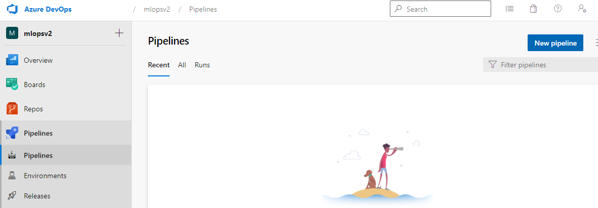

   3.6 
   - Select Azure Repos Git
   - Select the mlops-v2 repository
   - Select existing Azure Pipelines YAML file
   - Ensure the selected branch is **main**
   - Select the /.azuredevops/initialise-project.yml file in the patch drop-down
   - Click Continue 

   On the pipeline review page chose to **save** the pipeline before running it. 

   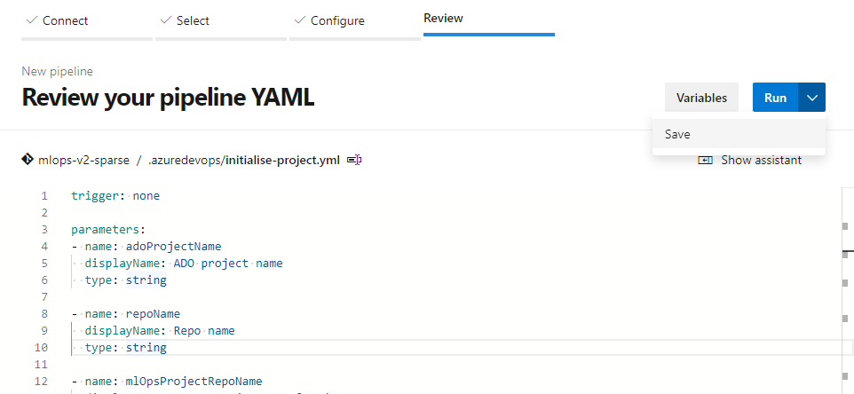

   3.7 Click run pipeline

   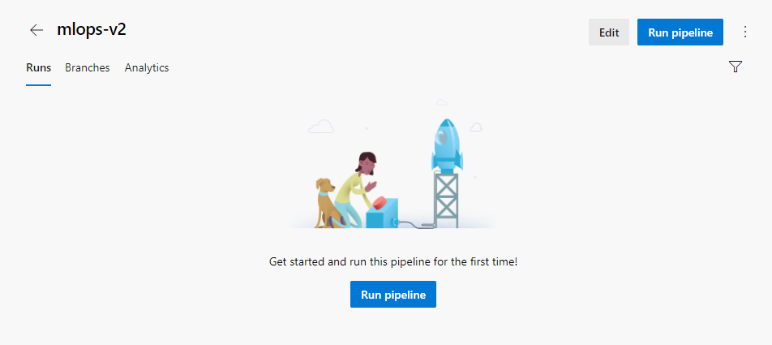

   You will need to complete the required parameters to configure your project

   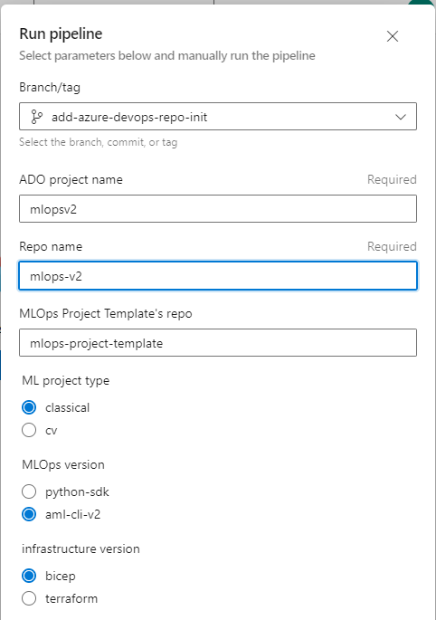

   - **ADO project name** : This is the name of the Azure DevOps project you created
   - **Project repo name**: This is the name of the mlops-v2 accelerator project you imported from GitHub (Default is **mlops-v2** unless you changed it during import)
   - **MLOps Project Template name**: Name of the shared templates you imported previously (Default is **mlops-project-template**)
   - ML Project type: 
     - Choose **classical** for a regression or classification project.
     - Choose **cv** for a computer vision project
     - Choose **nlp** for natural language  projects
   - MLOps version
     - choose **python-sdk** to use the python SDK for training and deployment of your model
     - Choose **aml-cli-v2** to yse the cli tools for training and deployment of your model
   - Infrastructure Version: 
     - Choose **Bicep** to deploy using Azure ARM based templates
     - Choose **terrform** to use terraform based templates. 

   3.8.1 The first run of the pipeline will require you to grant access to the repositories you created. Click **View** 

   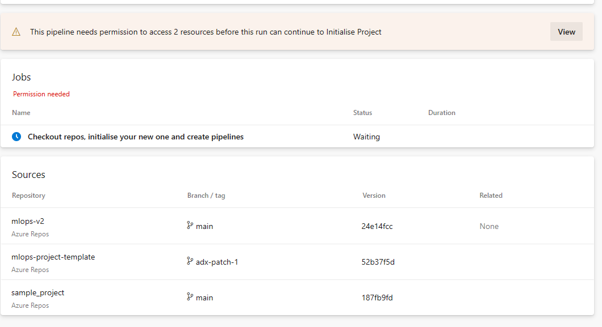

   3.8.2  Click **Permit** for all repositories waiting for review

   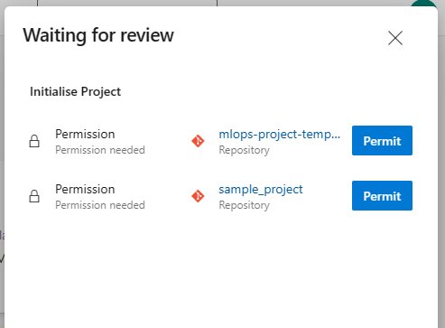

   3.9 The pipeline will run the following actions:
   - Your project repository will be populated with the files needed to create the Azure Machine Learning project and resources. 
   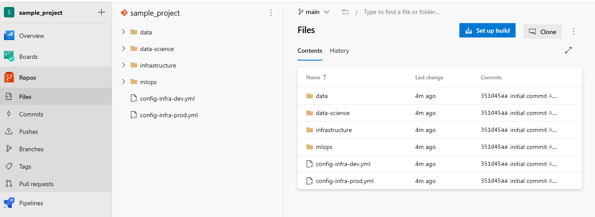
   - Pipelines for the creation of infrastructure and the training and deployment of machine learning models. 
   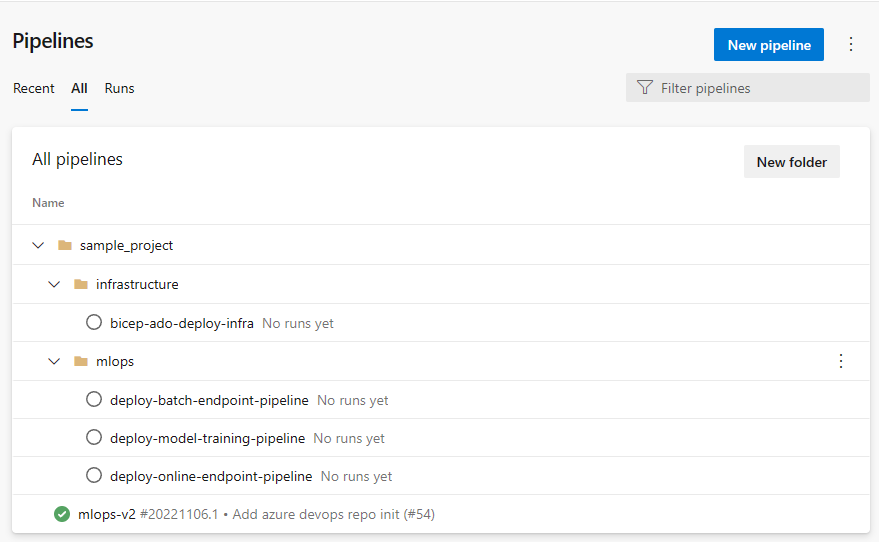
   **This finishes the prerequisite section and the deployment of the solution accelerator can happen accordingly.**
   </details>


## Outer Loop: Deploying Infrastructure via Azure DevOps
---
This step deploys the training pipeline to the Azure Machine Learning workspace created in the previous steps. 

<details>
<summary> Run Azure Infrastructure pipeline </summary>
 1. Go to your Github cloned repo and select the "config-infra-prod.yml" file.
   
   
   
   Under global, there's two values namespace and postfix. These values should render the names of the artifacts to create unique. Especially the name for the storage account, which has the most rigid constraints, like uniqueness Azure wide and 3-5 lowercase characters and numbers. So please change namespace and/or postfix to a value of your liking and remember to stay within the contraints of a storage account name as mentioned above. Then save, commit, push, pr to get these values into the pipeline.
   
   If your are running a Deep Learning workload such as CV or NLP, you have to ensure your GPU compute is availible in your deployment zone. Please replace as shown above your location to eastus. Example:
   
    namespace: [5 max random new letters]
    postfix: [4 max random new digits]
    location: eastus
    
   Please repeat this step for "config-infra-dev.yml" and "config-infra-prod.yml"!

   2. Go to ADO pipelines
   
   
   
   3. Select "New Pipeline".
   
   
   
   4. Select "Azure Repos Git".
   
   
   
   5. Select your /MLOps-Test repository. 
   
   
   
   If your new repository is not visible, then click on the "provide access" link and on the next screen, click on the "grant" button next to the organization name to grant access to your organization.
   
   6. Select "Existing Azure Pipeline YAML File"
   
   
   
   
   7. Select "main" as a branch and choose based on your deployment method your preferred yml path. For a terraform schenario choose: 'infrastructure/pipelines/tf-ado-deploy-infra.yml', then select "Continue". For a bicep schenario choose: 'infrastructure/pipelines/bicep-ado-deploy-infra.yml', then select "Continue".
   
   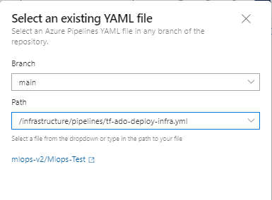
   

   
   8. Run the pipeline. This will take a few minutes to finish. The pipeline should create the following artifacts:
   * Resource Group for your Workspace including Storage Account, Container Registry, Application Insights, Keyvault and the Azure Machine Learning Workspace itself.
   * In the workspace there's also a compute cluster created.
   
   
   
   Now the Outer Loop of the MLOps Architecture is deployed.
   
   

> Note: the "Unable move and reuse existing repository to required location" warnings may be ignored.
</details>

>
 
## Inner Loop: Deploying Classical ML Model Development / Moving to Test Environment - Azure DevOps
---
   <details>
   <summary> Deploy Classical ML Model </summary>
   1. Go to ADO pipelines
   
   

   2. Select "New Pipeline".
   
   
   
   3. Select "Azure Repos Git".
   
   
   
   4. Select your /MLOps-Test repository
   
   
   
   5. Select "Existing Azure Pipeline YAML File"
   
   
   
   6. Select "main" as a branch and choose '/mlops/devops-pipelines/deploy-model-training-pipeline.yml', then select "Continue".  

   

   7. Before running the pipeline, the repository location for the mlops-templates will need to be updated. Modify the **resources** section of the pipeline to match the image below

   

   </details>
   
   
## Inner Loop: Checkpoint
   
   At this point, the infrastructure is configured and the Inner Loop of the MLOps Architecture is deployed. We are ready to move to our trained model to production.      

   
## Inner / Outer Loop: Moving to Production - Introduction
---
         
   >**NOTE: This is an end-to-end machine learning pipeline which runs a linear regression to predict taxi fares in NYC. The pipeline is made up of components, each serving  different functions, which can be registered with the workspace, versioned, and reused with various inputs and outputs.**

   >**Prepare Data
   This component takes multiple taxi datasets (yellow and green) and merges/filters the data, and prepare the train/val and evaluation datasets.
   Input: Local data under ./data/ (multiple .csv files)
   Output: Single prepared dataset (.csv) and train/val/test datasets.**

   >**Train Model
   This component trains a Linear Regressor with the training set.
   Input: Training dataset
   Output: Trained model (pickle format)**
   
   >**Evaluate Model
   This component uses the trained model to predict taxi fares on the test set.
   Input: ML model and Test dataset
   Output: Performance of model and a deploy flag whether to deploy or not.
   This component compares the performance of the model with all previous deployed models on the new test dataset and decides whether to promote or not model into production. Promoting model into production happens by registering the model in AML workspace.**

   >**Register Model
   This component scores the model based on how accurate the predictions are in the test set.
   Input: Trained model and the deploy flag.
   Output: Registered model in Azure Machine Learning.**
   

## Inner / Outer Loop: Moving to Production - Azure DevOps
---
   <details>
   <summary> Deploy ML model endpoint</summary>
   1. Go to ADO pipelines
   
   

   2. Select "New Pipeline".
   
   
   
   3. Select "Azure Repos Git".
   
   
   
   4. Select your /MLOps-Test repository! ("Empty" repository you created in 2.3)
   
   
   
   5. Select "Existing Azure Pipeline YAML File"
   
   
   
   6. Select "main" as a branch and choose:
      For Classical Machine Learning:
         Managed Batch Endpoint '/mlops/devops-pipelines/deploy-batch-endpoint-pipeline.yml'
         Managed Online Endpoint '/mlops/devops-pipelines/deploy-online-endpoint-pipeline.yml'
      For Computer Vision: 
         Managed Online Endpoint '/mlops/devops-pipelines/deploy-batch-endpoint-pipeline.yml'
      
      Then select "Continue".  
   
   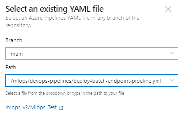

   7. The resource repository will need to be modified to request the correct repository from your project. Modify the Repository section as shown below

   
   
   8. Batch/Online endpoint names need to be unique, so please change [your endpointname] to another unique name and then select "Run".

   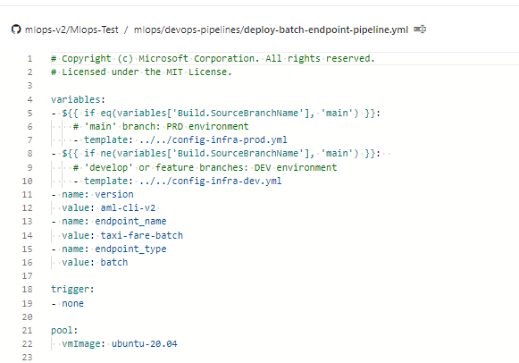
   
   **IMPORTANT: If the run fails due to an existing online endpoint name, recreate the pipeline as discribed above and change [your endpointname] to [your endpointname [random number]]"**
   
   9.  When the run completes, you will see:
   
   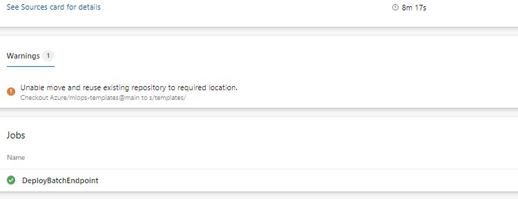
   
  Now the Inner Loop is connected to the Outer of the MLOps Architecture and inference has been run.
  </details>
  


## Next Steps
---

This finishes the demo according to the architectual pattern: Azure Machine Learning Classical Machine Learning. Next you can dive into your Azure Machine Learning service in the Azure Portal and see the inference results of this example model. 

As elements of Azure Machine Learning are still in development, the following components are not part of this demo:
- Model Monitoring for Data/Model Drift
- Automated Retraining
- Model and Infrastructure triggers

Interim it is recommended to schedule the deployment pipeline for development for complete model retraining on a timed trigger.

For questions, please [submit an issue](https://github.com/Azure/mlops-v2/issues) or reach out to the development team at Microsoft.