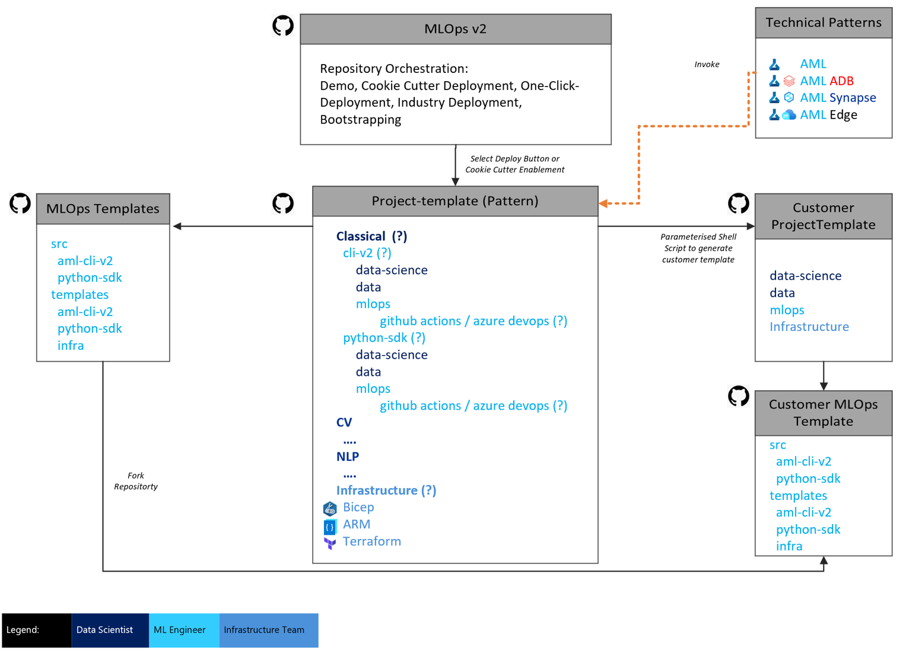

# Accelerator Structure and Implementation

The MLOps pattern the solution accelerator deploys is broadly organized into two loops, an inner loop and an outer loop:
* **Inner loop**: Data Scientists iterate over data wrangling, model development, and experimentation.
* **Outer loop**: Infrastructure and ML Engineers implement CI/CD patterns to orchestrate the model through testing, staging, production, and monitoring.

## Repositories

The solution accelerator itself is comprised of three code repositories:
* [Azure/mlops-v2](https://github.com/Azure/mlops-v2): This repository, the deployment starting point and "project factory" for repeatable MLOps projects.
* [Azure/mlops-template](https://github.com/Azure/mlops-templates): defines templates for mlops pipelines and actions such as training, model registration, deployment, etc. using either the CLI or SDK.
* [Azure/mlops-project-template](https://github.com/Azure/mlops-project-template): defines templates for deploying infastructure based on bicep or terraform as well as project spaces appropriate to each project type ([classical-ml](https://github.com/Azure/mlops-project-template/tree/main/classical), [computer vision](https://github.com/Azure/mlops-project-template/tree/main/cv), [natural language processing](https://github.com/Azure/mlops-project-template/tree/main/nlp)).

A diagram of the respoitories and their relationships is below:



## Defining a New ML Project

A new MLOps project is bootstrapped by configuring and running the [sparse_checkout.sh](/sparse_checkout.sh) script in the main repository. 

Configuration options at the top of the sparse_checkout.sh script are:

```bash
infrastructure_version=terraform   #options: terraform / bicep 
project_type=classical   #options: classical / cv / nlp
mlops_version=aml-cli-v2   #options: aml-cli-v2 / python-sdk-v1 / python-sdk-v2 / rai-aml-cli-v2
orchestration=azure-devops #options: github-actions / azure-devops
git_folder_location='<local path>'   #replace with the local root folder location where you want to create the project folder
project_name=test-project   #replace with your project name
github_org_name=orgname   #replace with your github org name
project_template_github_url=https://github.com/azure/mlops-project-template   #replace with the url for the project template for your organization created in step 2.2, or leave for demo purposes
```

**infrastructure_version** - choose the tooling you want to use, terraform or bicep, to manage infrastructure deployment

**project_type** - choose the project type from classical ml on tabular data, computer vision, or natural language processing. A workspace with typical inner loop steps and mlops pipelines appropriate to these use cases will be created for you.

**mlops_version** - choose the implementation approach, CLI or SDK, for interacting with the workspace and defining the mlops pipelines depending on needs or migrating legacy AzureML code.

**orchestration** - choose the mlops orchestration method, either Azure DevOps or GitHub Actions.

**git_folder_location** - this is a local directory into which your project will be created then pushed to your project repository.

**project_name** - Project name.

**github_org_name** - your github organization that will host the project source.

**project_template_github_url** - URL of the mlops_project_template to build your projects from. You can leave this as https://github.com/azure/mlops-project-template to use the base templates or point to a fork of this repository then modify/define your own templates for your organization.

## Creating the new project through sparse checkout

Once the [sparse_checkout.sh](/sparse_checkout.sh) script is configured, running it will perform a git sparse checkout from the template repositories, checking out only the code relevant to your selections in the script. This code is placed into your git_folder_location then the new customized project is pushed into your source code repository. 

<br>
<div style="text-align: right"><a /documentation/architecture/README.md>Next> Architectural Patterns<a></div>
